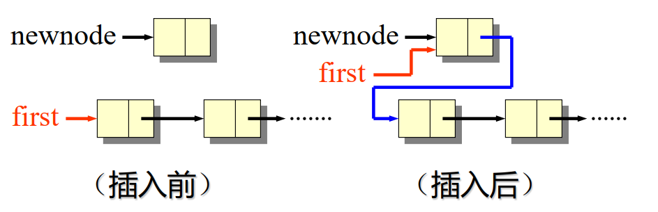
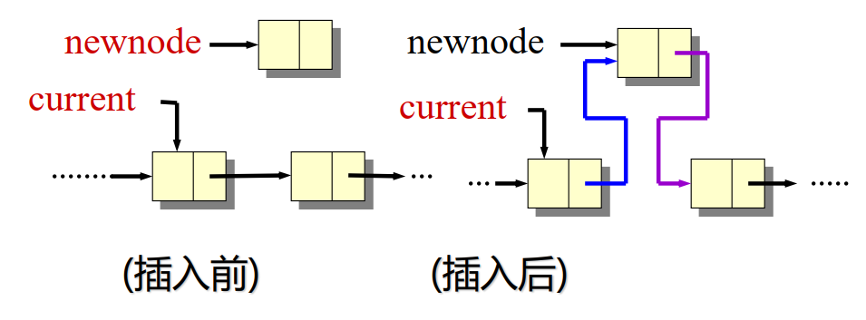
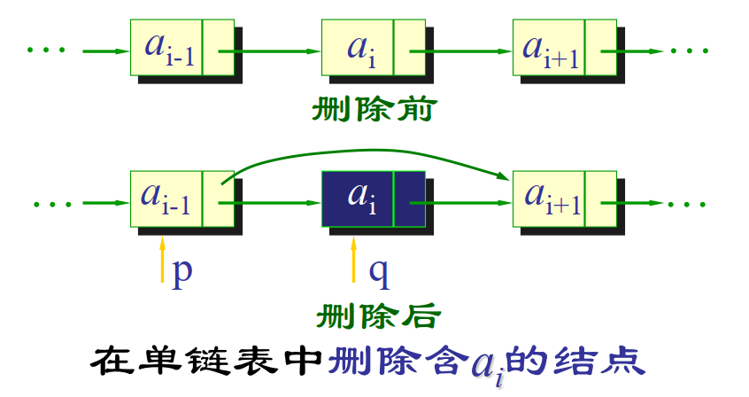

# Stack 栈

栈是一种后进先出（LIFO, Last In First Out）的数据结构。主要操作有：
- `push`: 将元素添加到栈顶
- `pop`: 移除并返回栈顶元素
- `peek` 或 `top`: 返回栈顶元素但不移除它
- `isEmpty`: 检查栈是否为空

## 顺序栈（数组实现）
使用数组实现栈，栈顶指针指向当前栈顶元素的位置
```cpp
struct Stack {
    int top; // 栈顶指针
    int capacity; // 栈的容量
    int* array; // 存储栈元素的数组
};

// 初始化栈
Stack* createStack(int capacity) {
    Stack* stack = (Stack*)malloc(sizeof(Stack));
    stack->capacity = capacity;
    stack->top = -1;
    stack->array = (int*)malloc(stack->capacity * sizeof(int));
    return stack;
}

// 入栈操作
void push(Stack* stack, int item) {
    if (stack->top == stack->capacity - 1) {
        // 栈满，扩容逻辑
        int* newArray = (int*)realloc(stack->array, stack->capacity * 2 * sizeof(int));
        if (!newArray) {
            // 内存分配失败，错误处理
            return;
        }
        stack->array = newArray;
        stack->capacity *= 2;
    }
    stack->array[++stack->top] = item;
}

// 出栈操作
int pop(Stack* stack) {
    if (stack->top == -1) {
        // 栈空，错误处理
    }
    return stack->array[stack->top--];
}

// 获取栈顶元素
int top(Stack* stack) {
    if (stack->top == -1) {
        // 栈空，错误处理
    }
    return stack->array[stack->top];
}
```

## 链式栈（链表实现）
使用链表实现栈，每个节点包含数据和指向下一个节点的指针
```cpp
struct Node {
    int data;
    struct Node* next;
};

struct Stack {
    struct Node* top; // 栈顶指针
};

// 初始化栈
Stack* createStack() {
    Stack* stack = (Stack*)malloc(sizeof(Stack));
    stack->top = NULL;
    return stack;
}

// 入栈操作
void push(Stack* stack, int item) {
    struct Node* newNode = (struct Node*)malloc(sizeof(struct Node));
    newNode->data = item;
    newNode->next = stack->top;
    stack->top = newNode;
}

// 出栈操作
int pop(Stack* stack) {
    if (stack->top == NULL) {
        // 栈空，错误处理
    }
    struct Node* temp = stack->top;
    int popped = temp->data;
    stack->top = stack->top->next;
    free(temp);
    return popped;
}

// 获取栈顶元素
int top(Stack* stack) {
    if (stack->top == NULL) {
        // 栈空，错误处理
    }
    return stack->top->data;
}
```

## C++ STL 栈
C++ 标准模板库（STL）提供了 `std::stack`，可以直接使用
```cpp
#include <stack>

std::stack<int> s;;
s.push(10); // 入栈
int topElement = s.top(); // 获取栈顶元素
s.pop(); // 出栈
s.empty(); // 检查栈是否为空
s.size(); // 获取栈的大小
```

# Queue 队列
队列是一种先进先出（FIFO, First In First Out）的数据结构。主要操作有：
- `enqueue`: 将元素添加到队尾
- `dequeue`: 移除并返回队首元素
- `front`: 返回队首元素但不移除它
- `isEmpty`: 检查队列是否为空

## 顺序队列（数组实现）
使用数组实现队列，维护头尾指针。头指针指向队首元素，尾指针指向下一个可插入位置
```cpp
class Queue {
public:
    int front, rear, capacity;
    int* array;
    Queue(int size) {
        capacity = size;
        front = rear = 0;
        array = new int[capacity];
    }

    void enqueue(int item) {
        if ((rear + 1) % capacity == front) {
            // 队列满，扩容逻辑
            int* newArray = new int[capacity * 2];
            int j = 0;
            for (int i = front; i != rear; i = (i + 1) % capacity) {
                newArray[j++] = array[i];
            }
            front = 0;
            rear = j;
            capacity *= 2;
            delete[] array;
            array = newArray;
        }
        array[rear] = item;
        rear = (rear + 1) % capacity;
    }

    int dequeue() {
        if (front == rear) {
            // 队列空，错误处理
        }
        int item = array[front];
        front = (front + 1) % capacity;
        return item;
    }

    int getFront() {
        if (front == rear) {
            // 队列空，错误处理
        }
        return array[front];
    }

    bool isEmpty() {
        return front == rear;
    }
};
```

## 链式队列（链表实现）
使用链表实现队列，维护头尾指针。头指针指向队首元素，尾指针指向队尾元素。与栈的链表实现类似，但需要同时维护头尾指针。

## C++ STL 队列
C++ 标准模板库（STL）提供了 `std::queue`，可以直接使用
```cpp
#include <queue>

std::queue<int> q;
q.push(10); // 入队
int frontElement = q.front(); // 获取队首元素
int backElement = q.back(); // 获取队尾元素
q.pop(); // 出队
q.empty(); // 检查队列是否为空
q.size(); // 获取队列的大小
```

## 双端队列 Deque
双端队列允许在两端进行插入和删除操作。C++ STL 提供了 `std::deque`，可以直接使用
```cpp
#include <deque>

std::deque<int> dq;
dq.push_back(10); // 在队尾插入
dq.push_front(20); // 在队首插入
int frontElement = dq.front(); // 获取队首元素
int backElement = dq.back(); // 获取队尾元素
dq.pop_back(); // 从队尾删除
dq.pop_front(); // 从队首删除
dq.empty(); // 检查双端队列是否为空
dq.size(); // 获取双端队列的大小
```

Python 也有类似的 `collections.deque` 模块，可以实现双端队列的功能。
```python
from collections import deque

dq = deque()
dq.append(10)        # 在队尾插入
dq.appendleft(20)    # 在队首插入
front_element = dq[0]  # 获取队首元素
back_element = dq[-1]  # 获取队尾元素
dq.pop()             # 从队尾删除
dq.popleft()         # 从队首删除
is_empty = len(dq) == 0  # 检查双端队列是否为空
size = len(dq)         # 获取双端队列的大小
```

# Array, List 数组、列表

## Array 数组
数组是一种线性数据结构，存储在连续的内存位置。主要特点包括：
- 固定大小：数组在创建时需要指定大小，大小不可更改。
- 快速访问：可以通过索引快速访问任意元素，时间复杂度为 O(1)。
- 插入和删除操作较慢：在数组中间插入或删除元素需要移动其他元素，时间复杂度为 O(n)。

C++ 直接使用 `type array[size];` 来定义数组，或者使用 `std::array` 和 `std::vector`。

## Array List
Array List 是一种基于数组的列表，能够根据需要自动调整大小。C++ STL 提供了 `std::vector`，Java 提供了 `ArrayList` 类。
```cpp
#include <vector>

std::vector<int> vec;
vec.push_back(10); // 添加元素
int element = vec[0]; // 访问元素
vec.pop_back(); // 删除最后一个元素
vec.size(); // 获取大小
```

```java
import java.util.ArrayList;

List<Integer> list = new ArrayList<>();
list.add(10); // 添加元素
int element = list.get(0); // 访问元素
list.remove(list.size() - 1); // 删除最后一个元素
list.size(); // 获取大小
```

## Linked List 链表
Linked List 是一种动态数据结构，由节点组成，每个节点包含数据和指向下一个节点的指针。主要特点包括：
- 动态大小：链表可以根据需要动态增长或缩小。
- 插入和删除操作快速：在链表中插入或删除元素只需调整指针，时间复杂度为 O(1)。
- 访问元素较慢：需要从头节点开始遍历，时间复杂度为 O(n)。

下面展示 C++ 实现的链表。

### 节点与链表类
```cpp
struct Node { // 单链表节点
    int data;
    Node* next;
};

class LinkedList { // 单链表
public:
    Node* head;

    LinkedList() {
        head = nullptr;
    }

    void insert(int i, int data); // 插入

    void remove(int i); // 删除

    int get(int i); // 访问
};

struct DoubleNode { // 双链表节点
    int data;
    DoubleNode* next;
    DoubleNode* prev;
};

class DoublyLinkedList { // 双链表
public:
    DoubleNode* head;
    DoubleNode* tail;

    DoublyLinkedList() {
        head = nullptr;
        tail = nullptr;
    }

    void insert(int i, int data); // 插入

    void remove(int i); // 删除

    int get(int i); // 访问
};
```

### 插入
单链表的插入，分为在头部插入和在其他位置插入
1. 在头部插入
```cpp
newnode->next = head;
head = newnode;
```



2. 在其他位置插入
```cpp
newnode->next = current->next; // current 是第 i-1 个节点
current->next = newnode;
```


总代码：
```cpp
void LinkedList::insert(int i, int data) {
    Node* newnode = new Node();
    newnode->data = data;
    if (i == 0) { // 在头部插入
        newnode->next = head;
        head = newnode;
    } else { // 在其他位置插入
        Node* current = head;
        for (int index = 0; index < i - 1 && current != nullptr; index++) {
            current = current->next; // 找到第 i-1 个节点
        }
        if (current != nullptr) {
            newnode->next = current->next;
            current->next = newnode;
        } else {
            // 索引超出范围，错误处理
        }
    }
}
```

双链表的插入
1. 在头部插入
```cpp
newnode->next = head;
if (head != nullptr) {
    // ！必须要判断 head 是否为空
    head->prev = newnode;
}
head = newnode;
if (tail == nullptr) {
    tail = newnode; // 如果链表为空，更新尾指针
}
```

2. 在其他位置插入
```cpp
newnode->next = current->next; // current 是第 i-1 个节点
newnode->prev = current;
if (current->next != nullptr) {
    current->next->prev = newnode;
}
current->next = newnode; // 最后更新 current 的 next 指针
```

### 删除
单链表的删除
1. 删除头部节点
```cpp
temp = head;
head = head->next;
delete temp;
```

2. 删除其他位置节点
```cpp
temp = current->next; // current 是第 i-1 个节点
current->next = temp->next;
delete temp;
```



总代码：
```cpp
void LinkedList::remove(int i) {
    if (head == nullptr) {
        // 链表为空，错误处理
        return;
    }
    Node* temp;
    if (i == 0) { // 删除头部节点
        temp = head;
        head = head->next;
        delete temp;
    } else { // 删除其他位置节点
        Node* current = head;
        for (int index = 0; index < i - 1 && current->next != nullptr; index++) {
            current = current->next; // 找到第 i-1 个节点
        }
        if (current->next != nullptr) {
            temp = current->next;
            current->next = temp->next;
            delete temp;
        } else {
            // 索引超出范围，错误处理
        }
    }
}
```

双链表的删除
1. 删除头部节点
```cpp
temp = head;
head = head->next;
if (head != nullptr) {
    head->prev = nullptr;
}
delete temp;
if (head == nullptr) {
    tail = nullptr; // 如果链表变为空，更新尾指针
}
```

2. 删除其他位置节点
```cpp
temp = current->next; // current 是第 i-1 个节点
current->next = temp->next;
if (temp->next != nullptr) {
    temp->next->prev = current;
}
delete temp;
```

### 访问
单/双链表的访问
```cpp
int LinkedList::get(int i) {
    Node* current = head;
    for (int index = 0; index < i && current != nullptr; index++) {
        current = current->next; // 遍历到第 i 个节点
    }
    if (current != nullptr) {
        return current->data;
    } else {
        // 索引超出范围，错误处理
    }
}
```
