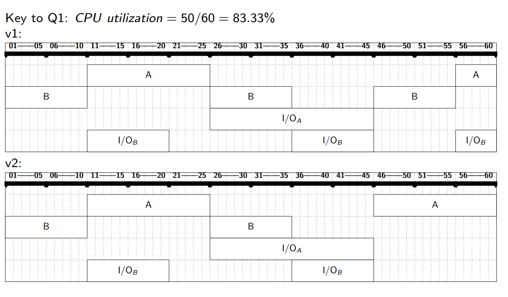
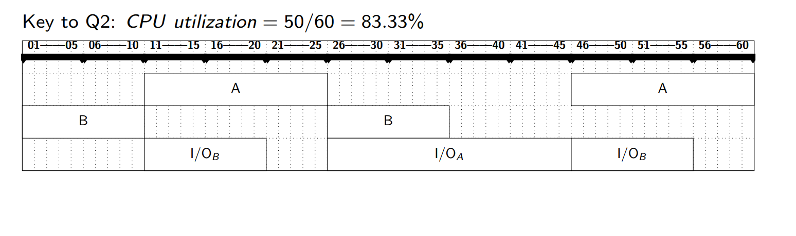

---
## 1. Warm-up Discussion 热身讨论  
### Key Questions 核心问题  
- **What OS are you familiar with?**  
  - Examples: Windows (GUI-focused), Linux (open-source), macOS (Unix-based), Android (mobile), iOS (Apple ecosystem).  

- **你熟悉哪些操作系统？**  
  - 例如：Windows（图形界面）、Linux（开源）、macOS（基于Unix）、Android（移动端）、iOS（苹果生态）。  
- **What is the "best" OS?**  
  - Subjective; depends on use case:  
    - **Servers**: Linux (stability, security).  
    - **Developers**: macOS/Unix-like (toolchain compatibility).  
    - **Gaming**: Windows (broad hardware support).  
- **最佳操作系统？**  
  - 主观选择，取决于场景：服务器（Linux稳定）、开发（macOS工具链兼容）、游戏（Windows硬件支持广）。  

---

## 2. What Operating Systems Do 操作系统的功能  
### Definition
- A program that acts as an intermediary between a user of a computer and the computer hardware.
- **OS**: A software layer between hardware and applications, managing resources and providing services.  
- **操作系统**：硬件与应用之间的软件层，管理资源并提供服务。  
- Resource Allocator, Control Program

### Goals 目标  
1. **Execute user programs** efficiently and conveniently.  
   - 高效、便捷地执行用户程序。  
2. **Abstract hardware complexity** (e.g., file systems hide disk details).  
   - 抽象硬件复杂性（如文件系统隐藏磁盘细节）。  
3. **Optimize resource utilization** (CPU, memory, I/O).  
   - 优化资源利用率（CPU、内存、I/O）。  

### Computer System Structure 计算机系统结构  
| Layer 层次         | Examples 示例                            |
| ---------------- | -------------------------------------- |
| **Hardware**     | CPU, RAM, Disk, GPU.                   |
| **OS**           | Windows Kernel, Linux Scheduler.       |
| **Applications** | Chrome, Word, Games.                   |
| **Users**        | Humans, other computers (via network). |
- OS is a **resource allocator**
	- Manages all resources.
	- Decides between conflicting requests for efficient and fair resource use.
- OS is a **control program**.
	- Controls execution of programs to prevent errors and improper use of the computer.

---

## 3. Computer-System Organization 计算机系统组织  
### Boot Process 启动流程  
1. **Bootstrap Program** (firmware) loads the OS kernel.  
   - **引导程序**（固件）加载内核。  
2. **Kernel initializes** hardware (CPU, memory, devices).  
   - **内核初始化**硬件（CPU、内存、设备）。  

### Von Neumann Architecture 冯·诺依曼架构  
- **Components**:  
  - CPU (fetches/executes instructions).  
  - Memory (stores data/instructions).  
  - I/O devices (communication).  
- **组件**：  
  - CPU（取指/执行）、内存（存储数据/指令）、I/O设备（通信）。  

### Interrupts 中断  
- **Hardware Interrupt**: Triggered by devices (e.g., keyboard input).  
  - **硬件中断**：设备触发（如键盘输入）。  
- **Software Interrupt (Trap)**: Caused by errors or system calls (e.g., division by zero).  
  - **软件中断（陷阱）**：错误或系统调用触发（如除零错误）。  

### Storage Hierarchy 存储层次  
| Level 层级      | Speed 速度 | Volatility 易失性 | Example 示例   |
| --------------- | ---------- | ----------------- | -------------- |
| **Registers**   | Fastest    | Volatile          | CPU registers. |
| **Cache**       | Very fast  | Volatile          | L1/L2 cache.   |
| **Main Memory** | Fast       | Volatile          | RAM.           |
| **SSD/HDD**     | Slow       | Non-volatile      | Disk storage.  |

---
## 4. Computer-System Architecture 计算机系统架构  
### Multiprocessor Systems 多处理器系统  
- **Symmetric (SMP)**: All CPUs perform tasks (e.g., modern PCs).  
  - **对称多处理**：所有CPU执行任务（如现代PC）。  
- **Asymmetric (AMP)**: CPUs have dedicated roles (e.g., GPU for graphics).  
  - **非对称多处理**：CPU分工明确（如GPU处理图形）。  

### Clustered Systems 集群系统  
- **High Availability**: Failover support (e.g., cloud servers).  
  - **高可用性**：故障转移（如云服务器）。  
- **High Performance Computing (HPC)**: Parallel processing (e.g., weather modeling).  
  - **高性能计算**：并行处理（如气象建模）。  

**In Class Exercise**

**Answer**

---
## 5. Operating-System Structure 操作系统结构  
### Historical Evolution 历史演进  
1. **Batch Systems (1950s)**: No interaction (e.g., punch cards).  
   - **批处理系统**：无交互（如打孔卡）。  
2. **Multiprogramming (1960s)**: Multiple jobs in memory to maximize CPU usage.  
   - **多道程序**：内存中驻留多个作业以提高CPU利用率。  
3. **Timesharing (1970s)**: Interactive computing (e.g., UNIX).  
   - **分时系统**：交互式计算（如UNIX）。  

### Key Concepts 核心概念  
- **Virtualization**: Illusion of dedicated resources (e.g., virtual memory).  
  - **虚拟化**：模拟独占资源（如虚拟内存）。  
- **Concurrency**: Managing multiple tasks (race conditions, deadlocks).  
  - **并发**：多任务管理（竞态条件、死锁）。  

---
## 6. Operating-System Operations 操作系统操作  
### Dual-Mode Operation 双模式运行  
- **User Mode**: Restricted access (e.g., apps cannot directly access hardware).  
  - **用户态**：受限访问（如应用无法直接操作硬件）。  
- **Kernel Mode**: Full privileges (e.g., OS manages devices).  
  - **内核态**：全权限（如OS管理设备）。  

### Timer 定时器  
- Prevents a process from monopolizing the CPU.  
  - **防止进程独占CPU**。  

---
## 7. Kernel Data Structures 内核数据结构  
### Essential Structures 基础结构  
- **Linked Lists**: Process scheduling queues.  
  - **链表**：进程调度队列。  
- **Hash Maps**: Fast file system lookups.  
  - **哈希表**：快速文件系统查询。  
- **Bitmaps**: Track free/used memory blocks.  
  - **位图**：跟踪内存块使用状态。  

---
## 8. After Class Exercise 课后练习  

- **Interrupts vs. Traps**:  
  - Interrupts are hardware-generated; traps are software-generated (e.g., system calls).  
  - **中断 vs. 陷阱**：中断由硬件触发，陷阱由软件触发（如系统调用）。  
- **Intentional Traps**: Yes, for system services (e.g., requesting file access).  
  - **故意触发陷阱**：可以，用于请求系统服务（如文件访问）。  
