---
#### **1. Warm-up 预热**  
**Storage Device Hierarchy 存储设备层次结构**  
- **Registers 寄存器**: The fastest and smallest storage, directly accessible by the CPU.  
  最快且最小的存储，CPU直接访问。  
- **Cache 缓存**: Faster than main memory, used to reduce access latency.  
  比主存更快，用于减少访问延迟。  
- **Main memory (RAM) 主存**: Volatile storage for currently running programs.  
  易失性存储，用于当前运行的程序。  
- **Solid-state disk (SSD) 固态硬盘**: Non-volatile, faster than magnetic disks.  
  非易失性，比机械硬盘更快。  
- **Magnetic disk (HDD) 机械硬盘**: Non-volatile, slower but higher capacity.  
  非易失性，速度较慢但容量大。  
- **Optical disk (e.g., CD/DVD) 光盘**: Read-only or writable optical storage.  
  只读或可写的光学存储。  
- **Magnetic tapes 磁带**: Sequential access, used for backups.  
  顺序访问，用于备份。  

---
#### **2. Disk Structure 磁盘结构**
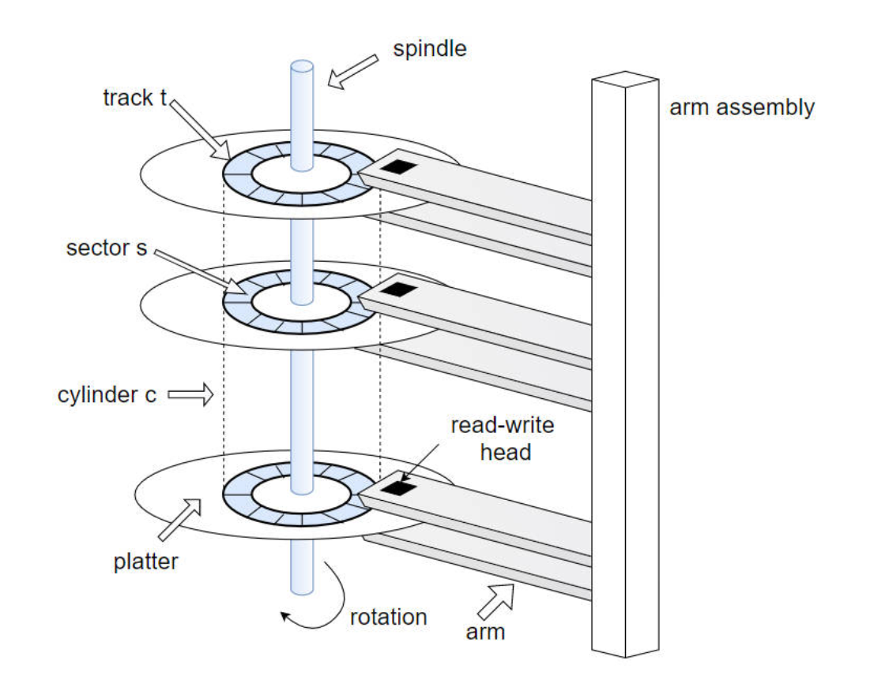
**Moving-head Disk Mechanism 移动磁头磁盘机制**  
- **Track 磁道**: Concentric circles on a platter where data is stored.  
  盘片上的同心圆，用于存储数据。  
- **Sector 扇区**: The smallest addressable unit (typically 512 bytes).  
  最小可寻址单元（通常512字节）。  
- **Cylinder 柱面**: Set of tracks at the same position across multiple platters.  
  多个盘片上同一位置的磁道集合。  
- **Platter 盘片**: Circular disk coated with magnetic material.  
  涂有磁性材料的圆形盘片。  
- **Read-write head 读写头**: Reads/writes data by magnetizing sectors.  
  通过磁化扇区读写数据。  

**Disk Interface 磁盘接口**  
- Disks are addressed as 1D arrays of **logical blocks** (512-byte sectors).  
  磁盘被寻址为一维逻辑块（512字节扇区）数组。  
- **Low-level formatting 低级格式化**: Creates logical blocks on physical media.  
  在物理介质上创建逻辑块。  
- Multi-sector operations (e.g., 4KB transfers) are common.  
  多扇区操作（如4KB传输）常见。  

**Disk I/O Time 磁盘I/O时间**  
- First a **seek**, then a remaining **rotation**, and finally the **transfer**.
- Formula:  
  $$  
  T_{I/O} = T_{seek} + T_{rotation} + T_{transfer}  
  $$
  - **Seek time 寻道时间**: Time to move the head to the correct track.  
    磁头移动到正确磁道的时间。  
  - **Rotational delay 旋转延迟**: Time for the desired sector to rotate under the head.  
    目标扇区旋转到磁头下的时间。  
  - **Transfer time 传输时间**: Time to read/write data.  
    读写数据的时间。  
- The rate of I/O is often more easily used for comparison between drives.
- Formula:
$$
  R_{I/O}=\frac{Size_{\text{Transfer}}}{T_{I/O}}
$$

**Seek Time Phases 寻道时间阶段**  
1. **Acceleration 加速**: First an acceleration phase as the disk arm gets moving
   机械臂开始移动。  
2. **Coasting 匀速**: Then coasting as the arm is moving at full speed
   机械臂全速移动。  
3. **Deceleration 减速**: Then deceleration as the arm slows down
	   机械臂减速。  
4. **Settling 稳定**: Finally settling as the head is positioned over the correct track
	- The settling time is often quite significant, e.g., 0.5 to 2 ms, as the drive must be certain to find the right track.
	- 磁头对准磁道

- **寻道时间 Seek Time**
	- 磁盘臂移动到正确磁道所需的时间
	- 平均磁盘寻道时间大约是最大寻道时间的三分之一

- **旋转延迟 Rotational delay**
	- 等待目标扇区旋转到磁盘磁头下方所需的时间。 
	- 平均旋转延迟是最大旋转延迟的一半。 
- **Rotational** and **Seek** (**NOT transfer**) 是最耗时的磁盘操作。

**Workload Assumptions 工作负载假设**  
- **Random workload 随机负载**: Small reads to random locations (high seek/rotation overhead).  
  小规模随机读取（寻道/旋转开销大）。  
- **Sequential workload 顺序负载**: Consecutive sector reads (minimal overhead).  
  连续扇区读取（开销最小）。  

**Track Skew 磁道偏斜**  
- to make sure that sequential reads can be properly serviced even when crossing track boundaries.
  调整扇区编号以确保跨磁道的顺序读取。  

**Multi-zoned Drives 多区域磁盘**  
- 多区域磁盘驱动器：外磁道的扇区数多于内磁道。 磁盘被划分为多个区域，每个区域是磁盘表面上连续的一组磁道。每个区域内的磁道具有相同的扇区数，且外层区域的扇区数多于内层区域。
	- 恒定角速度（CAV）和恒定线速度（CLV） 
- 缓存或磁道缓冲区：驱动器配备的少量内存（通常为64或256 MB左右），用于暂存从磁盘读取或向磁盘写入的数据。
---
#### **3. Disk Scheduling 磁盘调度**  
**Goals 目标**  
- Minimize **seek time** (≈ seek distance) and maximize **disk bandwidth**.  
  最小化寻道时间（≈寻道距离）并最大化磁盘带宽。  
- 磁盘I/O请求有多种来源 
	- 操作系统 
	- 系统进程 
	- 用户进程 
- I/O请求包括输入或输出模式、磁盘地址、内存地址、传输的扇区数 - 操作系统按磁盘或设备维护请求队列 
- 空闲磁盘可立即处理I/O请求，繁忙磁盘则需将请求排队 
	- 优化算法仅在存在队列时才有意义 
- 我们用一个请求队列（0-199）说明调度算法：98；183；37；122；14；124；65；67，磁头指针初始位于53

**Scheduling Algorithms 调度算法**
以98；183；37；122；14；124；65；67、磁头初始位于53
- **FCFS (First-Come-First-Serve) 先到先服务**:  
	- 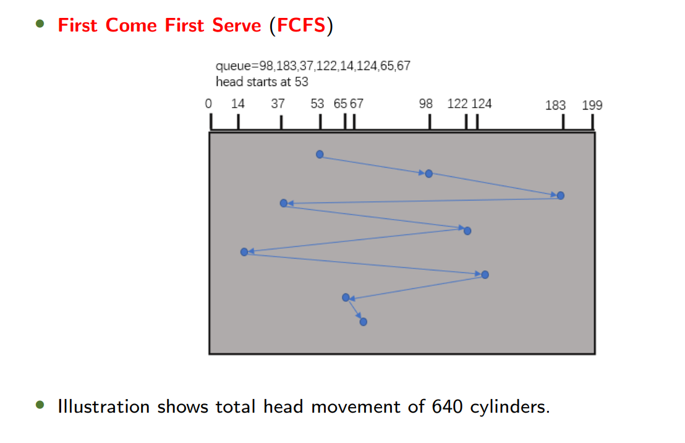
- **SSTF (Shortest Seek Time First) 最短寻道时间优先**:  
	- 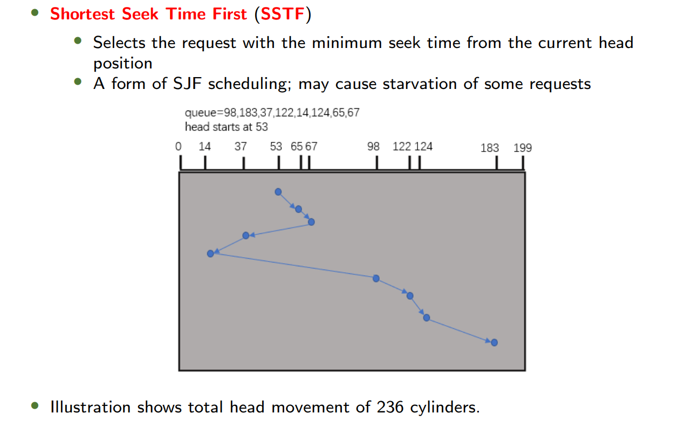
- **SCAN (Elevator Algorithm) 扫描算法**:  
	- 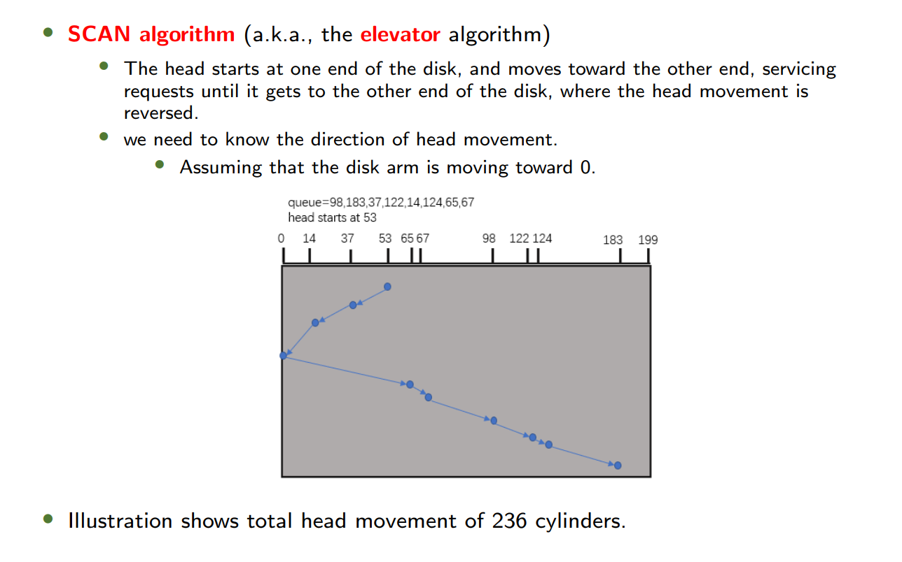
	- 必须到达柱面的一端
- **C-SCAN 循环扫描**:  
	-  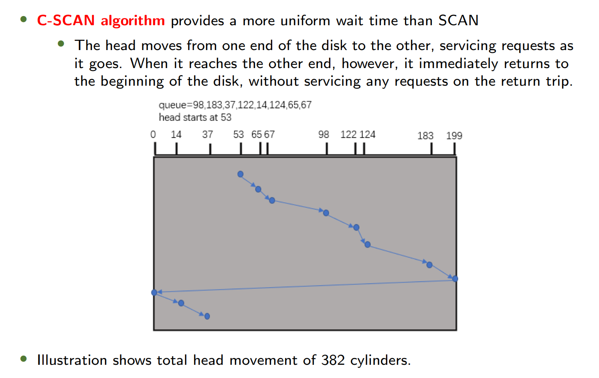
	- 只能沿着一个方向，当到达“结束端”时必须立即返回“开始端”
- **LOOK/C-LOOK 查看算法**:  
	- 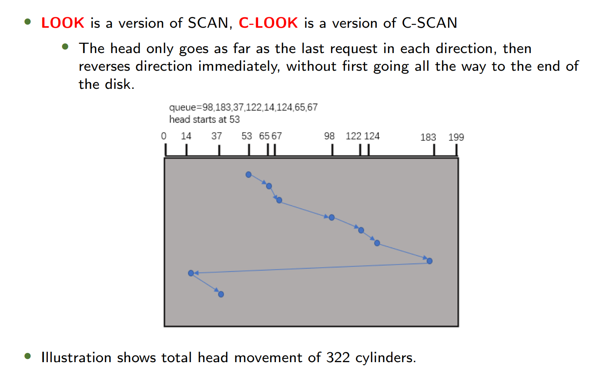
	- 不需要到达最底端，只需要到达最小或最大的磁道即可
- **SPTF (Shortest Positioning Time First) 最短定位时间优先**  
	- Considers both seek and rotation time (used internally by modern disks).  
	  同时考虑寻道和旋转时间（现代磁盘内部使用）。  

**In-Class Exercise 课堂练习**  

**Answer**
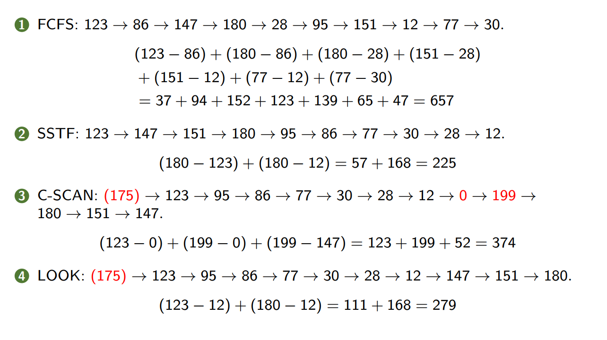

---
#### **4. RAID Structure 磁盘阵列结构**  
**Redundant Arrays of Independent Disks (RAIDs)**
- A technique to use multiple disks in concert to build a faster, bigger, and more reliable disk system.  
- 从外部来看，磁盘阵列（RAID）就像一块磁盘：是一组可供读取或写入的块。 
	- 这种透明性提高了磁盘阵列的可部署性。 
- 从内部来看，磁盘阵列由多个磁盘、内存（包括易失性和非易失性内存）以及一个或多个用于管理系统的处理器组成。
	- 磁盘阵列具有多种优势。
**Why RAID? 为什么使用RAID?**  
- **Performance 性能**: Parallel I/O across multiple disks speeds up transfers.  
  多磁盘并行I/O加速传输。  
- **Capacity 容量**: Combines disks into a larger logical volume.  
  将多磁盘合并为更大逻辑卷。  
- **Reliability 可靠性**: With some form of redundancy, RAIDs can tolerate the loss of a disk and keep operating as if nothing were wrong
  冗余设计容忍磁盘故障。  

**RAID Levels RAID级别**  
1. **RAID-0: Striping 条带化**  
   - 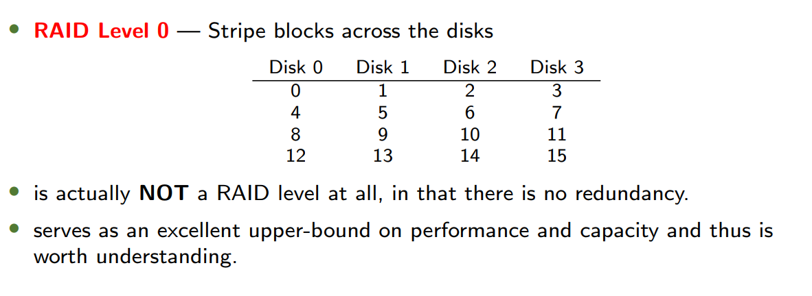
   - **Description**: Blocks striped across disks **without redundancy**.  
     数据块跨磁盘条带化**无冗余**。  
   - **块大小 Chunk Size** 主要影响磁盘阵列的性能。 
	   - 小块大小意味着许多文件会被条带化分布在多个磁盘上，从而提高对单个文件读写的并行性。 
	   - 然而，跨多个磁盘访问数据块的定位时间会增加，因为整个请求的定位时间由所有磁盘驱动器中请求定位时间的最大值决定。 
	   - 反之亦然。
   - **Capacity**: Perfect, given N disks each of size B blocks, striping delivers N × B blocks of useful capacity.
   - **Reliability**: **None**—any disk failure causes data loss.  
     无容错—任一磁盘故障导致数据丢失。  
   - **Performance**:  
	 -   单请求延迟 
		 - 单块请求的延迟应与单个磁盘的延迟几乎相同，因为RAID-0会简单地将该请求重定向到其某个磁盘。
	 - We will assume that a disk can transfer data at S MB/s under a sequential workload, and R MB/s when under a random workload (S >> R)
     - Sequential: $N \times S$ MB/s.  
     - Random: $N \times R$ MB/s.  
    
2.  **RAID-1: Mirroring 镜像**
	- 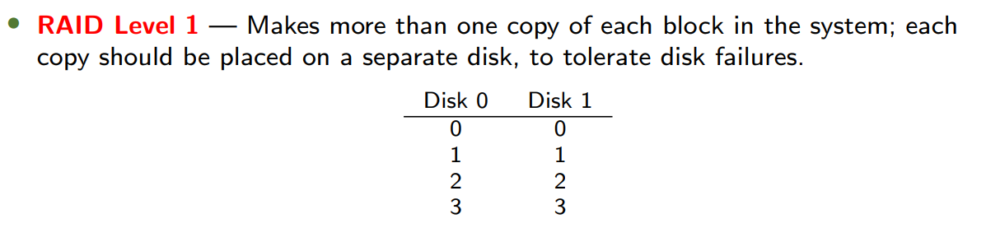
	- **Description**: Duplicates data on **two or more disks**.  
	     数据**完全复制**到多磁盘。  
	- **Capacity**: Expensive, $N \times B/2$ (50% utilization for 2 disks).  
	- **Reliability**: Tolerates up to $N/2$ disk failures.  
	     容忍最多$N/2$磁盘故障。  
	- **Performance**:  
	    - Single-request latency
			-  Read: The same as the latency on a single disk.
			- Write: Two writes in parallel. Thus suffers the worst-case seek and rotational delay of the two.
		- Steady-state throughput
			- Sequential
			    - $N \times S/2$ MB/s, for both reads and writes
			- Random:
			    - Read: $N \times R$ MB/s (parallel reads).  
			    - Write: $N \times R/2$ MB/s (mirroring overhead).  
3. **RAID 0+1 or RAID 1+0**
	- 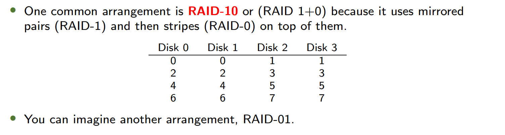
	- 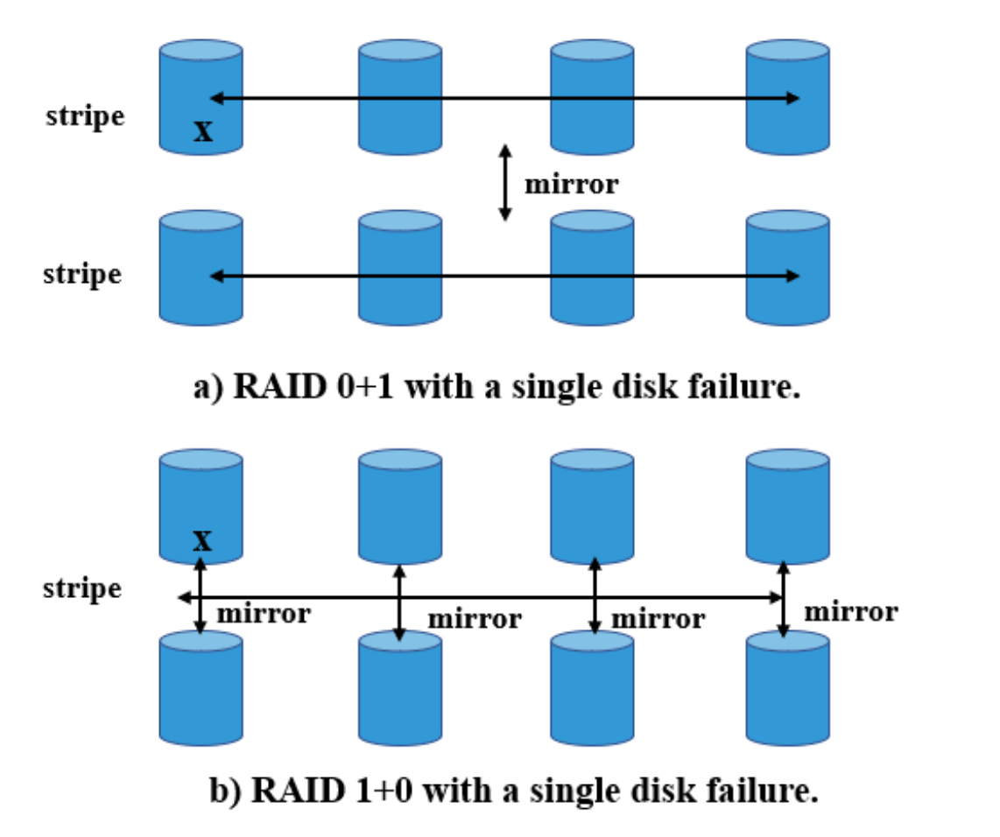
4. **RAID Level-4: Parity 奇偶校验**  
	- 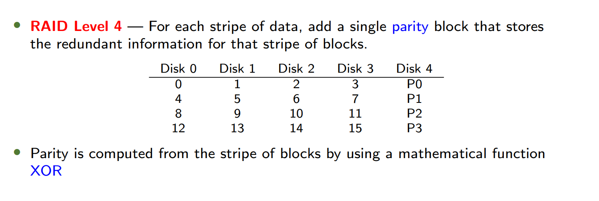
	- **Parity block**: 奇偶校验块，等于一条数据的异或
	- **Description**: Dedicated parity disk for each stripe.  
		每条纹带专用奇偶校验磁盘。  
	- **Capacity**: $(N-1) \times B$ (1 disk for parity).  
	- **Reliability**: Tolerates **1 disk failure**.  
		容忍1个磁盘故障。  
	- **Performance**:  
		- Single-request latency
			- Read: The same as the latency on a single disk.
			- Write: Twice as the latency on a single disk 因为要写入校验
		- Steady-state throughput
			- Sequential
				- $(N-1) \times S$ MB/s, for both reads and writes
				- 顺序写入时校验计算可流水线化，吞吐量仍由数据盘数量决定
			- Random
				- $(N − 1) \times R$ MB/s for reads, $R/2$ MB/s for writes.
				- 每次随机写入需 **两次读取（旧数据+旧校验） + 两次写入（新数据+新校验）**，校验盘成为严重瓶颈：校验盘的读写必须严格串行。
		-  全条带写入是RAID-4向磁盘写入数据的最高效方式。 
			- 对于随机写入： 
			- **加法奇偶校验**：要计算新奇偶校验块的值，需并行读取条带中的所有其他数据块。 
			- **减法奇偶校验**：仅使用已修改的块。 
			- 新奇偶校验值 = 旧数据 XOR 新数据 XOR 旧奇偶校验值 
			- 使用减法方法时，每次写入操作需要RAID执行4次物理I/O（两次读取旧数据和两次写入新数据）。
		- **Small-write problem**

5. **RAID Level-5: Rotating Parity 旋转奇偶校验**
	- 相比于RAID-4：Rotate the parity block across drives
	- 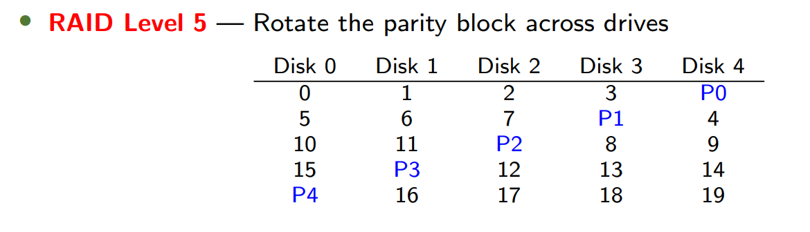
   - **Description**: Parity blocks distributed across all disks.  
     奇偶校验块分布所有磁盘。  
   - **Capacity**: Same as RAID-4, $(N-1) \times B$.  
   - **Reliability**: Same as RAID-4, tolerates **1 disk failure**.  
   - **Performance**:  
     - Single-request latency
		- Read: The same as the latency on a single disk.
		- Write: Twice as the latency on a single disk.
	- Steady-state throughput
		- Sequential
			- $(N − 1) \times S$ MB/s, for both reads and writes.
		- Random
			- $N \times R$ MB/s for reads
				- **所有磁盘**（包括校验盘）均可参与数据读取（因校验块分布轮换），吞吐量接近 $N$ 倍单盘随机读带宽。
			- $(N/4) × R$ MB/s for writes
				- 校验块分散在所有磁盘上，虽然仍需仍需 4 次 I/O，但不同条带的写入可**并行更新校验值**

**RAID Comparison 对比**

| Metric              | RAID-0       | RAID-1           | RAID-4           | RAID-5           |
| ------------------- | ------------ | ---------------- | ---------------- | ---------------- |
| **Capacity**        | $N \times B$ | $N \times B/2$   | $(N-1) \times B$ | $(N-1) \times B$ |
| **Fault Tolerance** | 0 disks      | 1 to $N/2$ disks | 1 disk           | 1 disk           |
| **Sequential Read** | $N \times S$ | $(N/2) \times S$ | $(N-1) \times S$ | $(N-1) \times S$ |
| **Random Write**    | $N \times R$ | $(N/2) \times R$ | $R/2$            | $(N/4) \times R$ |

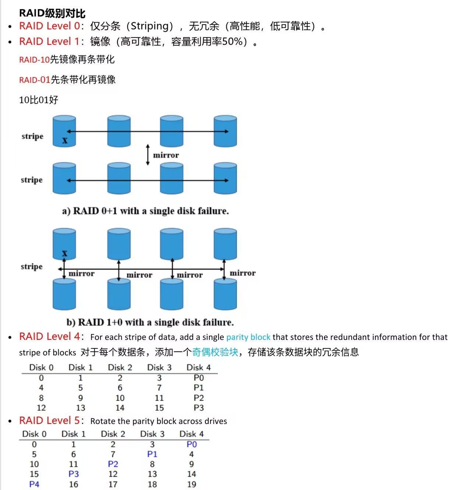