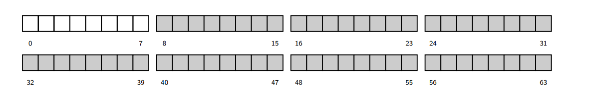
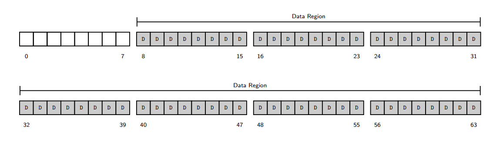
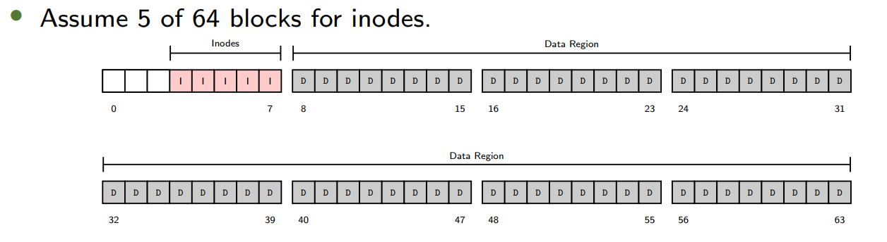
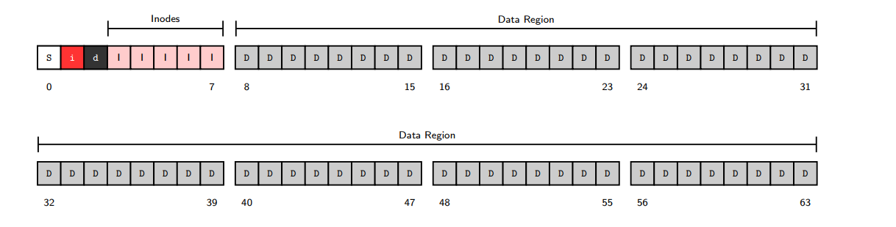
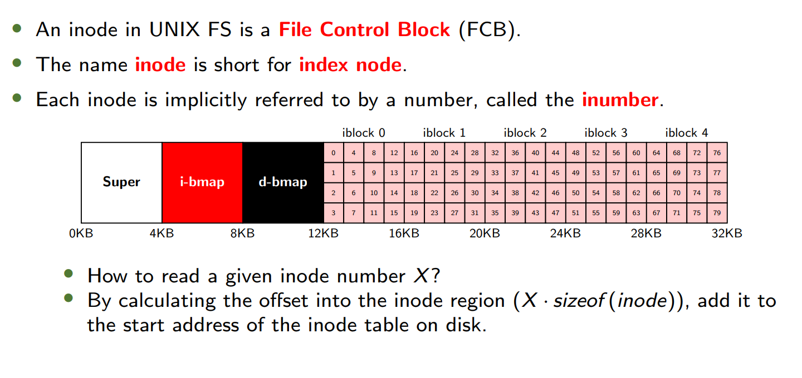
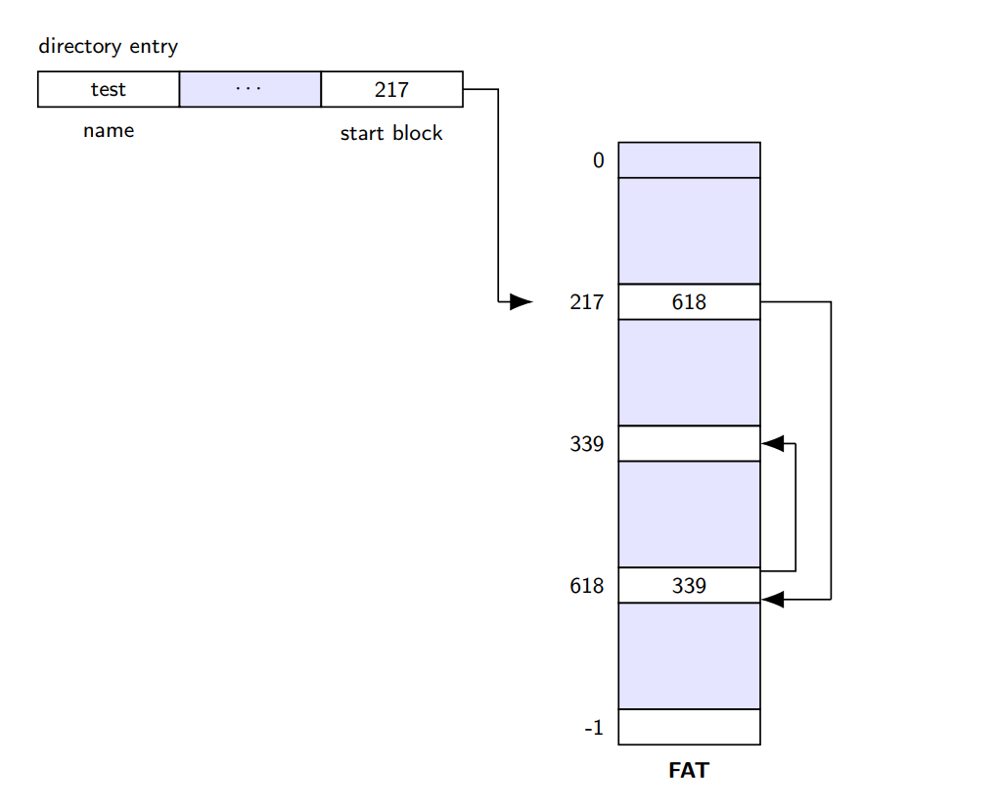
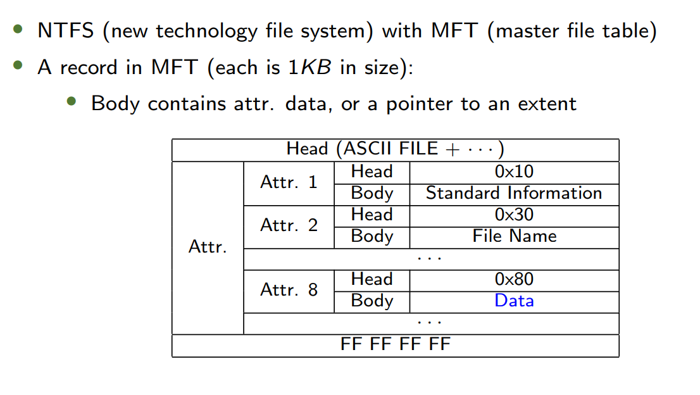
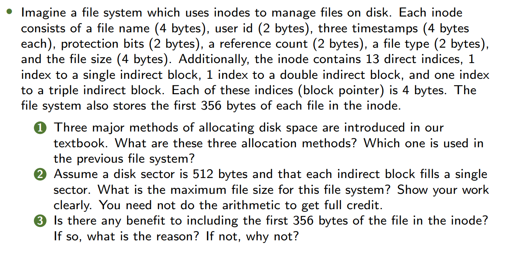
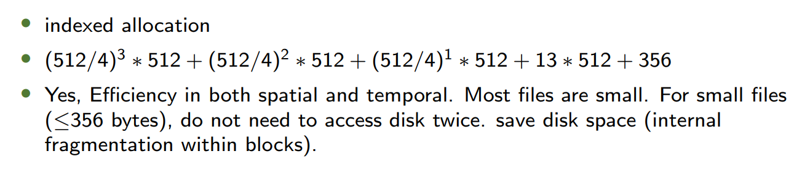

---
#### **1. Warm-up**  
**1.1 文件系统测量总结（File System Measurement Summary）**  
- **Most files are small**  
  - 大多数文件很小（常见大小为2KB）。  
- **Average file size is growing**  
  - 平均文件大小增长（约200KB）。  
- **Most bytes are stored in large files**
  - 大部分存储空间被少数大文件占用。  
- **File systems contain lots of files**
  - 文件系统平均包含约10万个文件。  
- **File systems are roughly half full**
  - 磁盘利用率通常为50%。
- **Directories are typically small**
  - 目录通常很小（多数条目≤20个）。  

**1.2 文件大小与空间占用（Size of A File）**

| 文件名 | 内容（重复行） | 实际大小 | 占用空间 |  
|--------|----------------|----------|----------|  
| `test1` | - | 0字节 | 0字节 |  
| `test2` | 1行 | 22字节 | 0字节 |  
| `test3` | 40行 | 878字节 | 4KB |  
| `test4` | 1行 | 22字节 | 4KB |  
- **关键点**：文件系统按块（如4KB）分配空间，导致小文件可能浪费空间（内部碎片）。  

---

#### **2. Typical File System**  
**2.1 极简文件系统（VSFS: Very Simple File System）**  
- **磁盘组织（Overall Organization）**  
  - 磁盘分为固定大小的块（如4KB），假设总块数为64。  
  - 
  - **数据区域（Data Region）**：占用最后56块（如块8-63）。  
  - 
  - **Inode表**：占用5块（如块2-6）
  - 
  - 如果每个Inode 256字节，最多存储 `(5×4KB)/256B = 80` 个Inode。 
	  - This number represents the maximum number of files we can have in our file system.
  - **位图（Bitmap）**：
	- 位图是由一系列二进制位（bit）组成的数组，每个位代表一个特定资源（如磁盘块或inode）的分配状态。
	- Inode位图（inode bitmap）：标记Inode是否空闲（1块）。  
	- 数据位图（data bitmap）：标记数据块是否空闲（1块）。 
  - **超级块（Superblock）**
	-   它包含有关此特定文件系统的信息，例如，文件系统中有多少索引节点（inode）和数据块、索引节点表从何处开始等等。
	- 挂载文件系统时，操作系统会首先读取超级块（superblock）。
  - 

**2.2 Inode结构（File Organization: the Inode）**

- **多级索引（Multi-Level Index）**：  
  - **直接指针**：每个指针指向属于该文件的一个磁盘块。
  - **间接指针**：Instead of pointing to a block that contains user data, it points to a block that contains more pointers, each of which point to user data.
  - To support even larger files, by adding a
	- double indirect pointer
		-  What is the maximum size, with 12 direct pointers, 1 indirect pointer, 1 double indirect pointer
  $$  
  \text{Max Size} = 12 \times 4\text{KB} + \frac{4\text{KB}}{4\text{B}} \times 4\text{KB} + \left(\frac{4\text{KB}}{4\text{B}}\right)^2 \times 4\text{KB} 
  $$
	-  triple indirect pointer
		-  What is the maximum size, with 12 direct pointers, 1 indirect pointer, 1 double indirect pointer, 1 triple indirect pointer
  $$  
  \text{Max Size} = 12 \times 4\text{KB} + \frac{4\text{KB}}{4\text{B}} \times 4\text{KB} + \left(\frac{4\text{KB}}{4\text{B}}\right)^2 \times 4\text{KB} + \left(\frac{4\text{KB}}{4\text{B}}\right)^3 \times 4\text{KB}  
  $$
- 或者，通过使用盘区（extent）而非指针（如 ext4 文件系统）。  
	- 一个盘区仅包含一个磁盘指针和一个长度（以块为单位），用于指定文件在磁盘上的存储位置。  
	- 基于盘区的文件系统通常允许存在多个盘区。  
	- 灵活性较低，但更紧凑。

**2.3 分配方法（Allocation Method）**
**FAT (File-Allocation Table)**

**NTFS**

**分配方法（重要！）**

| 方法                             | 描述           | 示例文件系统     |
| ------------------------------ | ------------ | ---------- |
| **连续分配 Contiguous allocation** | 文件占用连续的磁盘块   | ext4, NTFS |
| **链式分配 Linked allocation**     | 文件通过链表链接分散的块 | FAT        |
| **索引分配 Indexed allocation**    | 使用索引块集中管理指针  | ext2/ext3  |

1. **连续分配（Contiguous Allocation）**
	- **原理**：文件的所有数据块在磁盘上**物理连续存储**（如一个文件占用块5-9）。  
		- 文件元数据只需记录**起始块地址**和**长度**即可定位全部数据。
	- **优点**：  
		- **读写性能高**：连续存储减少磁头移动（适合HDD）。  
		- **实现简单**：只需维护起始位置和长度。  
	- **缺点**：
		- **外部碎片**：频繁创建/删除文件会导致空闲块分散，难以分配大文件。  
		- **扩容困难**：文件增长时可能需要整体移动。  
	- **应用文件系统**：  
		- `ext4`（支持预分配以减少碎片）、`NTFS`（对连续大文件优化）。
2. **链式分配（Linked Allocation）**
	- **原理**：  文件的每个数据块包含**指向下一个块的指针**，形成链表结构。  
		- 文件元数据只需记录**首块地址**，通过遍历链表访问全部数据。  
	- **优点**：  
		- **无外部碎片**：空闲块可分散利用。  
		- **动态扩容**：文件增长时只需追加新块。  
	- **缺点**：  
		- **随机访问慢**：必须从头遍历链表。  
		- **空间开销**：每个块需存储指针，降低有效存储容量。  
		- **可靠性风险**：指针损坏会导致数据丢失。  
	- **应用文件系统**：  
		- `FAT`（File Allocation Table）：实际通过**FAT表**集中存储指针链，而非在块中直接存储，但逻辑仍属链式分配。
 3. **索引分配（Indexed Allocation）**
	- **原理**：为每个文件分配一个**索引块**（index block），集中存储该文件所有数据块的指针。  
		- 文件元数据指向索引块，索引块中的指针直接定位数据块。  
	- **优点**：
		- **支持快速随机访问**：通过索引块直接跳转到目标数据块。  
		- **无外部碎片**：数据块可分散存储。  
	- **缺点**：
		- **小文件空间浪费**：即使文件很小，也需占用整个索引块。  
		- **大文件需扩展**：若索引块指针不足，需多级索引（如ext2的间接块）。  
	- **应用文件系统**：  
		- `ext2/ext3`：采用多级索引（直接、一级间接、二级间接指针）。  
		- 现代文件系统（如`ext4`）结合索引与扩展机制（如Extents）。

**In Class Exercise**

**Answer**

注意！每个indices是4B，这些indices可能在inode中（直接的），也可能在存储间接block的块中。间接block占一个sector，故一个间接block中有512/4个指向其他块的指针/indices


**2.4 目录组织（Directory Organization）**  
- A directory basically contains a list of `(entry name, inode number)` pairs
-   删除文件（例如调用unlink()函数）可能会在目录中间留下空白空间，因此需要某种方式对此进行标记（例如使用保留的索引节点号，如0）。
- 这种删除操作正是使用记录长度（reclen）的原因之一：新条目可能会重用旧的、更大的条目，从而在其中留有额外空间。 
- 目录拥有一个索引节点（inode），该节点位于索引节点表中的某个位置（其inode的类型字段标记为“目录”而非“普通文件”）。

**2.5 访问路径（Access Paths）**  
- **读取文件 `/foo/bar`**：  
  1. 读取根目录`/`的Inode和数据块，找到`foo`的Inode号。  
  2. 读取`foo`的Inode和数据块，找到`bar`的Inode号。  
  3. 读取`bar`的Inode和数据块。  
- **写入文件**：需额外更新位图和Inode（每次写入可能触发5次I/O）。  
---
#### **3. Fast File System (FFS)**  
**3.1 性能问题与优化**  
- **原始问题**：  
  - 数据块分散导致寻道时间长。  
  - 块大小过小（512字节）。  
- **解决方案**：  
  - **块组（Block Groups）**：将磁盘划分为多个组，每组包含完整文件系统结构（超级块、位图、Inode表、数据块）。  
  - **局部性策略**：  
    - 同一目录下的文件放在同一组。  
    - 大文件分散到不同组（避免占满单个组）。  

**3.2 示例对比**  
- **普通文件系统**：文件分散存储，导致长寻道。  
- **FFS**：  

| 组号 | Inode | 数据块 |  
|------|-------|-------|  
| 0 | `/`, `a` | `/`, `a` |  
| 1 | `b`, `c` | `b`, `c` |  

  - 目录`/a`及其文件`c`、`d`、`e`集中在同一组。  
---
#### **4. FSCK and Journaling**  
**4.1 崩溃一致性问题（Crash-Consistency Problem）**  
- **场景**：更新文件需写Inode、位图、数据块，若崩溃发生在部分写入后，会导致不一致。  
  - 例如：仅写入数据块（`Db`），其他未更新 → 无问题。  
  - 仅写入Inode（`I[v2]`）→ 元数据不一致（位图未标记块已用）。  

**4.2 解决方案**  
- **Fsck（File System Checker）**：  
  - 扫描磁盘修复不一致（如重建位图、清除损坏Inode）。  
  - **缺点**：速度慢（需扫描整个磁盘）。  
- **日志（Journaling）**：  
  1. **日志写入**：将事务（TxB、元数据、数据、TxE）写入日志区。  
  2. **提交**：写入TxE标记事务完成。  
  3. **检查点**：将日志中的更新写入实际位置。  
  - **元数据日志**：仅记录元数据（不记录数据块），减少写入量。  

**4.3 日志优化**  
- **批处理（Batching）**：合并多个事务写入日志。  
- **循环日志（Finite Log）**：通过日志超级块标记空闲事务。

**4.4 日志模式（Journaling Modes）**  
- **Data Journaling（数据日志）**  
  - 日志中记录完整事务（包括数据块），确保崩溃后完全恢复。  
  - **缺点**：数据需写入两次（日志+实际位置），性能开销大。  
  ```plaintext
  | Journal | TxB | I[v2] | B[v2] | Db | TxE | → Checkpoint: I[v2], B[v2], Db |
  ```  

- **Metadata Journaling（元数据日志）**  
  - 仅记录元数据（Inode、位图），数据块直接写入最终位置。  
  - **有序模式（Ordered）**：  
    1. 数据块先写入最终位置。  
    2. 元数据事务提交到日志。  
    3. 检查点更新元数据。  
  - **无序模式（Unordered）**：允许数据块和元数据乱序写入（风险更高）。  

**4.5 块重用问题（Block Reuse）**  
- **场景**：  
  1. 文件A占用块1000，后删除。  
  2. 文件B重用块1000，但崩溃时日志中残留文件A的旧事务。  
  - **风险**：恢复时可能错误地将旧数据写入新文件。  
- **解决方案**：  
  - **延迟重用**：直到删除操作完成检查点后才允许重用块。  
  - **撤销记录（Revoke）**：在日志中标记块不可回放（ext3采用）。  

**4.6 其他方法：写时复制（Copy-on-Write, COW）**  
- **原理**：更新时不覆盖旧数据，而是写入新位置（如日志结构文件系统LFS）。  
- **优点**：避免崩溃一致性问题，简化恢复流程。  

---
#### **5. 关键概念总结**  
| **概念**             | **描述**                            |
| ------------------ | --------------------------------- |
| **Inode**          | 文件控制块，包含元数据和数据块指针（直接/间接）。         |
| **多级索引**           | 通过间接指针支持大文件（计算最大文件大小需考虑块大小和指针大小）。 |
| **FFS块组**          | 将磁盘分组，提升局部性（同一目录文件放同组，大文件分散存储）。   |
| **Fsck**           | 扫描修复不一致，但速度慢（如重建位图、清除损坏Inode）。    |
| **日志（Journaling）** | 先记录事务到日志，再提交到实际位置（确保崩溃后可恢复）。      |
| **数据 vs 元数据日志**    | 数据日志更安全但性能差；元数据日志需有序写入数据块。        |

---
#### **6. 示例与计算**  
**6.1 最大文件大小计算**  
- **假设**：  
  - 块大小 = 4KB，指针大小 = 4B  
  - Inode包含：12直接指针 + 1间接指针 + 1双重间接指针 + 1三重间接指针  
- **计算**：  
  $$  
  \text{Max Size} = 12 \times 4\text{KB} + \left(\frac{4\text{KB}}{4\text{B}}\right) \times 4\text{KB} + \left(\frac{4\text{KB}}{4\text{B}}\right)^2 \times 4\text{KB} + \left(\frac{4\text{KB}}{4\text{B}}\right)^3 \times 4\text{KB}  
  $$  
  - 直接块：$12 \times 4\text{KB} = 48\text{KB}$  
  - 间接块：$1024 \times 4\text{KB} = 4\text{MB}$  
  - 双重间接：$1024^2 \times 4\text{KB} = 4\text{GB}$  
  - 三重间接：$1024^3 \times 4\text{KB} = 4\text{TB}$  
  - **总计**：~4TB（实际受限于Inode字段位数）。  

**6.2 文件创建的I/O操作**  
- **步骤**：  
  1. 读取Inode位图（找空闲Inode）。  
  2. 写入Inode位图（标记占用）。  
  3. 初始化Inode。  
  4. 写入目录数据块（添加文件名到Inode的映射）。  
  5. 更新目录Inode。  
- **总I/O次数**：6次（若目录需扩展，额外操作更多）。  

---

### **1. Log-Structured File System (LFS)**  

**1.1 Observations (观察)**  
- System memories are growing (系统内存增长)  
  - As more data is cached in memory, disk traffic increasingly consists of writes, as reads are serviced by the cache.  
  （随着更多数据缓存在内存中，磁盘流量主要由写入构成，因为读取由缓存服务。）  
- Large gap between random I/O and sequential I/O performance (随机I/O与顺序I/O性能差距大)  
  - Hard-drive transfer bandwidth has increased, but seek and rotational delay costs decrease slowly.  
  （硬盘传输带宽提升，但寻道和旋转延迟成本降低缓慢。）  
- Existing file systems perform poorly on common workloads (现有文件系统在常见负载下表现不佳)  
  - Even FFS incurs many short seeks and rotational delays.  
  （即使FFS也会产生大量短寻道和旋转延迟。）  
- File systems are not RAID-aware (文件系统未针对RAID优化)  
  - Small writes problem in RAID-4 and RAID-5.  
  （RAID-4和RAID-5中的小写入问题。）  

**1.2 LFS Core Idea (核心思想)**  
- Buffer all updates in memory segments, then write sequentially to disk (将更新缓存在内存段中，然后顺序写入磁盘)  
  - Segments are written to free locations, never overwriting existing data.  
  （段写入空闲位置，永不覆盖现有数据。）  
- Achieves high performance by transforming writes into sequential operations.  
  （通过将写入转为顺序操作实现高性能。）  

**1.3 Key Mechanisms (关键机制)**  
- **Inode Map (imap)** (inode映射表)  
  - Indirect mapping between inode numbers and disk locations.  
  （inode编号与磁盘位置的间接映射。）  
- **Checkpoint Region (CR)** (检查点区域)  
  - Fixed location storing pointers to the imap, updated periodically.  
  （固定位置存储指向imap的指针，定期更新。）  
- **Garbage Collection** (垃圾回收)  
  - Compacts live data by reclaiming dead blocks (e.g., via segment summary blocks).  
  （通过回收无效块压缩有效数据，如通过段摘要块。）  

**1.4 Crash Recovery (崩溃恢复)**  
- Uses a log structure with two checkpoint regions for atomic updates.  
  （使用日志结构和双检查点区域实现原子更新。）  
- Roll-forward mechanism to recover from partial writes.  
  （通过前滚机制恢复部分写入。）  

---
### **2. Flash-based SSDs**  

**2.1 Advantages (优势)**  
- Fast (no mechanical parts) and non-volatile.  
  （快速（无机械部件）且非易失性。）  

**2.2 Challenges (挑战)**  
- **Erase-before-write** (写前需擦除)  
  - Must erase entire blocks (128–256 KB) before programming pages (4 KB).  
  （编程页前需擦除整个块。）  
- **Wear-out** (磨损)  
  - Limited Program/Erase (P/E) cycles (e.g., 10k for MLC, 100k for SLC).  
  （有限的擦写周期，如MLC 1万次，SLC 10万次。）  

**2.3 Flash Operations (操作)**  
- **Read (a page)**: Fast random access (~25–75 μs).  
  （读取（页）：快速随机访问。）  
- **Erase (a block)**: Slow (~200–1350 μs).  
  （擦除（块）：慢速。）  
- **Program (a page)**: Moderate (~1500–4500 μs).  
  （编程（页）：中等速度。）  

**2.4 Flash Translation Layer (FTL)** (闪存转换层)  
- **Log-Structured FTL** (日志结构FTL)  
  - Maps logical writes to sequential physical writes, similar to LFS.  
  （将逻辑写入映射为顺序物理写入。）  
- **Garbage Collection** (垃圾回收)  
  - Reclaims blocks with dead pages by copying live data to new blocks.  
  （通过复制有效数据到新块回收无效块。）  
- **Hybrid Mapping** (混合映射)  
  - Combines block-level and page-level mapping for efficiency.  
  （结合块级和页级映射以提高效率。）  

**2.5 Performance (性能)**  
- SSDs outperform HDDs in random I/O (e.g., 103 MB/s vs. 2 MB/s).  
  （SSD在随机I/O上远超HDD。）  

---
### **3. Network File System (NFS)**  

**3.1 Stateless Design (无状态设计)**  
- Server stores no client state; each request is self-contained.  
  （服务器不存储客户端状态，每个请求自包含。）  
- Uses **file handles** (volume ID + inode + generation number) instead of descriptors.  
  （使用文件句柄（卷ID + inode + 世代号）而非描述符。）  

**3.2 Protocol (协议)**  
- **Mount Protocol**: Establishes initial connection.  
  （挂载协议：建立初始连接。）  
- **NFSv2 Operations**: Include `Fetch`, `Store`, `ListDir`.  
  （操作包括获取、存储、列目录。）  

---
### **4. Andrew File System (AFS)**  

**4.1 Scaling Goal (扩展目标)**  
- Whole-file caching on client disks to reduce server load.  
  （客户端磁盘上的全文件缓存以减少服务器负载。）  

**4.2 AFSv2 Improvements (改进)**  
- **File Identifier (FID)**: Replaces pathnames for efficiency.  
  （文件标识符（FID）：替代路径名以提高效率。）  
- **Callbacks**: Server notifies clients of file modifications.  
  （回调：服务器通知客户端文件修改。）  

---
### **5. Distributed Systems Fundamentals (分布式系统基础)**  

**5.1 Challenges (挑战)**  

| **Challenge**  | **Solution**  | **说明**  |  
|---|---|---|  
| **Failure**  | Redundancy, retries  | 通过冗余和重试处理故障  |  
| **Performance**  | Minimize messages; efficient protocols (e.g., UDP for RPC)  | 减少消息量；高效协议（如RPC基于UDP）  |  
| **Security**  | Authentication, encryption  | 认证与加密  |  

**5.2 Reliable Communication (可靠通信)**  
- **Ack + Timeout + Retry** (确认+超时+重试)  
  - If no ack is received, sender retransmits after timeout.  
  （若未收到确认，发送方超时后重传。）  
- **Sequence Counters** (序列计数器)  
  - Detect duplicate messages (e.g., TCP).  
  （检测重复消息，如TCP协议。）  

**5.3 Remote Procedure Call (RPC)**  
- **Stub Generator** (存根生成器)  
  - **Marshaling**: Pack arguments into messages (client side).  
  （序列化：将参数打包为消息（客户端）。）  
  - **Unmarshaling**: Unpack messages (server side).  
  （反序列化：解包消息（服务端）。）  
- **Runtime Library** (运行时库)  
  - Handles naming (IP + port) and transport protocol (e.g., UDP).  
  （处理命名（IP+端口）和传输协议（如UDP）。）  
