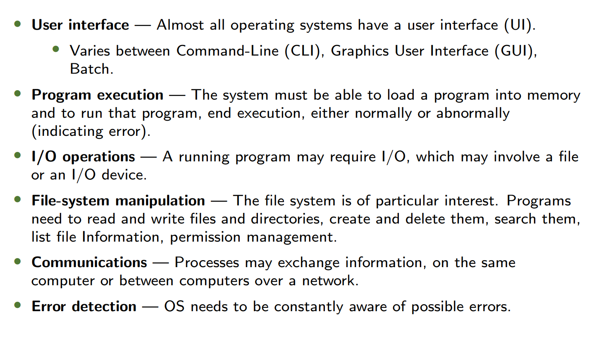
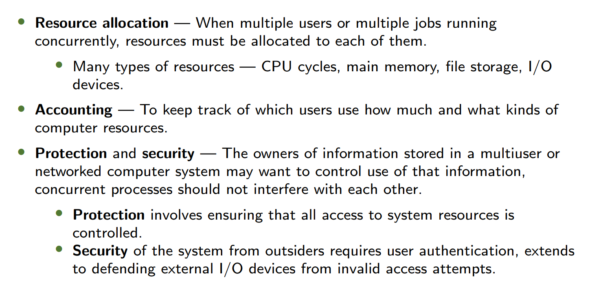
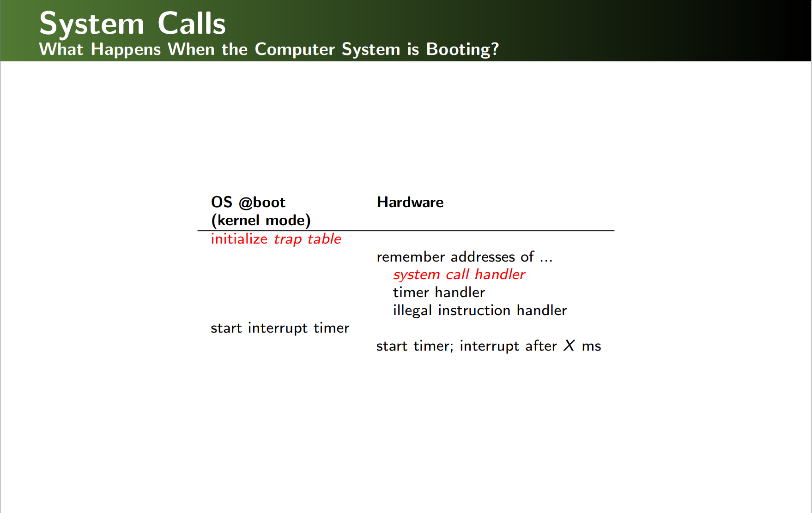
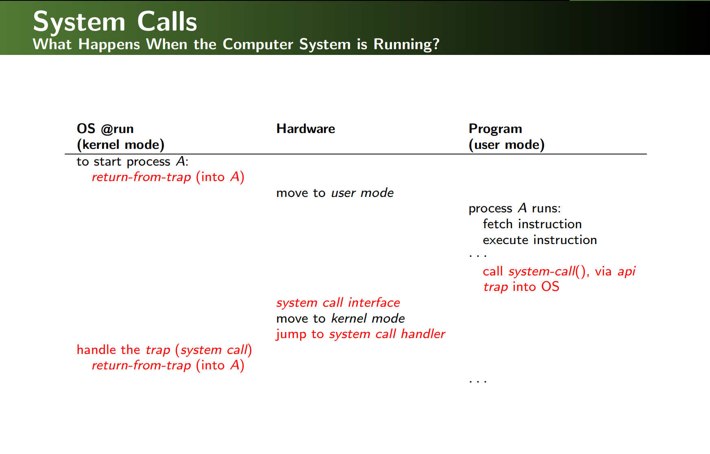
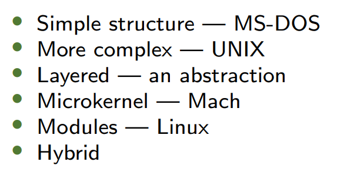
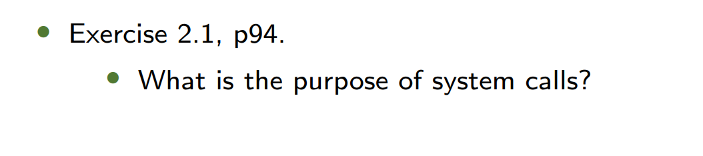

---
## 1. Warm-up: OS Evolution 操作系统发展史  
### Generations of OS 历代操作系统  
| **Generation** 代次 | **Technology** 技术          | **Key Features** 关键特性                                    |
| ------------------- | ---------------------------- | ------------------------------------------------------------ |
| **1st (1945-1955)** | Vacuum Tubes 电子管          | - Libraries of functions (函数库)  - Human-operated batch systems (人工批处理系统) |
| **2nd (1955-1965)** | Transistors 晶体管           | - Dual-mode protection (双模式保护)  - System calls introduced (引入系统调用) |
| **3rd (1965-1980)** | Integrated Circuits 集成电路 | - Multiprogramming (多道程序设计)  - Long-term scheduling (长期调度) |
| **4th (1980-now)**  | LSI/VLSI 大规模集成电路      | - Timesharing (分时系统)  - GUI, personal computing (图形界面与个人计算) |

**Key Transition**: From hardware-centric to user-centric design.  
**关键转变**：从以硬件为中心到以用户为中心的设计。  

---
## 2. Operating System Services 操作系统服务
### User-Centric Services 面向用户的服务  

### System-Centric Services 面向系统的服务  

---
## 3. User Operating System Interface 用户接口  
### Types of Interfaces 接口类型  
| **Type** 类型        | **Description** 描述              | **Examples** 示例                |
| ------------------ | ------------------------------- | ------------------------------ |
| **CLI** 命令行        | Text-based commands (基于文本的命令)   | Linux shell, Windows CMD       |
| **GUI** 图形界面       | Visual icons/windows (可视化图标与窗口) | Windows Explorer, macOS Finder |
| **Touchscreen** 触屏 | Gesture-based input (基于手势的输入)   | iOS, Android                   |

**CLI vs. GUI**:  
- CLI offers finer control (e.g., scripting).  
- GUI prioritizes usability (e.g., drag-and-drop).  
**CLI vs. GUI**：CLI提供更精细控制（如脚本），GUI侧重易用性（如拖拽操作）。  

---

## 4. System Calls 系统调用  
### Implementation 实现机制  
- **APIs** (e.g., POSIX, Win32) abstract system calls for portability.  
  - **API**（如POSIX、Win32）抽象系统调用以提高可移植性。  
- **Parameter Passing** 参数传递方法：  
  1. **Registers** 寄存器传递 (Fast but limited).  
  2. **Memory Block** 内存块传递 (Linux/Solaris).  
  3. **Stack** 栈传递 (Flexible for complex calls).  

### Execution Flow 执行流程  
1. **Trap** to kernel mode (陷入内核态).  
2. **Handler** executes via trap table (通过中断向量表执行处理程序).  
3. **Return** to user mode with results (返回用户态并带回结果).  

**Example**: `open()` system call for file access.  
**示例**：文件访问的`open()`系统调用。  

---

## 5. Types of System Calls 系统调用类型  
| **Category** 类别                  | **Functions** 功能                                                                        |
| -------------------------------- | --------------------------------------------------------------------------------------- |
| **Process Control** 进程控制         | `fork()`, `exit()`, `wait()` (创建/终止进程，进程同步).                                            |
| **File Management** 文件管理         | `open()`, `read()`, `write()` (文件操作).                                                   |
| **Device Management** 设备管理       | `ioctl()`, `read()` (设备控制与数据读写).                                                        |
| **Communication** 通信             | `pipe()`, `shmget()` (进程间通信).                                                           |
| **Information maintenance** 信息维护 | get/set time or date...                                                                 |
| **Protection** 保护                | control access to resources get and set permissions allow and deny user access... |

---
## 6. OS Structure 操作系统结构  
### Design Approaches 设计方法  
| **Model** 模型        | **Pros** 优点                                                  | **Cons** 缺点                         |
| ------------------- | ------------------------------------------------------------ | ----------------------------------- |
| **Monolithic** 单体结构 | High performance (e.g., Linux) 高性能                           | Difficult to debug/modify 难以调试/修改   |
| **Microkernel** 微内核 | Secure/portable (e.g., Mach) 安全/可移植                          | Slower due to message passing 消息传递慢 |
| **Hybrid** 混合结构     | Balances performance/flexibility (e.g., Windows NT) 平衡性能与灵活性 | Complex design 设计复杂                 |

---
## 7. Key Concepts 核心概念  
### Policy vs. Mechanism 策略与机制  
- **Mechanism** (How): E.g., timer interrupt implementation.  
  - **机制**（如何做）：如定时器中断的实现。  
- **Policy** (What): E.g., CPU scheduling algorithm (FIFO vs. Round-Robin).  
  - **策略**（做什么）：如CPU调度算法（FIFO vs. 轮询）.  

**Separation Benefit**: Policies can change without modifying mechanisms.  
**分离优势**：策略变更无需修改机制代码。

---
## 8. After Class Exercise 课后练习  
