---

## 目录 / Contents
1. Warm-up 热身练习 
2. Process Concept 进程概念 
3. Process Scheduling 进程调度 
4. Operations on Processes 进程操作 
5. Interprocess Communication 进程间通信 
6. Client-Server Communication 客户端-服务器通信
---
## 1. Warm-up  
### CPU虚拟化示例 / CPU Virtualization Example  
- **代码分析 / Code Analysis**  
  
  ```c
  /* cpu.c */
  int main(int argc, char *argv[]) {
      while (1) {
          spin(1);  // 模拟CPU占用 / Simulate CPU usage
          printf("%s\n", argv[1]); // 打印传入参数 / Print input argument
      }
  }
  ```
- **执行结果 / Execution Results**  
  - **单进程运行 / Single Process**: 连续输出 `A`  
  - **多进程并发运行 / Multiple Processes (`A & B & C & D`)**: 输出顺序随机（如 `A, B, D, C...`），体现CPU时间片轮转 / Output order is random, demonstrating CPU time-sharing.  

### 关键问题 / Key Questions  
- **如何实现CPU虚拟化？ / How to virtualize the CPU?**  
  - **机制 / Mechanism**: 上下文切换（保存/恢复进程状态） / Context switch (save/restore process state).  
  - **策略 / Policy**: 调度算法（决定下一个运行的进程） / Scheduling algorithm (decides the next process to run).  

---
## Process Concept  
### 进程 vs. 程序 / Process vs. Program  
- **程序 / Program**: 被动的磁盘实体（可执行文件） / Passive entity on disk (executable file).  
- **进程 / Process**: 活动的内存实体（程序加载后） / Active entity in memory (loaded program).  
  - 一个程序可对应多个进程（如多用户运行同一程序） / One program can be multiple processes (e.g., multiple users running the same program).  
- 进程包括当前活动：Current activity including program counter, processor registers

### 进程内存布局 / Process Memory Layout 
 **不是进程组成成分**

| Section:     | Description:                                     |
| ------------ | ------------------------------------------------ |
| **Text 文本段** | 程序代码 / Program code                              |
| **Data 数据段** | 全局变量 / Global variables                          |
| **Heap 堆段**  | 动态分配的内存 / Dynamically allocated memory           |
| **Stack 栈段** | 局部变量、函数参数 / Local variables, function parameters |

### 进程状态 / Process States  
- **New 新建**: 创建中 / Being created.  
- **Ready 就绪**: 等待分配CPU / Waiting to be assigned to CPU.  
- **Running 运行**: 执行中 / Executing.  
- **Waiting 等待**: 等待事件（如I/O） / Waiting for an event (e.g., I/O).  
- **Terminated 种植**: 已结束 / Finished.  
- 此外还有**Zombee 僵尸进程**等

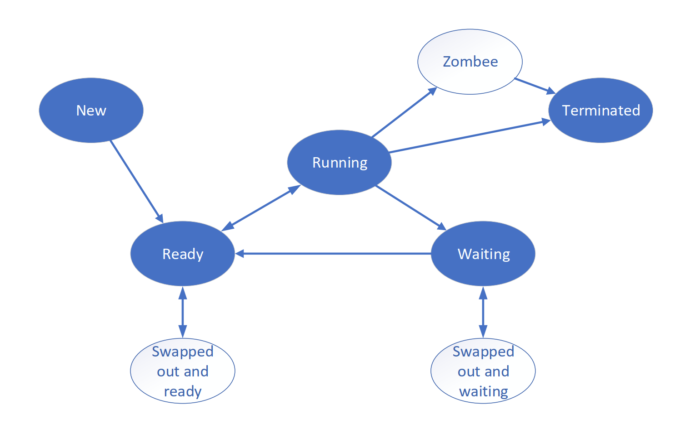  

### 进程控制块（PCB） / Process Control Block (PCB)  
- 存储进程状态的核心数据结构 / Core data structure storing process state. 
- **xv6 PCB示例 / Example (xv6)**:  
  ```c
  struct proc {
      int pid;                // 进程ID / Process ID
      enum proc_state state;   // 状态 / State
      struct context context;  // 寄存器上下文 / Register context
      // ...其他字段 / Other fields
  };
  ```

### Process Execution : Protection
- How can the OS make sure the program doesn’t do anything that we don’t want it to do?
	- Protection via dual mode and system call.

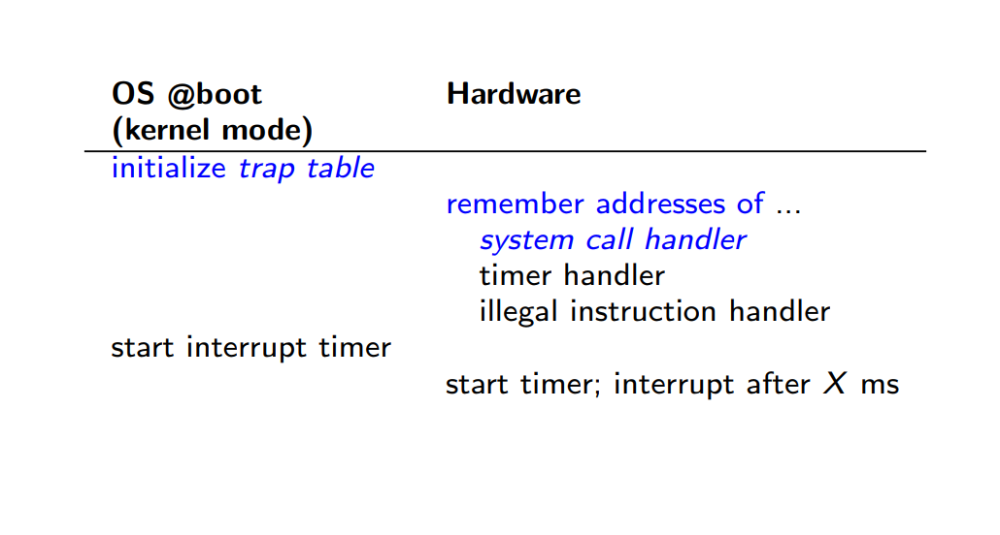

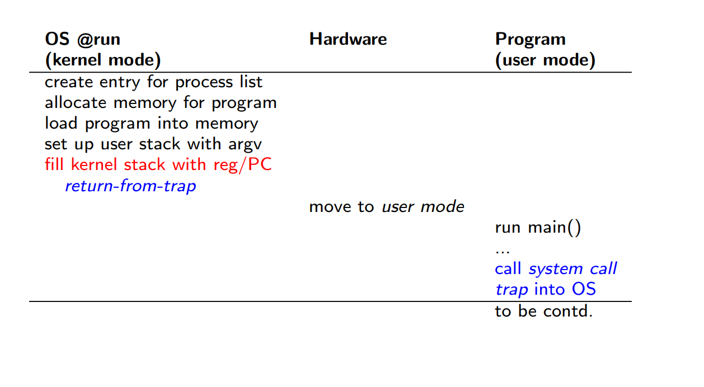

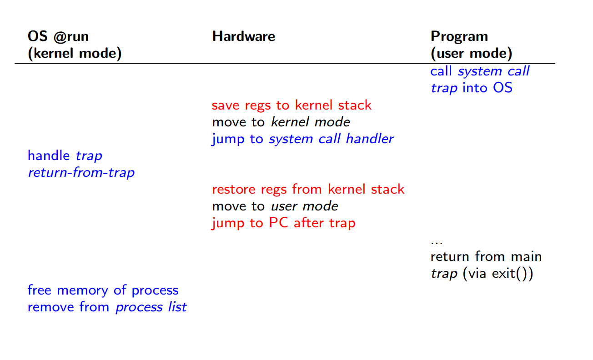

### Process Execution : Time Sharing
- How does the operating system stop it from running and switch to another
  process?
- Time sharing via context switch.

#### Context Switch 上下文切换: Saving and Restoring context
切换CPU核到另一个进程需要保存当前进程到状态并恢复另一个进程的状态
保存在PCB中


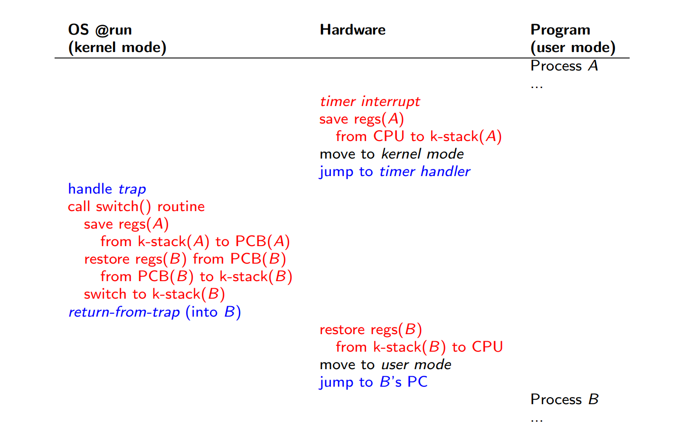

---
## Process Scheduling  
### 调度队列 / Scheduling Queues  
- **Job Queue**: 所有进程 / All processes
- **Ready Queue**: 就绪进程 / Processes in ready state
- **Device Queue**: 等待I/O的进程 / Processes in waiting state
- Processes migrate among the various queues
### 调度器类型 / Scheduler Types  

| Scheduler Type                           | Description                                                                                                                                                                                           | 中文解释                                                                       |
| ---------------------------------------- | ----------------------------------------------------------------------------------------------------------------------------------------------------------------------------------------------------- | -------------------------------------------------------------------------- |
| **Long-term scheduler (Job scheduler)**  | Controls the number of processes in memory (degree of multiprogramming). Selects **which jobs** from the job pool are loaded into the **ready queue**. Runs infrequently (seconds/minutes).           | **长期调度器（作业调度器）**：控制内存中的进程数量（多道程序度），**决定哪些作业**从作业池调入**就绪队列**。运行频率较低（秒/分钟级）。 |
| **Short-term scheduler (CPU scheduler)** | Selects the next process **from the ready queue to execute** on the CPU. Runs very frequently (milliseconds).                                                                                         | **短期调度器（CPU调度器）**：**从就绪队列中选择下一个要执行**的进程，分配CPU。运行频率极高（毫秒级）。                 |
| **Medium-term scheduler**                | Handles swapping (moving processes between memory and disk). Temporarily removes inactive or blocked processes to free memory (suspend/resume). Balances load between long and short-term scheduling. | **中期调度器**：负责交换（内存与磁盘间的进程移动），挂起不活跃或阻塞的进程以释放内存，平衡长/短期调度器的负载。                 |
注意：Long-term scheduler 本身并不把进程放入Ready Queue

| 调度器/Scheduler                            | 描述 / Description                                                             | 调用频率 / Frequency       |
| ---------------------------------------- | ---------------------------------------------------------------------------- | ---------------------- |
| **Long-term scheduler (job scheduler)**  | 控制多道程序度 / Controls degree of multiprogramming                                | 低（分钟级） / Low (minutes) |
| **Short-term scheduler (CPU scheduler)** | 选择下一个执行的进程 / selects which process should be executed next and allocates CPU | 高（毫秒级） / High (ms)     |
| **Medium-term scheduler**                | 交换（Swapping） / Swapping                                                      | 中 / Medium             |

### 进程类型 / Process Types  
- **I/O-bound process**: spends more time doing I/O than computations, many short CPU bursts
- **CPU-bound process**: spends more time doing computations; few very long CPU bursts
---
## Operations on Processes  
### 进程创建 / Process Creation  

- **Parent** process creates **children** processes, which, in turn create other processes, forming a **tree** of processes
- Generally, process identified and managed via a **process identifier (pid)**
- Resource sharing options
  - Parent and children share all resources
  - Children share subset of parent’s resources
  - Parent and child share no resources
- Execution options
  - Parent and children execute concurrently
  - Parent waits until children terminate
- Address space
  - Child duplicate of parent
  - Child has a program loaded into it

- **`fork()`**: 创建子进程（复制父进程） / Creates child process.  
- **`exec()`**: 替换进程内存空间 / Replaces process memory space.  

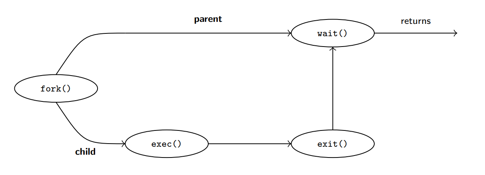

- **示例 / Example**:  

  ```c
  pid_t pid = fork();
  if (pid == 0) { 
      execlp("/bin/ls", "ls", NULL);  // 子进程执行ls / Child runs ls
  } else {
      wait(NULL);  // 父进程等待 / Parent waits
  }
  ```

### 进程终止 / Process Termination  
- Process executes the last statement and then asks the operating system to delete it using the `exit()` system call.
  - Returns status data from child to parent (via` wait()`)
  - Process’ resources are deallocated by operating system

- Parent may terminate the execution of children processes using the abort() system call. Some reasons for doing so:
  - Child has exceeded allocated resources
  - Task assigned to child is no longer required
  - The parent is exiting and the operating systems does not allow a child to continue if its parent terminates

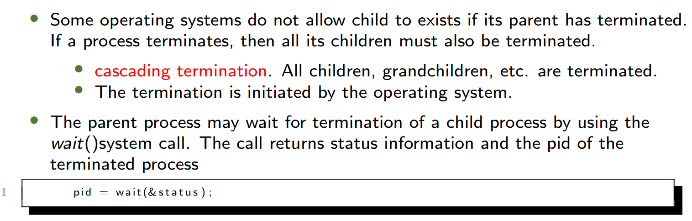

- **进程终止的类型**

  - **正常终止 / Normal**: `exit()` 返回状态给父进程 / Returns status to parent.  

  - **异常终止 / Abnormal**: `abort()` 由父进程终止子进程 / Parent terminates child.  

  - **僵尸进程 / Zombie**: 子进程终止但父进程未调用 `wait()` / Child terminated but parent did not call `wait()`.  

  - **孤儿进程 / Orphan**: 父进程终止后未调用`wait()`，子进程由init接管 / Child adopted by init after parent terminates without invoking `wait()`.  


#### 课堂练习

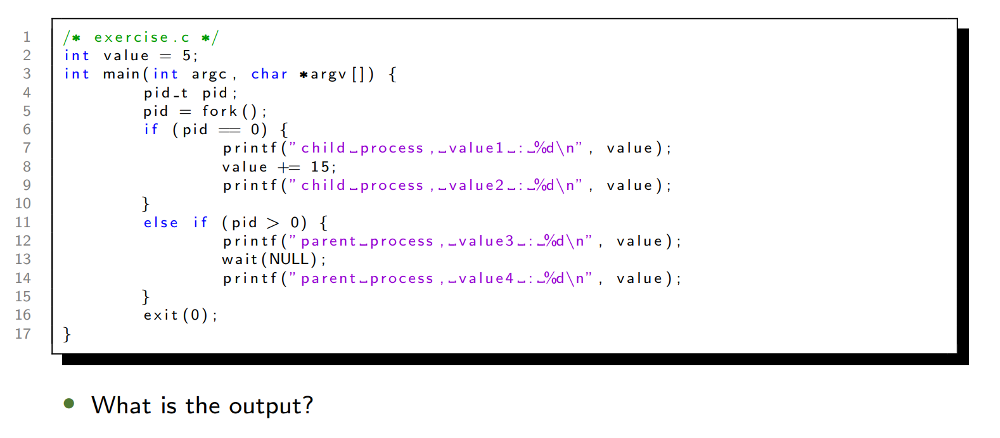
**Answer**
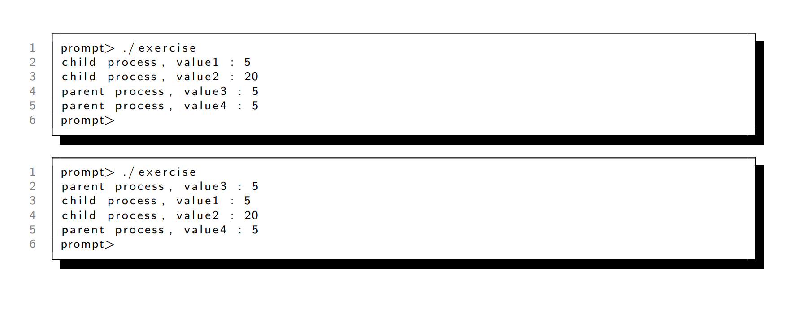

---
## Interprocess Communication (IPC)  
### 共享内存 vs. 消息传递 / Shared Memory vs. Message Passing  

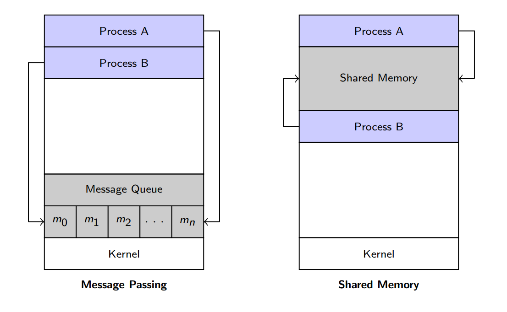

- In the **message-passing** model, communication takes place by means of messages exchanged between the cooperating processes.
- In the **shared-memory** model, a region of memory that is shared by cooperating processes is established. Processes can then exchange information by reading and writing data to the shared region.

| **共享内存 / Shared Memory**          | **消息传递 / Message Passing**              |
| --------------------------------- | --------------------------------------- |
| 高速（直接访问内存） / Fast (direct access) | 适用于分布式系统 / Works in distributed systems |
| 需同步机制 / Requires synchronization  | 内核介入较慢 / Slower (kernel involved)       |

### 生产者-消费者问题 / Producer-Consumer Problem  

- **共享内存方案 / Shared Memory Solution**:  
  
  ```c
  /* Solution is correct, but can only use BUFFER_SIZE - 1 elements */
  #define BUFFER_SIZE 10
  typedef struct {...} item;
  item buffer[BUFFER_SIZE];
  int in = 0;
  int out = 0;
  ```
  ```c
  /* producer */
  item next_produced;
  while (true) {
      while (((in + 1) % BUFFER_SIZE) == out);
      buffer[in] = next_produced;
      in = (in + 1) % BUFFER_SIZE;
  }
  ```
  ```c
  /* consumer */
  item next_consumed;
  while (true) {
      while (in == out);
      next_consumed = buffer[out];
      out = (out + 1) % BUFFER_SIZE;
  }
  ```

### Message Passing

- IPC facility provides two operations:
  - `send(message)`
  - `receive(message)`
- **Naming**

  - **直接通信 / Direct**: 进程显式命名对方 / Explicit naming
    - Symmetric addressing: both the sender process and the receiver process must name the other to communicate.
      - `send(P, message)`: Send a message to process P
      - `receive(Q, message)`: Receive a message from process Q

    - Asymmetric addressing: only the sender names the recipient; the recipient is not required to name the sender.
      - `send(P, message`): Send a message to process P
      - `receive(id, message)`: Receive a message from any process

  - **间接通信 / Indirect**: 通过邮箱或端口 / Via mailboxes
    - A mailbox can be viewed abstractly as an object into which messages can be placed by processes and from which messages can be removed.
      - `send(A, message)`: Send a message to mailbox A
      - `receive(A, message)`: Receive a message from mailbox A
- **Synchronization**

  - Message passing may be either blocking or non-blocking

  - **阻塞发送/接收 / Blocking**: 发送方或接收方等待 / Sender/receiver waits.  
    - **Blocking send**: the sender is blocked until the message is received
    - **Blocking receive**: the receiver is blocked until a message is available

  - **非阻塞 / Non-blocking**: 立即返回 / Returns immediately.  
    - **Non-blocking send**: the sender sends the message and continue
    - **Non-blocking receive**: the receiver receives: A valid message, or Null message

### 生产者-消费者问题 / Producer-Consumer Problem  

- **消息传递方案 / Message Passing Solution ** 
```c
  /* producer */
  message next_produced;
  while (true) {
      /* produce an item in next_produced */
      send(next_produced);
  }
  ```
  ```c
  /* consumer */
  item next_consumed;
  while (true) {
      receive(next_consumed);
      /* consume the item in next_consumed */
  }
  ```

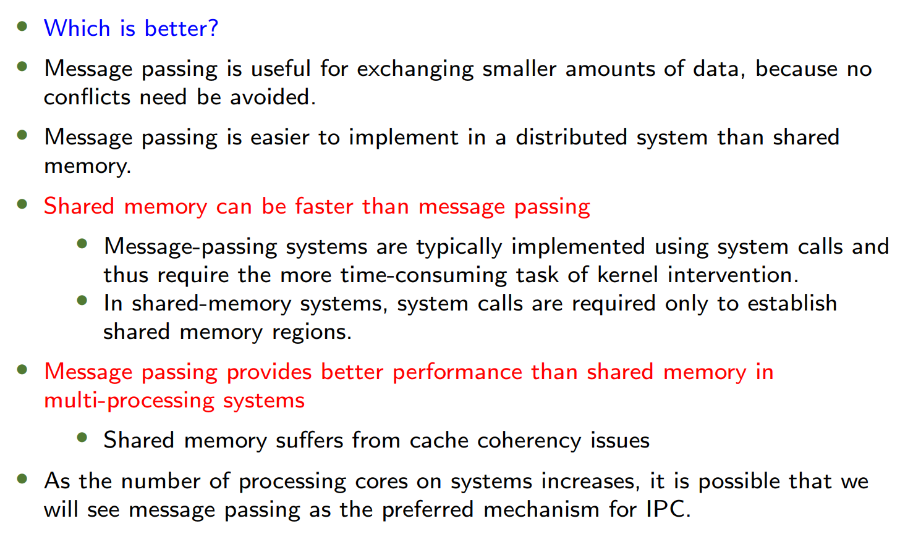

---

## Client-Server Communication  
### 套接字（Sockets） / Sockets  
- 端点：IP地址 + 端口 / Endpoint: IP address + port (e.g., `161.25.19.8:1625`).  
- **Loopback**: `127.0.0.1` 表示本机 / Refers to localhost.  

### 远程过程调用（RPC） / Remote Procedure Calls (RPC)  
- **存根（Stub）**: 客户端代理，封装参数 / Client-side proxy marshals parameters.  

### 管道（Pipes） / Pipes  
- **普通管道 / Ordinary**: 仅限父子进程 / Parent-child only.  
- **命名管道 / Named**: 允许无关进程通信 / Unrelated processes can communicate.  

---

## 练习 / Exercises  
### 问题1 / Problem 1  
```c
for (i = 0; i < 4; i++) fork();  // How many processes?
```
**Answer:**

首先，我们需要理解 `fork()` 系统调用的基本行为。`fork()` 用于创建一个新的进程，这个新进程是调用进程（父进程）的一个副本。调用 `fork()` 后，会创建一个子进程，子进程从 `fork()` 返回的地方开始执行。`fork()` 在父进程中返回子进程的进程 ID，在子进程中返回 0。如果 `fork()` 失败，则返回 -1。
 `fork()` 会被调用 4 次（i = 0, 1, 2, 3）。关键在于每次 `fork()` 调用都会复制当前的进程，包括其当前的执行状态（即循环的进度）。
 
**进程创建的模式**
为了更好地理解，让我们一步步看看每次 `fork()` 调用时会发生什么。
1. **初始状态 (i = 0):**
   - 只有一个进程，称之为 P0。
   - P0 执行 `fork()`，创建 P1。
   - 现在有两个进程：P0 和 P1。
   - 两个进程都将继续执行下一次循环（i = 1）。
1. **i = 1:**
   - P0 和 P1 各自执行 `fork()`。
     - P0 创建 P2。
     - P1 创建 P3。
   - 现在有四个进程：P0, P1, P2, P3。
   - 所有四个进程都将继续执行下一次循环（i = 2）。
1. **i = 2:**
   - P0, P1, P2, P3 各自执行 `fork()`。
     - P0 创建 P4。
     - P1 创建 P5。
     - P2 创建 P6。
     - P3 创建 P7。
   - 现在有八个进程：P0 到 P7。
   - 所有八个进程都将继续执行下一次循环（i = 3）。
1. **i = 3:**
   - P0 到 P7 各自执行 `fork()`。
     - P0 创建 P8。
     - P1 创建 P9。
     - ...
     - P7 创建 P15。
   - 现在有十六个进程：P0 到 P15。
   - 循环结束（i = 4 不满足条件），所有进程退出循环。
**进程数量的增长**
从上面的步骤可以看出，每次 `fork()` 调用都会使当前的进程数量翻倍。具体来说：
- 初始：1 个进程（P0）。
- 第一次 `fork()` (i=0): 1 -> 2 个进程。
- 第二次 `fork()` (i=1): 2 -> 4 个进程。
- 第三次 `fork()` (i=2): 4 -> 8 个进程。
- 第四次 `fork()` (i=3): 8 -> 16 个进程。
因此，经过 4 次 `fork()` 调用后，总共有 16 个进程。

**原始进程与新创建进程**
需要注意的是，这 16 个进程中包括最初的父进程（P0）和它创建的所有子进程。每次 `fork()` 都是在当前所有存在的进程中进行的，因此进程数量呈指数增长。
数学上，如果有 n 次 `fork()` 调用，且每次都在所有当前进程中调用 `fork()`，那么最终的进程总数是 2^n。在这里，n = 4，所以 2^4 = 16。

**数学表达**
更一般地，对于 `for (i = 0; i < n; i++) fork();`：
- 每次迭代 i，进程数量乘以 2。
- 因此，总进程数为 2^n。
- 新创建的进程数为 2^n - 1。
### 问题2 / Problem 2  
**Draw process state diagram**  

**答案 / Answer**:

