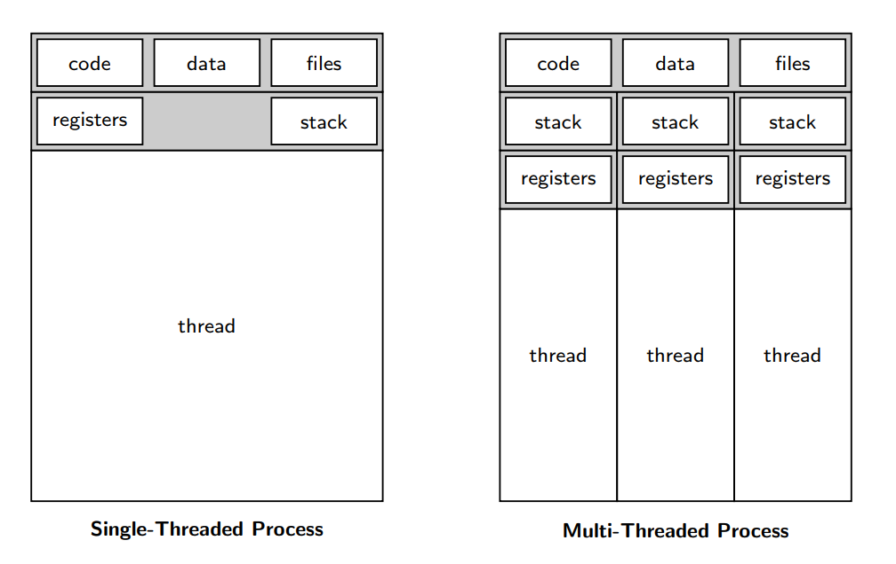
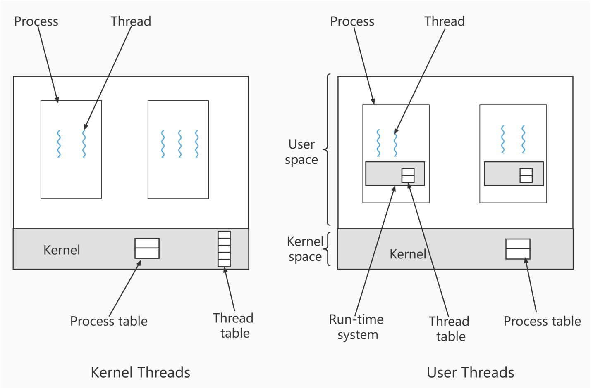
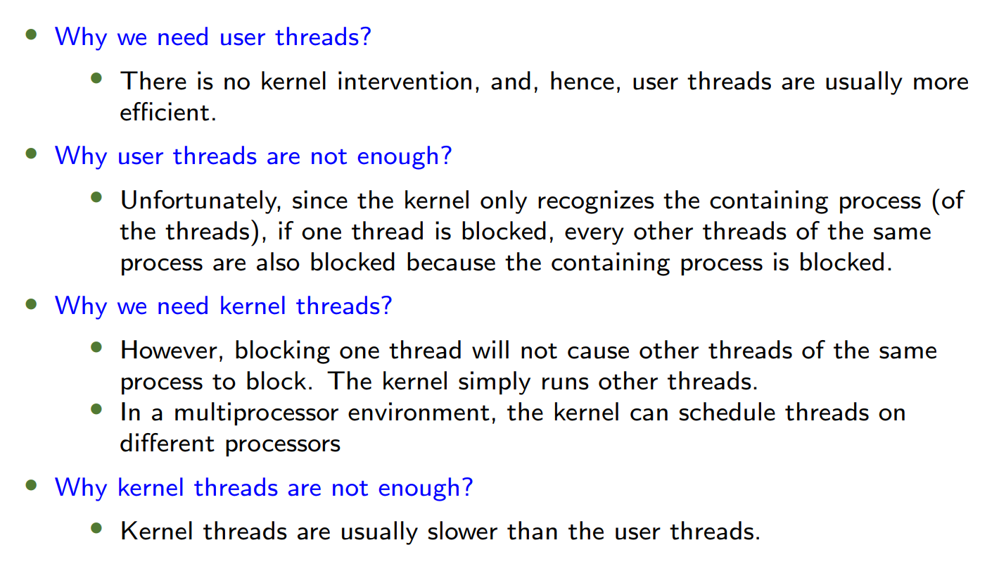
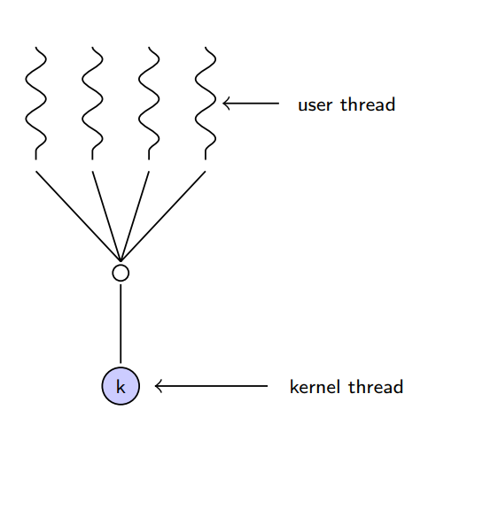
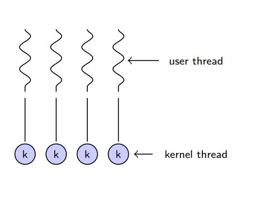
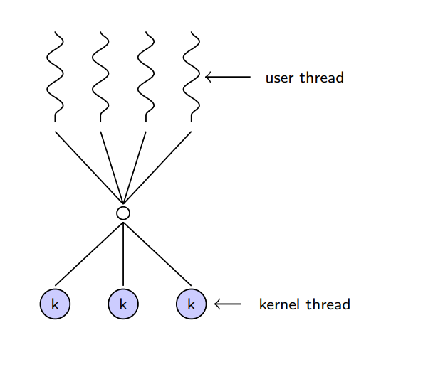
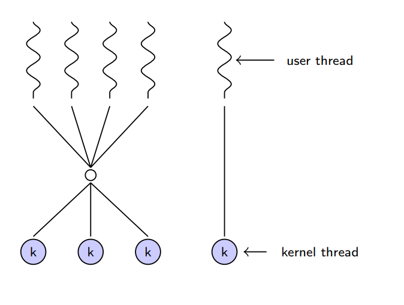
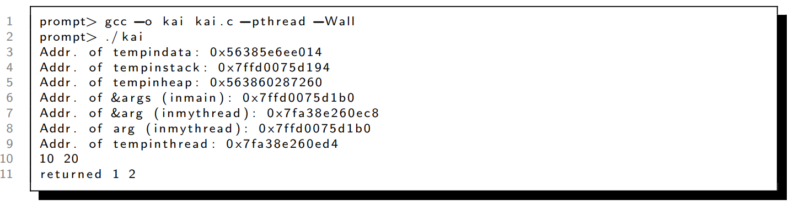
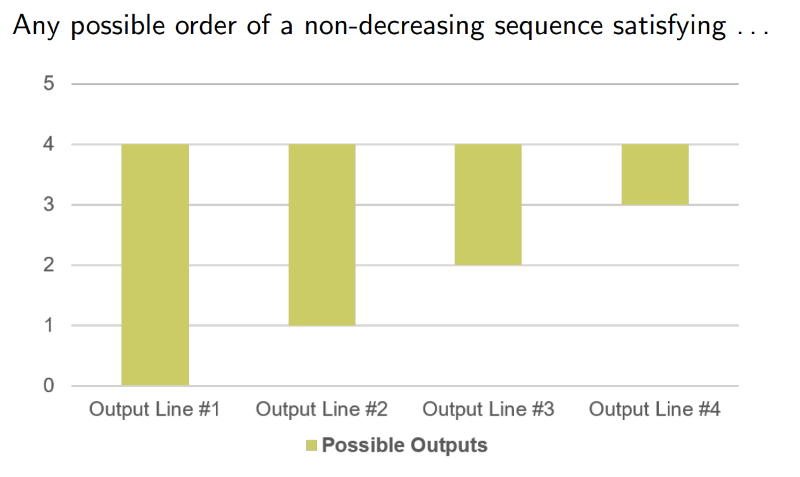
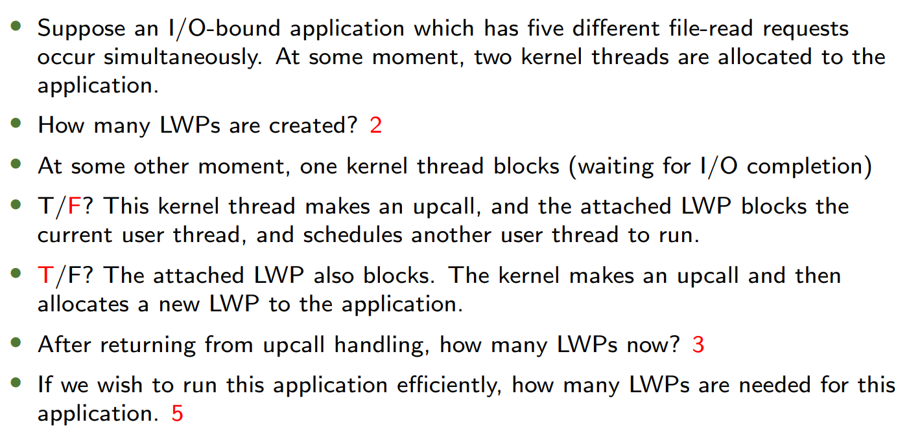

---
## 目录 (Contents)
1. Warm-up​
2. Overview​
3. Multicore Programming​
4. Multithreading Models​
5. Thread Libraries
6. Implicit Threading​
7. Threading Issues
---
## 1. Warm-up
### 线程抽象的必要性 (Why Threads?)
- **Motivation**:  
  - 程序可能需要多个执行点（如多个程序计数器PC）。  
  - **Example 1**: 加速大型数组相加。  
  - **Example 2**: 部分任务需等待输入时，其他任务可继续执行。  
- **Threads vs Processes**:  
  - 线程更轻量，共享同一进程的资源（如内存、文件），创建和切换开销更低。  
### 核心问题 (Key Questions)
- 为什么需要线程而非多进程？  
  - 线程共享进程资源，通信成本低；进程独立，切换开销大。  
---
## 2. Overview

| **对比维度**    | **进程 (Process)**                    | **线程 (Thread)**                           |
| ----------- | ----------------------------------- | ----------------------------------------- |
| **定义**      | 操作系统资源分配的基本单位，拥有独立的内存空间             | 进程内的执行单元，共享进程资源（内存、文件等）                   |
| **独立性**     | 完全隔离，一个进程崩溃不影响其他进程                  | 共享进程内存，线程崩溃可能导致整个进程崩溃                     |
| **资源开销**    | 高（独立内存、文件描述符等）                      | 低（共享进程资源，仅需独立栈和寄存器）                       |
| **创建/切换成本** | 高（需操作系统介入，上下文切换复杂）                  | 低（用户态可调度，上下文切换快）                          |
| **通信方式**    | 进程间通信（IPC）：管道、消息队列、共享内存、Socket 等    | 直接读写共享内存（需同步机制如互斥锁、信号量）                   |
| **并发性**     | 多进程可并行运行（利用多核 CPU）                  | 多线程可并发执行（单核 CPU 通过时间片切换，多核可真正并行）          |
| **典型应用场景**  | 需要高稳定性/隔离性的任务（如浏览器多标签页、QQ 主程序与安全模块） | 需要高效协作的任务（如聊天软件的消息处理、UI 渲染与网络请求分离）        |
| **系统管理**    | 由操作系统直接调度                           | 由进程内的线程库（如 pthread）管理，操作系统感知为“轻量级进程”（LWP） |
| **示例**      | 同时运行的 QQ 和 Chrome 是两个独立进程           | QQ 主进程内的消息收发线程和文件传输线程                     |

### 多线程应用场景 (Multithreading Applications)
- **Examples**:  
  - 文字处理器：同时处理显示更新、数据获取、拼写检查。  
  - 多线程RPC服务器：并发处理请求。  
  - 操作系统内核：多线程设计提高效率。  
### 单线程 vs 多线程进程 (Single vs Multi-threaded Processes)
- **Single-threaded**:  
  - 包含代码、数据、文件和单一线程（寄存器+栈）。  
- **Multi-threaded**:  
  - 同一进程内多个线程共享代码、数据、文件，但各有独立的寄存器和栈。
  - **code, data, files: 共享；registers, stack: 独享**


### 多线程优势 (Benefits)
| **Advantage**        | **Description**                                                                                                                     |
| -------------------- | ----------------------------------------------------------------------------------------------------------------------------------- |
| **Responsiveness**   | 部分线程阻塞时，其他线程仍可运行（如UI线程）。<br />may allow continued execution if part of process is blocked, especially important for user interfaces |
| **Resource Sharing** | 线程共享进程资源，无需IPC（共享内存/消息传递）。<br />threads share resources of process, easier than shared memory or message passing                    |
| **Economy**          | 创建线程比进程更快，上下文切换开销更低。<br />cheaper than process creation, thread switching lower overhead than context switching                     |
| **Scalability**      | 多核架构下，线程可并行执行。<br />process can take advantage of multiprocessor architectures                                                      |

### 多线程分类 (Multithreading Models)
- **四种模式**:  
  1. 单进程单线程（如MS-DOS）。  
  2. 单进程多线程（如Java运行时环境）。  
  3. 多进程单线程（传统UNIX）。  
  4. 多进程多线程（现代OS主流）。  

---
## 3. Multicore Programming
### 并行 Parallelism 与并发 Concurrency
- **Concurrency**: 单核上通过调度实现多任务“同时”推进（时间片轮转）。  
- **Parallelism**: 多核上真正同时执行多任务。  

### 并行类型 (Types of Parallelism)
- **Data Parallelism**: 数据分片，各核心对不同数据执行相同操作。 distributes subsets of the same data across multiple cores, same operation on each
- **Task Parallelism**: 不同线程执行不同任务。  distributing threads across cores, each thread performing unique operation

### Amdahl's Law (阿姆达尔定律)
- Identifies performance gains from adding additional cores to an application that has both serial and parallel components
- 对于既有串行也有并行组件的应用程序，该公式确定由于计算核的增加而得到的性能改进。

- **公式**:  
  $$
  \text{speedup} \leq \frac{1}{S + \frac{(1-S)}{N}}
  $$
  - $S$ : 串行部分比例，$N$: 核心数。
- **关键结论**:  
  - 串行部分限制多核加速潜力（如25%串行 → 最大加速比4倍）。  
  - Serial portion of an application has disproportionate effect on performance gained by adding additional cores
  - 应用程序的串行部分对通过增加额外内核所获得的性能提升有着不成比例的影响。
---
## 4. Multithreading Models
### 用户线程 vs 内核线程 (User vs Kernel Threads)
| **Type**           | **Managed By**    | **Pros**          | **Cons**         |
| ------------------ | ----------------- | ----------------- | ---------------- |
| **User Threads**   | 用户态线程库（如Pthreads） | 无内核干预，高效。         | 一个线程阻塞会导致整个进程阻塞。 |
| **Kernel Threads** | 操作系统内核            | 阻塞线程不影响其他线程；支持多核。 | 创建和切换开销较大。       |




### 多线程模型 (Threading Models)
1. **Many-to-One**:  
   - 多用户线程映射到单内核线程（已淘汰）。  
   - 
1. **One-to-One**:  
   - 每个用户线程对应一个内核线程（如Windows/Linux的NPTL）。
   - 
3. **Many-to-Many**:  
   - 动态映射用户线程到内核线程（平衡并发与效率）。  
   - 
4. **Two-Level Model**:  
   - 类似M:M，但允许绑定部分用户线程到内核线程。 
   - 

---
## 5. Thread Libraries
### 主流线程库 (Thread Libraries)
- **Pthreads**: POSIX标准，跨平台（用户/内核态实现）。  
**1. `pthread_create` - 创建线程**
```c
int pthread_create(
    pthread_t *thread,          // 线程标识符指针
    const pthread_attr_t *attr, // 线程属性（可NULL）
    void *(*start_routine)(void *), // 线程入口函数
    void *arg                  // 传递给入口函数的参数
);
```
#### **参数说明：**
| 参数                  | 类型                       | 说明                                                |
| ------------------- | ------------------------ | ------------------------------------------------- |
| **`thread`**        | `pthread_t *`            | 输出参数，返回新线程的标识符（用于后续操作如`pthread_join`）。            |
| **`attr`**          | `const pthread_attr_t *` | 线程属性（栈大小、调度策略等），通常传`NULL`表示默认属性。                  |
| **`start_routine`** | `void *(*)(void *)`      | 线程入口函数指针，函数格式必须为`void* func(void* args)`。         |
| **`arg`**           | `void *`                 | 传递给`start_routine`的参数（需强制转换为`void*`，在线程内再转回实际类型）。 |

#### **返回值：**
- 成功返回 `0`，失败返回错误码（非`errno`，需用`strerror`解析）。
### **2. `pthread_join` - 等待线程结束**
```c
int pthread_join(
    pthread_t thread,     // 要等待的线程标识符
    void **value_ptr      // 接收线程返回值（可NULL）
);
```

#### **参数说明：**
| 参数              | 类型          | 说明                               |
| --------------- | ----------- | -------------------------------- |
| **`thread`**    | `pthread_t` | 要等待的线程标识符（由`pthread_create`返回）。  |
| **`value_ptr`** | `void **`   | 输出参数，接收线程入口函数的返回值（若不需要可传`NULL`）。 |
注意：void\* ret == \*value_ptr的指向会被pthread改变
#### **返回值：**
- 成功返回 `0`，失败返回错误码。

 **示例：**
```c
void* thread_task(void *arg) {
    int *result = malloc(sizeof(int));
    *result = 42;
    return (void *)result; // 返回动态分配的内存
}

int main() {
    pthread_t tid;
    pthread_create(&tid, NULL, thread_task, NULL);

    void *ret_val;
    pthread_join(tid, &ret_val); // 等待线程并获取返回值
    printf("Thread returned: %d\n", *(int *)ret_val);
    free(ret_val); // 释放线程返回的内存
    return 0;
}
```
  
  示例1

  ```c
  #include <pthread.h>
  
  typedef struct myarg_t {
      int a;
      int b;
  } myarg_t;
  
  void *mythread(void *arg) {
      myarg_t *m = (myarg_t *) arg;
      printf("%d %d\n", m->a, m->b);
      return NULL;
  }
  
  int main(int argc, char *argv[]) {
      pthread_t p;
      int rc;
      myarg_t args;
      args.a = 10;
      args.b = 20;
      rc = pthread_create(&p, NULL, mythread, &args);
      // ... (rest of the code, e.g., pthread_join)
  }
  ```

  示例2

  ```c
  #include <stdio.h>
  #include <pthread.h>
  #include <assert.h>
  #include <stdlib.h>
  
  int tempindata = 0;
  
  typedef struct myarg_t {
      int a, b;
  } myarg_t;
  
  typedef struct myrett_t {
      int x, y;
  } myrett_t;
  
  void *mythread(void *arg) {
      printf("Addr. of &arg (in mythread): %p\n", &arg);
      printf("Addr. of arg (in mythread): %p\n", arg);
      int tempinthread = 0;
      printf("Addr. of tempinthread: %p\n", &tempinthread);
      
      myarg_t *m = (myarg_t *) arg;
      printf("%d %d\n", m->a, m->b);
      
      myrett_t *r = (myrett_t *) malloc(sizeof(myrett_t));
      r->x = 1;
      r->y = 2;
      return (void *) r;
  }
  
  int main(int argc, char *argv[]) {
      int tempinstack = 0;
      int *tempinheap = (int *) malloc(sizeof(int));
      *tempinheap = 0;
      
      printf("Addr. of tempindata: %p\n", &tempindata);
      printf("Addr. of tempinstack: %p\n", &tempinstack);
      printf("Addr. of tempinheap: %p\n", tempinheap);
      
      pthread_t p;
      myrett_t *m;
      myarg_t args;
      args.a = 10;
      args.b = 20;
      printf("Addr. of &args (in main): %p\n", &args);
      
      pthread_create(&p, NULL, mythread, &args);
      pthread_join(p, (void **) &m);
      
      printf("returned %d %d\n", m->x, m->y);
      free(m);
      free(tempinheap);
      return 0;
  }
  ```

​	输出：



- **Windows Threads**: 内核级API。  

  ```c
  CreateThread(NULL, 0, Summation, &Param, 0, &ThreadId);
  ```

- **Java Threads**: 通过JVM实现，底层依赖OS线程。  
  ```java
  class Summation implements Runnable {
      public void run() { /* 线程逻辑 */ }
  }
  ```

### In Class Exercise
What are the outputs?
```c
/* kai.c */
#include <stdio.h>
#include <pthread.h>

void *helloFunc(void *ptr) {
    int *data;
    data = (int *)ptr;
    printf("I'm Thread %d\n", *data);
    return (void *)data;
}

int main(int argc, char *argv[]) {
    pthread_t hThread[4];
    int *rvals[4];
    
    for (int i = 0; i < 4; i++) {
        pthread_create(&hThread[i], NULL, helloFunc, (void *)&i);
    }
    
    for (int i = 0; i < 4; i++) {
        pthread_join(hThread[i], (void **)&rvals[i]);
        // printf("Thread %d returns %d\n", i, *rvals[i]);
    }
    
    return 0;
}
```

```sh
gcc -o kai kai.c -pthread -Wall
./kai
```

**Answer**


#### **问题所在**
- **数据竞争（Race Condition）**：
	- 所有线程共享主线程的局部变量 `i` 的地址（`&i`）。
	- 主线程的 `for` 循环会快速修改 `i` 的值（从`0`递增到`4`），而子线程可能在 `i` 被修改后才读取它。
	- 最终可能导致多个线程打印相同的 `i` 值，甚至越界（如`i=4`）。
- 因此一切非降的序列都是对的
	- 因为主线程对`i`的改变只有增加

**More details**
更合理的操作
```c
#include <stdio.h>
#include <pthread.h>
#include <stdlib.h>

void *helloFunc(void *ptr) {
    int *data = malloc(sizeof(int));
    data = (int *)ptr;// 内存泄露！
    printf("I'm Thread %d\n", *data);
    return (void *)data;
}

int main(int argc, char *argv[]) {
    pthread_t hThread[4];
    int pvals[4];
    int j;
    
    for (j = 0; j < 4; j++)
        pvals[j] = j;
    // 为每个线程单独分配一个参数
    for (int i = 0; i < 4; i++)
        pthread_create(&hThread[i], NULL, helloFunc, (void *)&pvals[i]);
    
    int *rvals[4];
    for (int i = 0; i < 4; i++) {
        rvals[i] = malloc(sizeof(int));
        pthread_join(hThread[i], (void **)&rvals[i]);
        printf("Thread %d returns %d\n", i, *rvals[i]);
        // free(rvals[i]); // Segmentation fault with this line
    }
    
    return 0;
}
```
但是会出现内存泄露问题
### 常见问题 (Common Issues)
- **线程安全**: 共享数据需同步（如互斥锁）。  
- **内存管理**: 线程栈变量生命周期短暂，需用TLS或堆内存传递数据。  
---
## 6. Implicit Threading
### 隐式线程技术
- **目的**: 减少显式线程管理的复杂性。  
- **实现方式**:  
  - Create a number of threads in a pool where they await work
  - **Thread Pools**: 预创建线程池复用线程（如Windows API）。  
  - **OpenMP/GCD**: 编译器自动并行化代码。  
### 线程池优势 Advantages
- Usually slightly faster to service a request with an existing thread than create a new thread 
- Allows the number of threads in the application(s) to be bound to the size of the pool
- Separating task to be performed from mechanics of creating task allows different strategies for running task
- i.e. Tasks could be scheduled to run periodically
---
## 7. Threading Issues
### 关键问题 (Key Issues)
1. **`fork()`与`exec()`的语义**:  
   - `fork()`可能有两种类型：子进程复制父进程所有线程，或仅复制父进程中调用了`fork()`的线程。  
   - `exec()`替换整个进程（包括所有线程）。  

2. **线程取消 (Thread Cancellation)**:  
   - **异步取消 Asynchronous cancellation**: 立即终止目标线程（可能导致资源泄漏）。  
   - **延迟取消 Deferred cancellation**: 线程定期检查取消点（更安全）。  
   - 仅当线程达到**撤销点 cancellation point**才会撤销

3. **信号处理 (Signal Handling)**:  
   - Signals are used in UNIX systems to notify a process that a particular event has occurred.
   - A signal handler is used to process signals
     - Signal is generated by particular event
     -  Signal is delivered to a process
     - Signal is handled by one of two signal handlers:
       - default
       - user-defined
   - Every signal has **default handler** that kernel runs when handling signal
     - **User-defined signal handler** can override default
     - For single-threaded, signal delivered to process
   - 信号可发送到特定线程或整个进程（如`SIGSEGV`）。  
4. **线程本地存储 (TLS)**:  
   - 同一进程的线程共享进程的数据。
   - 线程本地存储：每个线程拥有独立数据（如全局计数器副本）。  

5. **调度器激活 (Scheduler Activations)**:  
   - In M:M or Two-level model, how to maintain an appropriate number of kernel threads allocated to the application?
     - Communication
   - Typically use an intermediate data structure between user and kernel threads: **轻量级进程 lightweight process (LWP)**
     - Appears to be a virtual processor on which process can schedule user thread to run
     - Each LWP attached to kernel thread
   - Scheduler activations provide **回调 upcalls** - a communication mechanism from the kernel to the upcall handler in the thread library. (vs. downcalls)
   - This communication allows an application to maintain the correct number kernel threads
   - 内核通过upcall通知 用户态线程库调整LWP数量。  
   - 

---

## 课后练习 (After Class Exercise)
- **Q**: What are two differences between user-level threads and kernel-level threads? Under what circumstances is one type better than the other?
- **A**:  
  1. **管理方**: 用户线程由库管理，内核线程由OS管理。  
  2. **阻塞影响**: 用户线程阻塞会阻塞整个进程，内核线程不会。  
  - **适用场景**: 用户线程适合高并发但无需多核的场景；内核线程适合需多核并行或避免阻塞的场景。  