---
### 目录 / Table of Contents  
1. **基本概念 / Basic Concepts**  
2. **调度标准 / Scheduling Criteria**  
3. **简单调度算法 / Simple Scheduling Algorithms**  
4. **多级反馈队列 (MLFQ) / Multilevel Feedback Queue**  
---
## 1. 基本概念 / Basic Concepts  

### CPU调度器 / CPU Scheduler  
- **短程调度器 (Short-term scheduler)**  
  - 从就绪队列中选择进程并分配CPU / Selects processes from the ready queue and allocates the CPU.  
  - 队列可按多种方式排序 / The queue may be ordered in various ways.  
- **调度时机 / Timing** 
  1. 进程从运行态切换到等待态 / Process switches from running to waiting state.  
  2. 进程从运行态切换到就绪态 / Process switches from running to ready state.  
  3. 进程从等待态切换到就绪态 / Process switches from waiting to ready.  
  4. 进程终止 / Process terminates.    
- **非抢占式调度**：仅在第1、4种情况下调度 / Nonpreemptive scheduling (only under 1 and 4).  
- **抢占式调度**：其他情况均为抢占式 / Preemptive scheduling (all other cases).  
### 分发器 / Dispatcher  
- Dispatcher module gives control of the CPU to the process selected by the short-term scheduler; this involves:
  - switching context
  - switching to user mode
  - jumping to the proper location in the user program to restart that program
- **分发延迟 (Dispatch latency)**：停止一个进程并启动另一个所需的时间 / Time to stop one process and start another.  
---
## 2. 调度标准 / Scheduling Criteria
### 评价指标 / Common Scheduling Criteria  
1. **CPU利用率 (CPU utilization)**  
   - 尽可能保持CPU繁忙 / Keep the CPU as busy as possible.  
2. **吞吐量 (Throughput)** 
   - 单位时间完成进程数 / Number of processes completed per time unit.  
3. **周转时间 (Turnaround time)**  
   - 进程从**提交**到**完成**的总时间 / Total time from **submission** to **completion**.  
   - Arrival Time: 提交的时间（到达）不是开始运行时间
   - $$
     T_{\text{turnaround}} = T_{\text{completion}} - T_{\text{arrival}}
     $$
4. **等待时间 (Waiting time)**  
   - 进程在**就绪队列**中的总等待时间 / Time spent waiting in the **ready queue**.  
5. **响应时间 (Response time)**  
   - 从**请求提交**到**首次响应**的时间 / Time from **submission** to **first response** (e.g., in interactive systems).
**注**：
- **Burst Time**: 进程在CPU上执行花费的时间，不包括I/O时间; 
- **Arrival Time**: 进程进入就绪态的时刻
---
## 3. 简单调度算法 / Simple Scheduling Algorithms  
### 先到先服务 (FCFS/FIFO)
- **规则**：按到达顺序执行 / Execute jobs in arrival order.  
- **示例**：  
  - 三个作业A、B、C，运行时间均为10秒 / Three jobs (A, B, C) with 10s each.  
  - 平均周转时间：$\frac{10+20+30}{3} = 20$.  
  - **Gantt Chart**:
   - 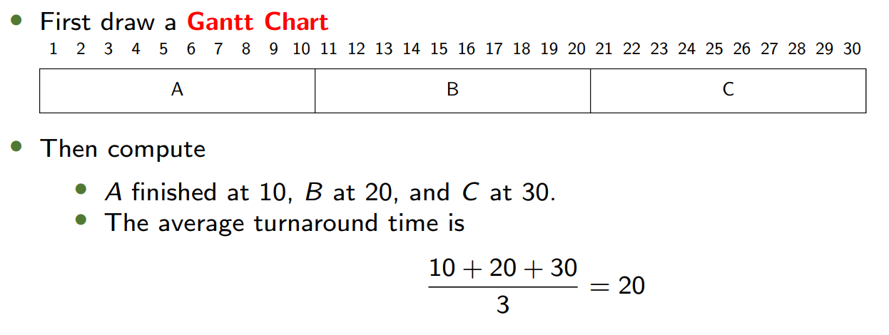
- **缺点**：护航效应 (Convoy effect) / 长作业阻塞短作业
### 最短作业优先 (SJF)  
- **规则**：优先运行最短作业 / Execute the shortest job first.  
- **示例**：  
  - 作业A运行10秒，B、C各1秒 / A (10s), B (1s), C (1s).  
  - 平均周转时间：$\frac{12+1+2}{3} = 5$.  
  - 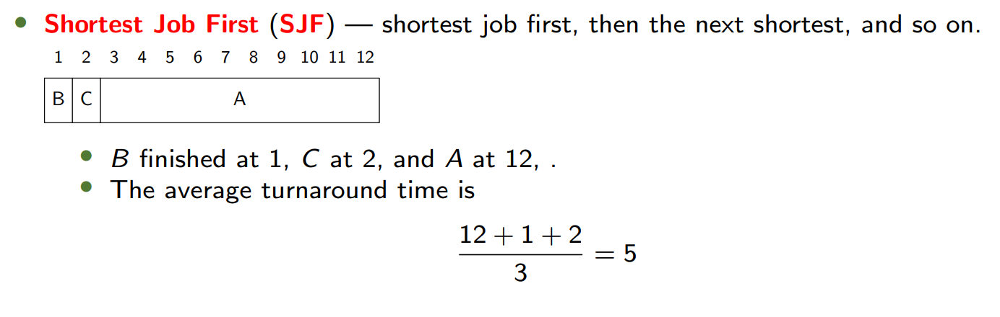
- The SJF algorithm is a special case of the general **priority-scheduling** algorithm.
  - **规则**：按优先级执行 / Execute jobs based on priority
  - **示例**：  
    - 进程表：P1(10,3), P2(1,1), P3(2,4), P4(1,5), P5(5,2).  
    - 执行顺序：P2 → P5 → P1 → P3 → P4.  
    - 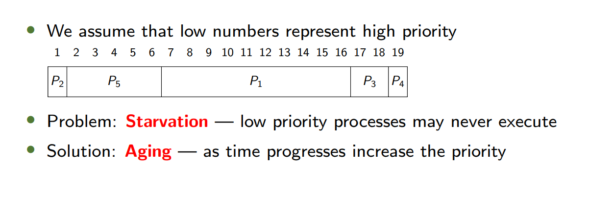
- **问题**：饥饿 (Starvation) / 低优先级进程可能永远无法运行
- **Solution**: **Aging**: as time progresses increase the priority
- **Highest Response Ratio Next (HRRN)**: the next job is not that with the shorted estimated run time, but that with the **highest response ratio** defined as
   $$response\_ratio = 1 +\frac{waiting\_time}{estimated\_run\_time}$$
### 抢占式短作业优先 (Preemptive SJF)
- Preemptive, and non-preemptive schedulers: Whether a job can preempt another job
- All modern schedulers are preemptive.
- The dispatcher performs a context switch.
- Think of preemptive version of SJF and Priority.
- **Preemptive Shortest Job First** (preemptive SJF, or Shortest Time-to-Completion First (STCF), or Shortest-Remaining-Time First (SRTF)
- 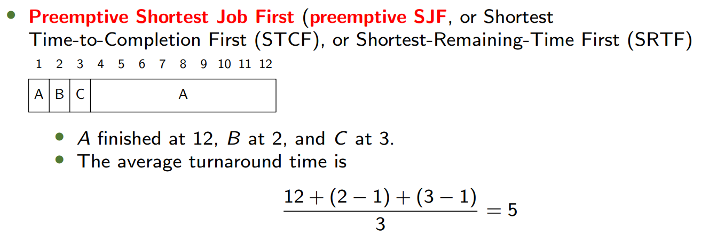
- 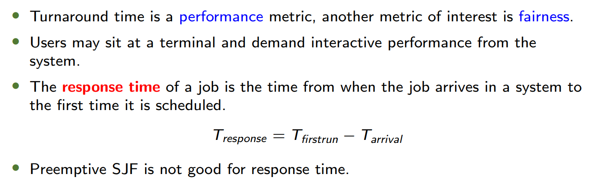
### 轮转调度 (Round-Robin, RR)  
- RR runs a job for a **time slice 时间片**(sometimes called a scheduling **quantum**) and then switches to the next job in the run queue.
- **示例**：
  - 三个作业A、B、C，时间片1秒 / Time quantum = 1s.  
  - 平均响应时间：$$\frac{0+1+2}{3} = 1$$.  
  - 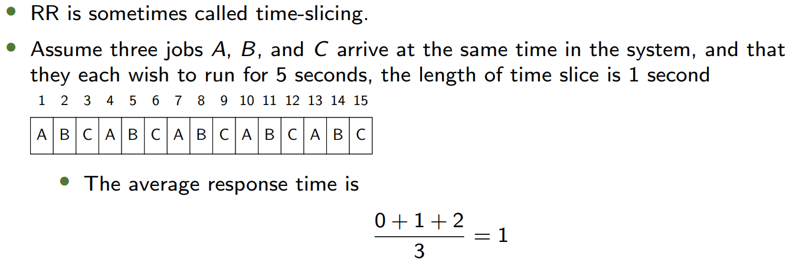
- **权衡**：公平性 vs. 周转时间 / Trade-off between fairness and turnaround time.  
- 轮转算法在周转时间表现较差。RR is awful in **turnaround time**. 
  Any policy that is fair, performs poorly on performance metrics such as turnaround time.
### A Hybrid: Multilevel Queue
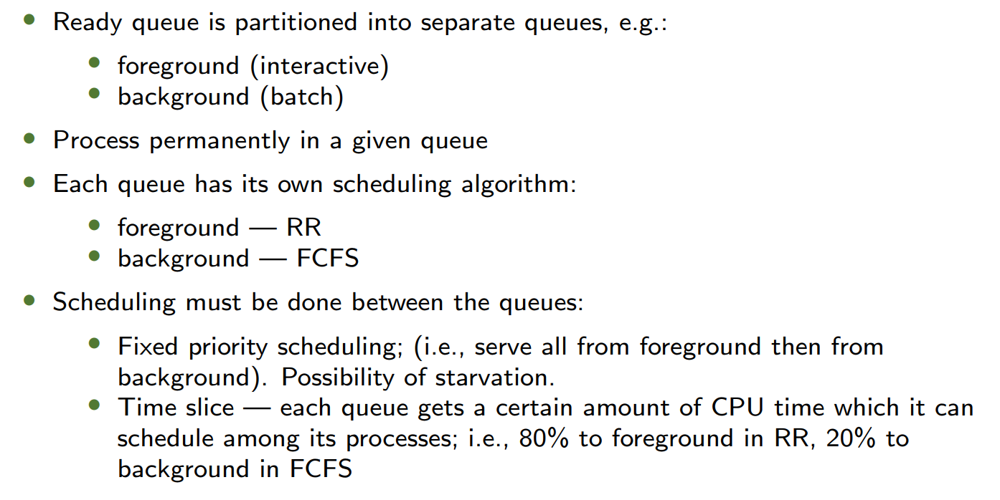
### In Class Exercise
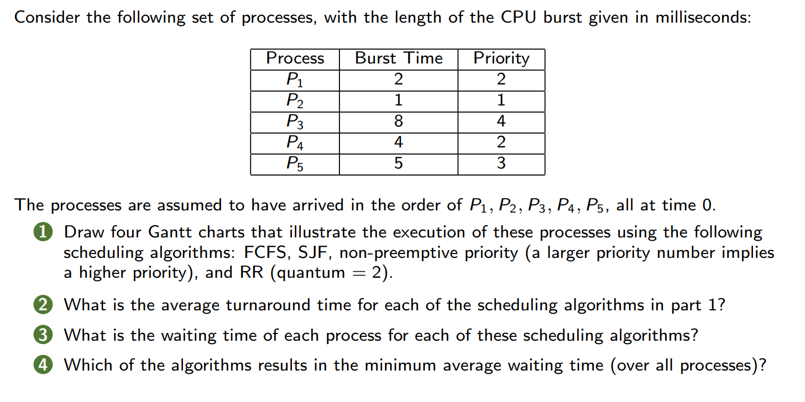
**Answer**
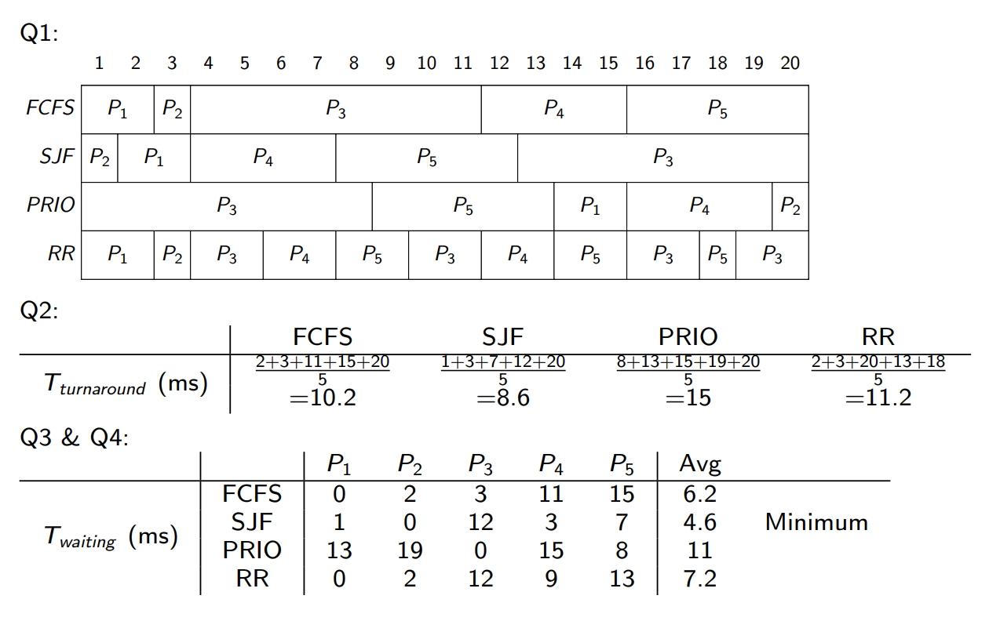

---
## 4. 多级反馈队列 / Multilevel Feedback Queue (MLFQ) 

### 核心思想 / Core Idea  
- **多级队列**：按优先级划分队列 / Multiple queues with different priorities.  
- **反馈机制**：根据进程行为动态调整优先级 / Adjust priority based on job behavior. 
### 规则 / Rules  
1. **优先级比较**：高优先级队列的进程优先运行 / Higher priority jobs run first.  
   If Priority(A) > Priority(B), A runs (B doesn’t)
2. **同优先级轮转**：同队列内使用轮转调度 / RR within the same priority.  
   If Priority(A) = Priority(B), A & B run in RR
   注：如果题目明确指出用什么算法就按照题目来
3. **新进程入队**：初始置于最高优先级队列 / New jobs enter the topmost queue.  
   When a job enters the system, it is placed at the highest priority (the topmost queue).
4. **时间配额耗尽后降级**：若进程用完时间配额，优先级降低 / Demote priority if time slice is fully used.  
   Once a job uses up its time allotment at a given level (regardless of how many times it has given up the CPU), its priority is reduced (i.e., it moves down one queue).
5. **周期优先级提升**：定期将所有进程重置到最高队列 / Periodically boost all jobs to the top queue.  
   After some time periods, move all the jobs in the system to the topmost queue.
### 优化 / Optimizations
- **避免饥饿**：周期优先级提升解决长作业饥饿 / Priority boost prevents starvation.  
- **防止作弊**：精确记录CPU时间防止进程滥用 / Track CPU time to prevent gaming.  
### In Class Exercise
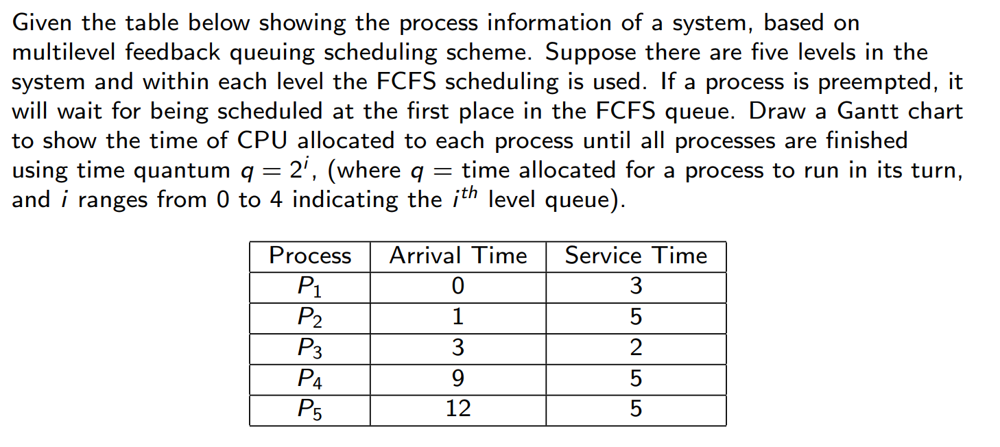

**Answer**

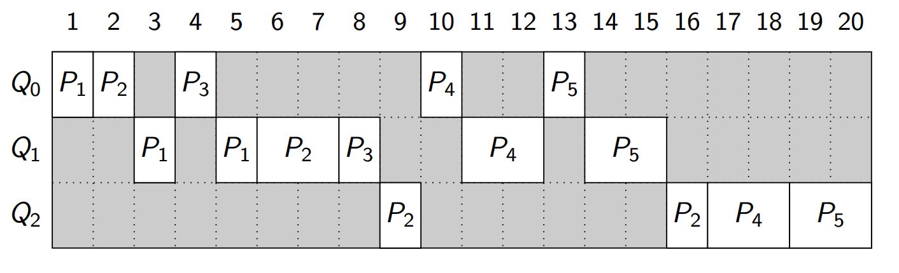
## 5. Lottery Scheduling

### 比例份额调度 (Proportional-Share Scheduling)

- **核心思想**：按比例分配CPU时间，而非优化周转时间或响应时间。
  - **应用场景**：虚拟化数据中心（如为Windows VM分配25% CPU，其余给Linux）。  
- **公平性指标 (Unfairness Metric U)**：
  - 定义：两个相同任务完成时间的比值（理想时U=1）。  
### 彩票调度 (Lottery Scheduling)
- **机制**：  
  - 通过“彩票”随机选择下一个运行的任务，高优先级任务获得更多彩票。  
  - **关键特性**：  
    - **彩票货币 (Ticket Currency)**：用户自定义子任务间的彩票分配。  
    - **彩票转让 (Ticket Transfer)**：临时转移彩票给其他任务。  
    - **彩票膨胀 (Ticket Inflation)**：临时调整自身彩票数量。  
- **优点**：无全局状态，动态适应新任务加入。  
### 步幅调度 (Stride Scheduling)
- **确定性算法**：  
  - 每个任务的步幅（Stride）= 总票数 / 该任务票数
  - Every time a process runs, we will increment a counter for it (called its **pass** value) by its stride to track its global progress
  - At any given time, pick the process to run that has the lowest pass value so far 选择Pass最小的进程
  - **示例**：  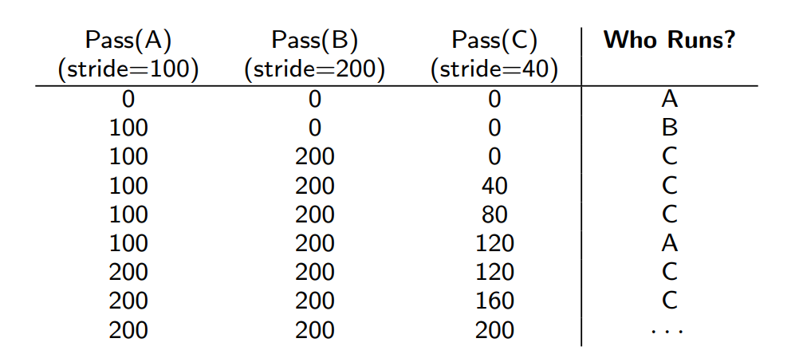
- **缺点**：新任务加入需全局状态调整（Pass值初始化问题）
---
## 6. Thread Scheduling
### 用户线程 vs 内核线程 (User-Level vs Kernel-Level Threads)
- **内核线程调度 (SCS - System-Contention Scope)**：  
  - 由OS调度到CPU核心，全系统范围内竞争资源。  
- **用户线程调度 (PCS - Process-Contention Scope)**：  
  - 线程库将用户线程映射到LWP（轻量级进程），进程内优先级竞争。  
  - **模型**：  
    - Many-to-One：用户线程阻塞导致进程阻塞（已淘汰）。  
    - Many-to-Many：动态平衡并发与效率（现代主流）。  
### 调度策略对比

| **特性**   | **用户线程 (PCS)** | **内核线程 (SCS)** |
| -------- | -------------- | -------------- |
| **管理方**  | 用户态线程库         | 操作系统内核         |
| **阻塞影响** | 阻塞整个进程         | 仅阻塞当前线程        |
| **适用场景** | 高并发但无需多核       | 需多核并行或实时性要求    |

---
## 7. Multiple-Processor Scheduling
### 缓存亲和性 (Cache Affinity)
- **局部性原理**：  
  - **时间局部性 (Temporal Locality)**：频繁访问相同数据。  
  - **空间局部性 (Spatial Locality)**：访问邻近数据。  
- **亲和性优势**：任务在相同CPU上运行可复用缓存状态，减少延迟。  
### 多处理器调度模型
#### 非对称多处理 (Asymmetric Multiprocessing - SQMS)
- **单队列调度 (Single Queue)**：  
  - Simply reuse the basic framework for single processor scheduling, by putting all jobs that need to be scheduled into a single queue
  - 所有任务放入全局队列，轮流分配到各CPU。 
  - **问题**：缓存亲和性差（任务频繁切换CPU）。  
  - **示例**：（采用FCFS）
  
    ```plaintext
    Queue → A → B → C → D → E → NULL
    CPU0: A → E → D → C → B 
    CPU1: B → A → E → D → C 
    CPU2: C → B → A → E → D
    CPU3: D → C → B → A → E
    ```
  
#### 对称多处理 (Symmetric Multiprocessing - MQMS)
- **多队列调度 (Per-CPU Queue)**：  
  - One queue per CPU. Each queue will likely follow a particular scheduling discipline, such as round robin
  - 每个CPU维护独立队列（如轮转调度）。 
  - **问题**：负载不均（需任务迁移平衡）。 
  - **示例**：  
    ```plaintext
    Queue0: A → C → NULL  
    Queue1: B → D → NULL  
    CPU0: A → C → A → C → (迁移B)  
    CPU1: B → D → B → D  
    ```

---
## 8. Real-Time CPU Scheduling

### 实时系统分类
- **软实时 (Soft Real-Time)**：尽力满足截止时间，无严格保证（如视频流）。
- **硬实时 (Hard Real-Time)**：必须在截止时间内完成（如航天控制）。 
### 延迟类型 (Latencies)

| **延迟类型**                   | **定义**                         | **影响因素**                       |
| ------------------------------ | -------------------------------- | ---------------------------------- |
| **中断延迟 Interrupt latency** | 中断发生到服务例程启动的时间     | 内核态代码禁用中断。               |
| **调度延迟 Dispatch latency**  | 从停止当前任务到启动新任务的时间 | 内核态抢占、低优先级任务释放资源。 |

### 调度过程示例

```plaintext
事件 → [中断延迟] → 中断处理 → [调度延迟] → 任务切换 → 响应完成  
          |__临界区阻塞中断        |__资源冲突或优先级调整  
```
