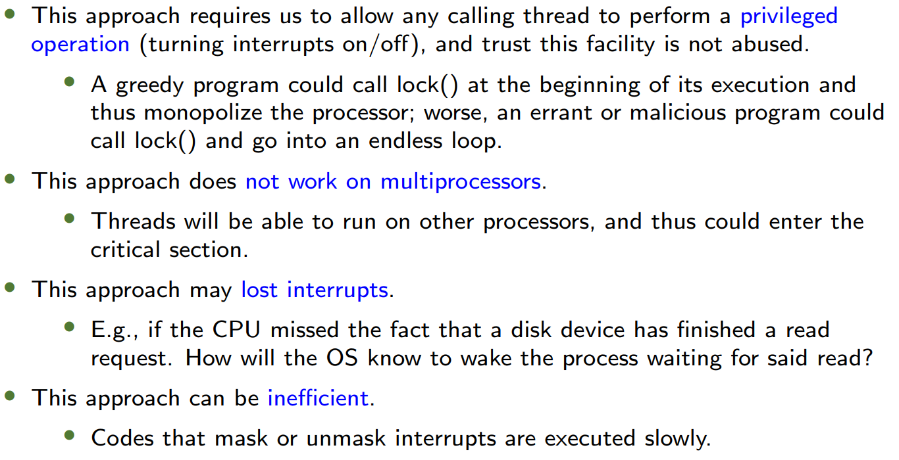
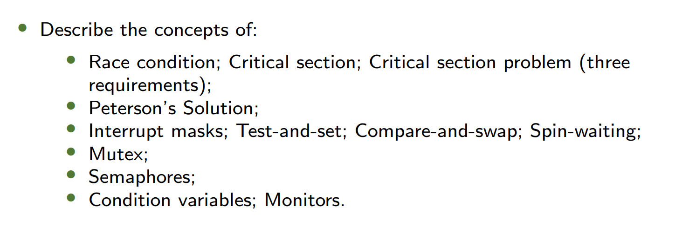

---
## **1. Warm-up 热身**  
### **Concurrency Example 并发示例**  
- **Code Example**:  
  ```c
  volatile int counter = 0;
  void *worker(void *arg) {
      for (i = 0; i < loops; i++) { counter++; }
    	return NULL;
  }
  ```
  - **Output**:  
    - For small loops (e.g., `./thread 1000`): Final value = 2000 (correct).  
    - For large loops (e.g., `./thread 100000`): Final value ≠ 200,000 (race condition).  
- **Key Concept**:  
  - **Race Condition (竞争条件)**: Multiple threads accessing shared data concurrently, leading to inconsistent results due to uncontrolled scheduling.  
  - **Shared Data**: `counter` is shared between threads.  

---
## **2. Background 背景**  
### **Critical-Section Problem 临界区问题**  
- **Definition**:  
  - A segment of code where shared data is accessed, requiring **mutual exclusion** to prevent race conditions.  
- **Assembly Breakdown**:  
  
  - `counter++` translates to:  
    ```assembly
    mov 0x8049alc, %eax    ; Load counter into register
    add $0x1, %eax         ; Increment register
    mov %eax, 0x8049alc    ; Store back to counter
    ```
  - **Interleaving Issue**: If threads switch between these steps, final `counter` may be incorrect.

### **Uncontrolled Scheduling 不可控调度**
- **Example**:  
  - Thread 1 and Thread 2 interleave `mov` and `add` operations, resulting in lost updates (e.g., final `counter = 51` instead of 52).
- **Solution Requirement**: Atomic execution of critical sections.

### **Race Condition & Solutions 竞争条件与解决方案**
- **Race Condition**: Outcome depends on the order of execution.  
- **Approaches**:  
  - **Hardware Support**: Atomic instructions (e.g., `test-and-set`, `compare-and-swap`).  
  - **Software Algorithms**: Peterson’s, Bakery Algorithm.  

---

## **\*\*3. The Critical-Section Problem 临界区问题**
### **问题描述**

- 给定$n$个进程$P_0, P_1, ..., P_{n-1}$
- 每一个进程都有一段**临界区 (Critical Section)**代码
  - Process may be changing common variables, updating table, writing file, etc
  - When one process in critical section, no other may be in its critical section
- Critical section problem is to design protocol to avoid race condition.
- Each process must ask permission to enter critical section in entry section, may follow critical section with exit section, then remainder section

```c
  do{
    [entry section]进入区
    	[critical section]临界区
    [exit section]退出区
    	[remainder section]剩余区
  }while(true)
  ```

### **Requirements 要求**  
1. **Mutual Exclusion (互斥)**:
   If process $P_i$ is executing in its critical section, then no other processes can be executing in their critical sections
   一次只有一个进程在临界区
2. **Progress (进展)**:
   If no process is executing in its critical section and there exist some processes that wish to enter their critical section, then the selection of the processes that will enter the critical section next cannot be postponed **indefinitely**.
   如果没有进程正在其临界区内执行，并且存在一些想要进入它们临界区的进程，那么对于接下来将要进入临界区的进程的选择不能被**无限期**地推迟。 
   **注意：只要有一个进程能进入临界区就赢了，就算不满足有限等待是某个进程无限进入也是在进入，满足Progress**
3. **Bounded Waiting (有限等待)**:
   A bound must exist on the number of times that other processes are allowed to enter their critical sections after a process has made a request to enter its critical section and before that request is granted
   - Assume that each process executes at a nonzero speed
   - No assumption concerning relative speed of the n processes
   在一个进程发出进入其临界区的请求之后且该请求被批准之前，对于其他进程被允许进入它们临界区的**次数**必须存在一个限制。
   - 假定每个进程都以非零的速度执行。
   - 不假定这n个进程的相对速度情况。
   - **是 *次数*  不是时间！！**

Two approaches depending on if kernel is preemptive or non-preemptive
- Preemptive: allows preemption of process when running in kernel mode
- Non-preemptive: runs until exits kernel mode, blocks, or voluntarily yields CPU

### ⚠️重点！！！判断是否满足三个条件

#### 互斥Mutual Exclusion的判断
1. 假设A进程进入了临界区
2. 运行
3. 在B进程进临界区前，如果在任意地方被中断并切换到B进程执行都不会出现两个同时在临界区的情况，则符合互斥；否则不符合
#### 进步Progress的判断
1. 假设两个进程AB都刚开始运行
2. 运行
3. 假设A刚离开临界区（无论是否释放锁），在这两种情况下，只要有进程（即便是A）想进入临界区，就会有程序在临界区运行，说明满足进步；否则不满足
#### 有限等待Bounded Waiting的判断
1. 假设A刚从临界区出来要释放互斥锁，突然中断
2. 此时B一定不能进入临界区，判断中断转到A后A能否重新进入，若能说明不满足

---
## **4. Mutex Locks 互斥锁**  
### **Lock&Unlock**

- 我们需要硬件**同步元语 Hardware synchronization primitives**
- Lock代码在临界区两边，确保一次只有一个进程进入临界区
- A lock is just a variable
```c
  do{
    lock();
    	[critical section]
    unlock();
    	[remainder section]
  }while(true);
```
### Controlling Interrupts
```c
void lock(){
  DisableInterrupts();
}
void unlock(){
  EnableInterrupts();
}
```

- `DisableInterrupts`/`EnableInterrupts()` are implemented by using special hardware instructions.
- Question: Is it a solution to the critical section problem?
  - Answer:
    - Mutual Exclusion, Progress
    - NOT satisfies Bounded Waiting
	    - 原因：假设进程A执行完临界区后正要`EnableInterrupts()`的时候突然中断转到B，此时B无法进入临界区。若一段时间后转到A，此时A可以重新进入临界区，实现无限进入临界区
- Negatives:
  

### **Without special hardware support**
 1. **Peterson’s Solution (Software Approach) 彼得森算法**
    - **Shared Variables**:
      ```c
      int turn;               // Whose turn is it?
      bool flag[2];           // Ready to enter critical section?
      ```
    - **Algorithm for Process Pi**:
      ```c
      do {
          flag[i] = true;     // Pi is ready
          turn = j;           // Let Pj go first
          while (flag[j] && turn == j); // Wait if Pj is ready and it's its turn
          // Critical Section
          flag[i] = false;    // Pi is done
          // Remainder Section
      } while (true);
      ```
    - **Algorithm for Process Pj**:
    ```c
      do {
          flag[j] = true;     // Pi is ready
          turn = i;           // Let Pj go first
          while (flag[i] && turn == i); // Wait if Pi is ready and it's its turn
          // Critical Section
          flag[j] = false;    // Pi is done
          // Remainder Section
      } while (true);
      ```
    - **Proof**: Satisfies all three requirements.
		- Mutual Exclusion: 假如Pi进入临界区但是Pj没有，此时发生中断转向Pj。此时`flag[i] == true`。若`turn == i`，此时Pj无法进入。若`turn == j`，此时由于`flag[i] == true`，Pj无法进入。
		- Progress: 假设Pi刚好离开临界区发生中断，极端情况`flag[i]`还未改为false，此时Pi无法进入临界区；此时转向Pi后一定会有`flag[i] = false`，下次转向Pj后一定可以进入临界区。
		- Bounded Waiting: 假设Pi刚好离开临界区发生中断，极端情况`flag[i]`还未改为false，此时Pi无法进入临界区，而由于在进入区`turn = j`，Pi无法再次进入临界区，不会无限次数进入。
2. **Bakery Algorithm (n-Process Solution) 面包店算法（多进程方案）**
	- **Key Idea**: Assign a unique number to each process; the smallest number enters first.  
	- **Number Assignment**:  Before entering its critical section, a process (customer) receives a number. The process with the smallest number enters the critical section (waits in a queue).
	- **Tie-Breaking Rule**:  If processes $P_i$ and $P_j$ receive the same number:  
	  - If $i < j$, $P_i$ is served first.  
	  - Otherwise, $P_j$ is served first.  
	  *(Ensures a unique order even with identical numbers.)*
	- **Numbering Scheme**:  Numbers are generated in strictly increasing order (e.g., 1, 2, 3, 3, 3, 3, 3, 4, 5, …).
	- **Comparison**: $(a, b) < (c, d)$ if:  $a < c$, **or**  $a = c$ and $b < d$.
	- **Maximum**:   $\max(a_0, \cdots, a_{n-1}) = k$, where $k \geq a_i \, \forall i \in [0, n]$.  
	- **核心思想**: 为每个进程分配一个唯一编号；编号最小的进程优先进入临界区。  
	- **编号分配**: 在进入临界区之前，进程（类比顾客）会获取一个编号。编号最小的进程将进入临界区（在队列中等待）。  
	- **相同编号仲裁规则**: 如果进程 $P_i$ 和 $P_j$ 获得相同编号：  
	  - 若 $i < j$，则 $P_i$ 优先被服务。  
	  - 否则，$P_j$ 优先被服务。  
	  *(确保即使编号相同，执行顺序仍然唯一。)*  
	- **编号生成规则**: 编号按严格递增顺序生成（例如 1, 2, 3, 3, 3, 3, 3, 4, 5, …）。  
	- **比较规则**: $(a, b) < (c, d)$ 当且仅当：$a < c$，或者 $a = c$ 且 $b < d$。  
	- **最大值计算**: $\max(a_0, \cdots, a_{n-1}) = k$，其中 $k \geq a_i \, \forall i \in [0, n]$。  
-  **Shared Data**:
	```c
	  bool choosing[n]; // Process is choosing a number, initialized to false
	  int number[n];    // Assigned ticket number, initialized to 0
	```
- **Algorithm**: 进程Pi的算法
```c
do{
	choosing[i] = true;
	number[i] = max(number[0], number[1], ..., number[n - 1]) + 1;
	choosing[i] = false;
	
	for (j = 0; j < n; j++) {
	    while (choosing[j]);
	    // 如果前面有正在选的进程，阻塞
	    while ((number[j] != 0) && ((number[j], j) < (number[i], i)));
	    // 如果前面有已经选择了且优先级更高的进程需要进入临界区，阻塞
	}
	
		critical_section
	
	number[i] = 0;// 0表示没选
	
		remainder_section
} while (true);
```
- 为什么没有`choosing[]`会失败？ 
	- 不满足Mutual Exclusion
### **Hardware Support 硬件支持**  
1. **Test-and-Set (测试并设置)**:  Some form of <font color="red">test-and-set</font> instruction
   ```c
   int TestAndSet(int *old_ptr, int new) {
       int old = *old_ptr;
       *old_ptr = new;
       return old; // Returns old value atomically
   }
   ```
   A spin lock based on this:
```c
   typedef struct --lock_t { int flag; } lock_t;

	void init(lock_t *lock) {
	    lock->flag = 0; // 0 -> available, 1 -> held
	}

	void lock(lock_t *lock) {
	    while (TestAndSet(&lock->flag, 1) == 1)
	    ; // spin-waiting
	}

	void unlock(lock_t *lock) {
	    lock->flag = 0;
	}
```
- Evaluating this spin lock:
	- Mutual exclusion? Yes
	- Progress? Yes
	- Bounded waiting? No
2. **Compare-and-Swap (比较并交换)**:  <font color="red">compare-and-swap</font> atomic instruction
   ```c
   int CAS(int *ptr, int expected, int new) {
       int actual = *ptr;
       if (actual == expected) *ptr = new;
       return actual;
   }
   ```
   A spin lock based on this:
```c
   void lock(lock_t *lock) {
	    while (CAS(&lock->flag, 0, 1) == 1)
	    ; // spin-waiting
	}
```
- Evaluating this spin lock:
	- Mutual exclusion? Yes
	- Progress? Yes
	- Bounded waiting? No
3. Compare-and-swap is more powerful than test-and-set. Can be used to achieve lock-free synchronization.
   ```c
   int CompareAndSwap(int *ptr, int expected, int new) {
       int actual = *ptr;
       if (actual == expected) {
	       *ptr = new;
       return 1;
	   }
       return 0;
   }
   ```   
   An alternative approach that does not require explicit locking:
   不需要显式的locking
   ```c
   void AtomicIncrement(int *counter, int amount){
	   do{
		   int old = *counter;
	   }while(CompareAndSwap(counter, old, old + amount) == 0);
   }
	```
4. **Fetch-and-Add (获取并增加)**:  
   ```c
   int FetchAndAdd(int *ptr) {
       int old = *ptr;
       *ptr = old + 1;
       return old;
   }

	/* ticket lock */
	typedef struct {
	    int ticket;
	    int turn;
	} lock_t;
	
	void lock_init(lock_t *lock) {
	    lock->ticket = 0;
	    lock->turn = 0;
	}
	
	void lock(lock_t *lock) {
	    int myturn = FetchAndAdd(&lock->ticket);
	    while (lock->turn != myturn);
	}
	
	void unlock(lock_t *lock) {
	    lock->turn = lock->turn + 1;
	}
   ```
   - **Ticket Lock**: Uses `ticket` and `turn` variables for fairness.  
### **Spin-Waiting 自旋等待** 
- When a thread waits to acquire a lock that is already held, it endlessly checks the value of flag, a technique known as spin-waiting.
  当一个线程等待获取一个已被持有的锁时，它会不断地检查标志（flag）的值，这是一种被称为自旋等待的技术。
  公平但效率很低
避免方法：
- **Yield**: `yield()` syscall to voluntarily give up CPU. 主动放弃CPU
	- Think about N threads contending for a lock; N − 1 threads may execute the run-and-yield pattern.
	- Starvation
- **Queue-Based Locks**:  
	- `park()`: Puts a calling thread to sleep.  
	- `unpark(threadID)`: Wakes a particular thread.  
	- Race condition before the call to park(): With just a wrong timing switch, the subsequent park by the first thread would then sleep forever (potentially).
	- Use system call `setpark()` : A thread indicates it is about to park
	- If it then happens to be interrupted and another thread calls unpark() before park() is actually called, the subsequent park() returns immediately instead of sleeping.
	- 如果在调用 `setpark()` 之后、实际调用 `park()` 之前，线程被中断，并且另一个线程调用了 `unpark()`，那么后续的 `park()` 会立即返回，而不会进入休眠状态。这样就避免了永久休眠的问题。
	- Is spin avoided? No, but the time spent spinning is quite limited.
- **Priority Inversion (优先级反转)**: Higher-priority threads blocked by lower-priority ones. Solved via **priority inheritance**.  
---
## **5. Locked Data Structures 加锁的数据结构**  
### Concurrent Counter 并发计数器  
- **Simple Lock**: Global lock on all operations (inefficient).  
- **Sloppy Counter**:  
- **Local counters** per CPU + occasional sync to global counter.  
- **Threshold**: Controls how often local counters sync.  

### Linked List 链表  
- **Coarse-Grained Lock**: Single lock for entire list.  
- **Fine-Grained Lock**: Per-node locks (e.g., hand-over-hand locking).  

### Queue 队列  
- **Two Locks**: Separate locks for `head` (dequeue) and `tail` (enqueue).  

### Hash Table 哈希表  
- **Per-Bucket Locks**: Each bucket has its own lock for scalability.  

---

## **4. Mutex Locks (Continued) 互斥锁（续）**  

### **Spin Locks vs. Blocking Locks 自旋锁 vs. 阻塞锁**  
| **特性**     | **自旋锁 (Spin Lock)**                   | **阻塞锁 (Blocking Lock)**       |
| ------------ | ---------------------------------------- | -------------------------------- |
| **实现方式** | 循环检查锁状态 (`while (lock == held);`) | 调用 `park()`/`unpark()` 让出CPU |
| **适用场景** | 临界区短、多核CPU                        | 临界区长、单核CPU                |
| **性能开销** | 高（占用CPU空转）                        | 低（线程休眠）                   |
| **公平性**   | 可能饥饿（无顺序保证）                   | 可通过队列实现公平性             |

### **Two-Phase Locking (Linux Hybrid Approach) 两阶段锁（Linux混合方案）**  
1. **第一阶段（自旋）**: 短暂自旋尝试获取锁（适用于短临界区）。  
2. **第二阶段（阻塞）**: 若自旋失败，线程休眠并加入等待队列。  

### **Priority Inversion Problem 优先级反转问题**  
- **场景**:  
  - 低优先级线程（L）持有锁 → 中优先级线程（M）抢占CPU → 高优先级线程（H）等待锁。  
  - **结果**: H被阻塞，尽管其优先级最高。  
- **解决方案**:  
  - **优先级继承 (Priority Inheritance)**: L临时继承H的优先级，使其快速执行并释放锁。  

---

## **5. Locked Data Structures 加锁的数据结构**  

### Concurrent Counter 并发计数器  
#### Sloppy Counter 松散计数器  
- **设计思想**:  
  - **局部计数器 (Per-CPU)**: 每个CPU维护自己的计数器，减少全局锁争用。  
  - **全局计数器 (Global)**: 定期将局部值累加到全局计数器。  
- **阈值 (Threshold)**: 控制局部→全局同步的频率（平衡性能与准确性）。  
  ```c  
  if (local_counter >= threshold) {  
      lock(&global_lock);  
      global += local;  
      unlock(&global_lock);  
      local = 0;  
  }  
  ```
#### **性能对比**  
| **线程数** | **简单锁 (ms)** | **松散锁 (ms)** |
| ---------- | --------------- | --------------- |
| 1          | 30              | 35              |
| 2          | 5000            | 100             |

---
### Concurrent Linked List 并发链表  
#### Hand-Over-Hand Locking 手拉手锁  
- **加锁方式**:  
  - 遍历时，先锁下一个节点，再释放当前节点锁。  
  ```c  
  lock(&curr->lock);  
  lock(&next->lock);  
  unlock(&curr->lock);  
  ```
- **缺点**: 锁开销高，实际性能可能不如单锁（因频繁加解锁）。  
#### **扩展性优化**  
- **分段锁 (Bucket Locking)**: 将链表分段，每段一个锁（类似哈希表）。  
---
### Concurrent Queue 并发队列  
#### 双锁设计 (Two-Lock Queue)  
- **Enqueue**: 仅锁 `tail`，操作 `tail->next`。  
- **Dequeue**: 仅锁 `head`，操作 `head->next`。  
- **Dummy Node**: 避免头尾竞争（初始化时头尾指向哑节点）。  
  ```c  
  void enqueue(queue_t *q, int value) {  
      lock(&q->tail_lock);  
      q->tail->next = new_node;  
      q->tail = new_node;  
      unlock(&q->tail_lock);  
  }  
  ```
---
### Concurrent Hash Table 并发哈希表  
#### Per-Bucket Locking 分桶锁  
- **设计**: 每个桶一个独立的锁（锁粒度 = 桶数量）。  
- **性能**: 并发访问不同桶的线程无需阻塞。  
  ```c  
  int hash_insert(hash_t *h, int key) {  
      int bucket = key % BUCKETS;  
      lock(&h->locks[bucket]);  
      list_insert(&h->lists[bucket], key);  
      unlock(&h->locks[bucket]);  
  }  
  ```
---
# Contd. 续
#### **1. Condition Variables (条件变量)**  
**1.1 Implementing `pthread_join()`**  
- **Problem #1**: How to indicate the child thread is done?  
  **问题1**：如何指示子线程已完成？  
- **Problem #2**: How to make the parent thread wait for the child?  
  **问题2**：如何让父线程等待子线程？  
**Initial Solution (Shared Variable)**:  
```c
int done = 0;
void *child(void *arg) {
    printf("child\n");
    done = 1;  // Signal completion
    return NULL;
}
// Parent spins while waiting (wastes CPU)
while (done == 0); 
```
**缺点**: Spin-waiting (忙等待) 浪费CPU资源。  
**1.2 Condition Variable Operations**  
- **`wait(c, m)`**：根据条件变量`c`，线程休眠并释放锁 `m`。  
- **`signal(c)`**：根据条件变量`c`唤醒一个等待 `c` 的线程。  
**Correct Implementation**:  
```c
pthread_mutex_t m = PTHREAD_MUTEX_INITIALIZER;
pthread_cond_t c = PTHREAD_COND_INITIALIZER;
int done = 0;

void thr_exit() {
    pthread_mutex_lock(&m);
    done = 1;
    pthread_cond_signal(&c);  // Wake parent
    pthread_mutex_unlock(&m);
}

void thr_join() {
    pthread_mutex_lock(&m);
    while (done == 0)
        pthread_cond_wait(&c, &m);  // Sleep and release lock
    pthread_mutex_unlock(&m);
}
```
**Key Points**:  
- Always use a **while loop** to recheck conditions after wake-up (避免虚假唤醒).  
- Condition variables **must** be paired with a mutex and a flag (条件变量必须与互斥锁和标志变量配合使用).  
**1.3 Broken Code Examples**  
```c
void thr_exit() {
    pthread_mutex_lock(&m);
    pthread_cond_signal(&c);
    pthread_mutex_unlock(&m);
}

void thr_join() {
    pthread_mutex_lock(&m);
    pthread_cond_wait(&c, &m);
    pthread_mutex_unlock(&m);
}

/* broken code #1 */
```
```c
void thr_exit() {
    done = 1;
    pthread_cond_signal(&c);
}

void thr_join() {
    if (done == 0)
    pthread_cond_wait(&c);
}

/* broken code #2 */
```
- **Broken #1**: Missing flag check → may miss signals.  
  **错误1**：未检查标志变量 → 可能丢失信号。  
- **Broken #2**: No mutex → race condition.  
  **错误2**：无互斥锁 → 竞态条件。  
---

**1.4 Producer-Consumer Problem (生产者-消费者问题)**  
**Single Buffer Solution (Initial Attempt)**:  
```c
cond_t cond; mutex_t mutex;
void producer() {
    pthread_mutex_lock(&mutex);
    if (count == 1) pthread_cond_wait(&cond, &mutex);
    put();  // Produce
    pthread_cond_signal(&cond);
    pthread_mutex_unlock(&mutex);
}
// Similar for consumer
```
**Issue**: With multiple threads, `signal` may wake the wrong thread (e.g., another producer instead of a consumer).  
**问题**：多线程下，`signal` 可能唤醒错误的线程（如唤醒生产者而非消费者）。  

**Fix**: Use **two condition variables** (`empty` and `full`):  
```c
cond_t empty, fill;
void producer() {
    pthread_mutex_lock(&mutex);
    while (count == MAX) pthread_cond_wait(&empty, &mutex);
    put();
    pthread_cond_signal(&fill);  // Wake consumer
    pthread_mutex_unlock(&mutex);
}
void consumer() {
    pthread_mutex_lock(&mutex);
    while (count == 0) pthread_cond_wait(&fill, &mutex);
    get();
    pthread_cond_signal(&empty);  // Wake producer
    pthread_mutex_unlock(&mutex);
}
```
**Key Point**:  
- **`while`** (not `if`) to recheck after wake-up (必须用 `while` 循环重新检查条件).  

**1.5 Covering Condition (覆盖条件)**  
- Scenario: Multiple threads waiting for different conditions (e.g., memory allocation).  
  **场景**：多个线程等待不同条件（如内存分配）。  
- **Solution**: Use `pthread_cond_broadcast()` to wake all waiting threads.  
  **解决方案**：用 `pthread_cond_broadcast()` 唤醒所有等待线程。  
---
#### **2. Semaphores (信号量)**  
**2.1 Definition**  
- A semaphore is an integer with two atomic operations:  
  **信号量**是一个整数，支持两种原子操作：  
  - **`wait(s)`** (or **`P()`**): Decrements `s`; blocks if `s < 0`.  
    **`wait(s)`**：`s` 减1；若 `s < 0` 则阻塞。  
  - **`signal(s)`** (or **`V()`**): Increments `s`; wakes a blocked thread if any.  
    **`signal(s)`**：`s` 加1；唤醒一个阻塞线程（若有）。  

**Implementation (No Busy-Waiting)**:  
```c
typedef struct {
    int value;
    struct process *list;
} semaphore;

void wait(semaphore *s) {
    s->value--;
    if (s->value < 0) {
        add this process to s->list;
        block();
    }
}
void signal(semaphore *s) {
    s->value++;
    if (s->value <= 0) {
        remove a process P from s->list;
        wakeup(P);
    }
}
```

**2.2 Synchronization Patterns**  
- **Signaling**: Ensure `statement a` executes before `statement b`.  
  **信号传递**：保证 `a` 在 `b` 前执行。  
  ```c
  semaphore s = 0;
  Thread A: statement a; signal(s);
  Thread B: wait(s); statement b;
  ```  
- **Rendezvous**: 两线程必须都到达汇合点后才能继续
- Ensure `a1` before `b2` and `b1` before `a2`.  
  **汇合点**：保证 `a1` 在 `b2` 前，`b1` 在 `a2` 前。  
  ```c
  semaphore a = 0, b = 0;
  Thread A: a1; signal(a); wait(b); a2;
  Thread B: b1; signal(b); wait(a); b2;
  ```  
- **Mutex**: Protect critical sections.  
  **互斥锁**：保护临界区。  
  ```c
  semaphore mutex = 1;
  wait(mutex); count++; signal(mutex);
  ```  
- **Barrier** 问题
- 无效的Barrier
```c
/* Bad barrier solution */
rendezvous;
wait(mutex);
count = count + 1;
if (count == n)
    signal(barrier);
wait(barrier);
signal(barrier);
signal(mutex);
critical point;
```
- 无效原因：造成死锁
	- 假设进程A到达`wait(mutex)`后，未触发`signal(barrier)`，卡在`wait(barrier)`，另一个进程B此时想`wait(mutex)`，发现无法进入。
- 有效的Barrier
```c
semaphore barrier1 = 0, barrier2 = 0, mutex = 1;

rendezvous;
wait(mutex);
count += 1;
if (count == n)
    for (int i = 0; i < n; i++)
    signal(barrier1);

signal(mutex);
wait(barrier1);
critical point;
wait(mutex);
count -= 1;
if (count == 0)
    for (int i = 0; i < n; i++)
    signal(barrier2);

signal(mutex);
wait(barrier2);
```
**2.3 Pairing**
- Imagine that threads represent ballroom dancers and that two kinds of dancers, leaders and followers, wait in two queues before entering the dance floor. When a leader arrives, it checks to see if there is a follower waiting. If so, they can both proceed. Otherwise it waits. Similarly, when a follower arrives, it checks for a leader and either proceeds or waits, accordingly.
- 关键点：保证dance配对执行
	- 使用两个int变量存储当前leader和follower的数量。定义信号量leader, follower，用于等待对方。mutex互斥锁保证数量的改变不会冲突。此外还需要pairing信号量通知leader配对完成。
	- leader的逻辑：首先获取锁。如果当前follower的数量大于0，说明已经有follower在等待，`signal(leader)`，通知follower直接dance；否则，需要等待follower，释放锁并`wait(follower)`。dance后`wait(pairing)`，等待follower结束。最后释放互斥锁
	- follower的逻辑：首先获取锁。如果当前leader的数量大于0，说明已经有leader在等待，`signal(follower)`，通知leader直接dance；否则，需要等待leader，释放锁并`wait(leader)`。dance后`signal(pairing)`。
	- 注意动态改变两者数量
初始化
```c
/* initialization */
int num_l = 0, num_f = 0;
semaphore leader = 0, follower = 0, pairing = 0, mutex = 1;
```
leader
```c
/* leader */
wait(mutex);
if (num_f > 0) {
    num_f --;
    signal(leader);
}
else {
    num_l ++;
    signal(mutex);
    wait(follower);
}
dance();
wait(pairing);
signal(mutex);
```
follower
```c
/* follower */
wait(mutex);
if (num_l > 0) {
    num_l --;
    signal(follower);
}
else {
    num_f ++;
    signal(mutex);
    wait(leader);
}
dance();
signal(pairing);
// no signal(mutex);
```
**2.4 Producer-Consumer with Semaphores**  
需要注意mutex保护生产消费所在的地址空间
```c
semaphore empty = MAX, full = 0, mutex = 1;
void producer() {
    wait(empty);  // Wait for space
    wait(mutex);  // Enter critical section
    put();
    signal(mutex);
    signal(full);  // Increment filled count
}
void consumer() {
    wait(full);
    wait(mutex);
    get();
    signal(mutex);
    signal(empty);
}
```

**2.5 Dining Philosophers (哲学家就餐问题)**  
- There are five “philosophers” sitting around a table. Between each pair of philosophers is a single chopstick (and thus, five total). The philosophers each have times where they think, and don’t need any chopsticks, and times where they eat. In order to eat, a philosopher needs two chopsticks, both the one on their left and the one on their right. The basic loop of each philosopher is as follows, assuming each has a unique identifier $p \in [0, 4]$:
```c
  while(true){
	  think();
	  getchopsticks();
	  eat();
	  putchopsticks();
  }
```
- 注意死锁问题：当所有哲学家同时获取左边或右边的筷子时，会发生死锁。
```c
/* a correct solution */

int left(int p) { return p; }
int right(int p) { return (p + 1) % 5; }

void putchopsticks() {
    signal(chopsticks[left(p)]);
    signal(chopsticks[right(p)]);
}

void getchopsticks() {
    if (p == 4) {
        wait(chopsticks[right(p)]);
        wait(chopsticks[left(p)]);
    }
    else {
        wait(chopsticks[left(p)]);
        wait(chopsticks[right(p)]);
    }
}
```
**2.6 The Readers-Writers Problem**
- 试想有许多并发操作，包括读取和写入操作。 
	- 写入会改变数据的状态。 
	- 读取则不会——只要我们能保证没有写入操作在进行，许多读取操作就可以并发进行。
- 第一个读者-写者问题——要求除非写者已获得使用共享对象的权限，否则不应让读者等待。
- 第二个读者-写者问题——要求一旦写者准备好，该写者应尽快执行其写入操作。
**2.6.1 First Readers-Writers Problem**  
- **Priority to Readers**: No reader waits unless a writer is already active.  
  **读者优先**：除非写者已获得锁，否则读者无需等待。  
```c
semaphore write_mutex = 1;
semaphore readcount_mutex = 1;
int read_count = 0;

void write() {
    do {
        wait(write_mutex);
        /* writing */
        signal(write_mutex);
    } while (true);
}

void read() {
    do {
        wait(readcount_mutex);
        read_count++;
        if (read_count == 1)
            wait(write_mutex);
        signal(readcount_mutex);
        /* reading */
        wait(readcount_mutex);
        read_count--;
        if (read_count == 0)
            signal(write_mutex);
        signal(readcount_mutex);
    } while (true);
}
```
**Issue**: Starvation of writers (写者可能饿死).  
No-starvation: 
```c
semaphore readcount_mutex = 1;
semaphore writemutex = 1;
int read_count = 0;
semaphore readmutex = 1;

void write() {
    do {
        wait(readmutex);
        wait(writemutex);
        /* writing */
        signal(writemutex);
        signal(readmutex);
    } while (true);
}

void read() {
    do {
        wait(readmutex);
        signal(readmutex);
        wait(readcount_mutex);
        read_count++;
        if (read_count == 1)
            wait(writemutex);
        signal(readcount_mutex);
        /* reading */
        wait(readcount_mutex);
        read_count--;
        if (read_count == 0)
            signal(writemutex);
        signal(readcount_mutex);
    } while (true);
}
```
**4.2 Second Readers-Writers Problem**  
- **Priority to Writers**: Once a writer is ready, it proceeds ASAP.  
  **写者优先**：写者就绪后尽快执行。  
```c
semaphore readcount_mutex = 1;
semaphore writemutex = 1;
int write_count = 0, read_count = 0;
semaphore writecount_mutex = 1;
semaphore readmutex = 1;

void write() {
    do {
        wait(writecount_mutex);
        write_count++;
        if (write_count == 1)
            wait(readmutex);
        signal(writecount_mutex);
        wait(writemutex);
        /* writing */
        signal(writemutex);
        wait(writecount_mutex);
        write_count--;
        if (write_count == 0)
            signal(readmutex);
        signal(writecount_mutex);
    } while (true);
}

void read() {
    do {
        wait(readmutex);
        wait(readcount_mutex);
        read_count++;
        if (read_count == 1)
            wait(writemutex);
        signal(readcount_mutex);
        signal(readmutex);
        /* reading */
        wait(readcount_mutex);
        read_count--;
        if (read_count == 0)
            signal(writemutex);
        signal(readcount_mutex);
    } while (true);
}
```

---
#### **3. Monitors (管程)**  
**3.1 Definition**  
- A **monitor** is a high-level synchronization construct that encapsulates shared data and operations, ensuring only one thread can execute within the monitor at a time.  
  **管程**是一种高级同步原语，封装了共享数据及其操作，保证同一时间仅有一个线程在管程内执行。  
- **Key Features**:  
  - **Mutual exclusion** (互斥): Automatic lock management.  
  - **Condition variables** (条件变量): `wait()` and `signal()` for thread coordination.  

**Java Example**:  
```java
public class SynchronizedCounter {
    private int c = 0;
    public synchronized void increment() { c++; }  // Monitor entry
    public synchronized void decrement() { c--; }
}
```
**Note**: `synchronized` methods in Java act as monitors.  

---
**3.2 Hoare vs. Mesa Semantics**  

| **Hoare Semantics** (霍尔语义)                                     | **Mesa Semantics** (Mesa语义)                                                   |     |
| -------------------------------------------------------------- | ----------------------------------------------------------------------------- | --- |
| `signal()` immediately switches execution to the woken thread. | `signal()` moves a thread to the ready queue; the signaling thread continues. |     |
| **Guarantees** condition holds when woken thread runs.         | **Requires rechecking** conditions after wake-up (`while` loop).              |     |
| Less common in practice.                                       | Used in Java, POSIX, and most modern systems.                                 |     |

**Example (Bounded Buffer)**:  
```java
monitor class BoundedBuffer {
    private int buffer[MAX], fill = 0, use = 0, count = 0;
    condition empty, full;

    void produce(int item) {
        if (count == MAX) empty.wait();  // Hoare: if; Mesa: while
        buffer[fill] = item;
        fill = (fill + 1) % MAX;
        count++;
        full.signal();
    }
    int consume() {
        if (count == 0) full.wait();    // Hoare: if; Mesa: while
        int item = buffer[use];
        use = (use + 1) % MAX;
        count--;
        empty.signal();
        return item;
    }
}
```
**Key Point**:  
- **Mesa semantics require `while` loops** to handle spurious wake-ups (虚假唤醒).  

---
### After Class Exercise
