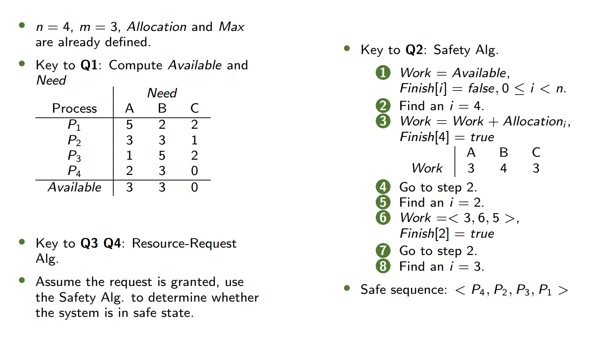
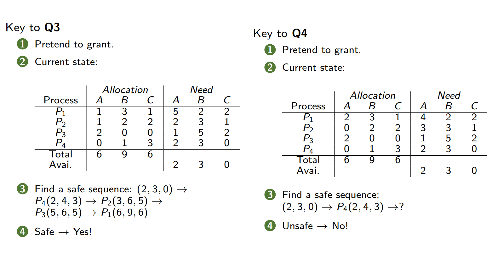
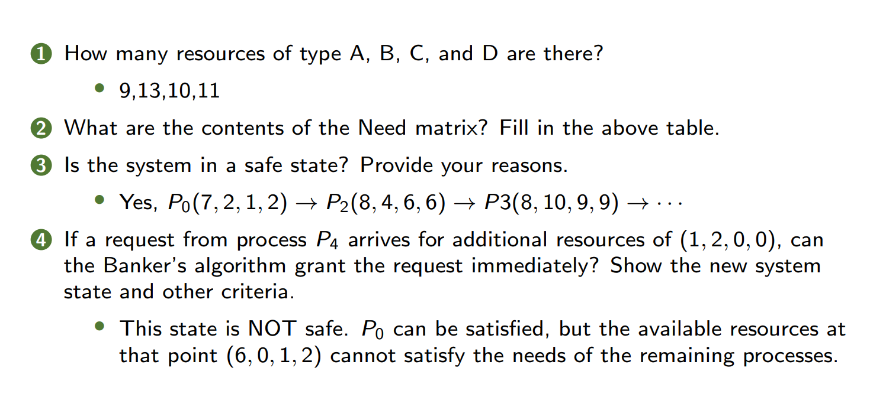
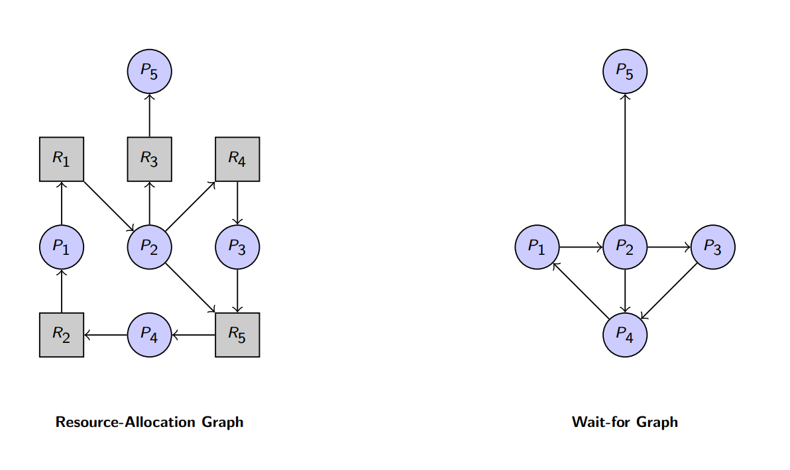

---
## 1. Warm-up - 热身  
### Non-deadlock Bugs - 非死锁错误  
- **97%的非死锁错误是原子性违反(Atomicity violation)或顺序违反(Order violation)**  
  - **Atomicity violation bugs (原子性违反错误)**  
    ```text
    Thread 1: fputs(thd->proc_info, ...)
    Thread 2: thd->proc_info = NULL
    ```
  - **Order violation bugs (顺序违反错误)**  
    ```text
    Thread 1: mThread = PR_CreateThread(mMain, ...)
    Thread 2: mState = mThread->State
    ```
### Deadlock Bugs - 死锁错误  
- **原因**:  
  - 大型代码库中组件间的复杂依赖关系  
    - 例如：虚拟内存系统需要访问文件系统来从磁盘分页，而文件系统又需要内存页来读取块  
  - 封装性导致模块化与锁机制不兼容  
    - 示例：Java的`Vector.AddAll()`方法可能因锁顺序不一致导致死锁  
    ```java
    Vector v1, v2;
    v1.AddAll(v2);  // 若另一线程调用v2.AddAll(v1)，可能死锁
    ```

---
## 2. System Model - 系统模型  
- **资源类型**：CPU周期、内存空间、I/O设备$R_1, R_2, \cdots, R_m$
- **资源实例**：每种资源类型$R_i$$有$$W_i$个实例  
- **资源使用流程**：  
  1. **Request** - 请求  
  2. **Use** - 使用  
  3. **Release** - 释放  
---
## 3. Deadlock Characterization - 死锁特征  
### 四个必要条件（需同时满足）  
1. **Mutual Exclusion (互斥)**：资源一次仅能被一个进程占用  
2. **Hold and Wait (占有并等待)**：进程持有至少一个资源并等待获取其他进程占用的资源  
3. **No Preemption (不可抢占)**：资源只能由持有进程自愿释放  
4. **Circular Wait (循环等待)**：存在进程集合 \{$P_0, P_1, \cdots, P_n$\} ，其中$P_i$ 等待的资源被$P_{(i+1 \mod n)}$ 持有  
Necessary, but NOT sufficient condition(s)
必要不充分条件

### 资源分配图 (Resource-Allocation Graph)  
- **顶点**：进程$P = \{P_1, P_2, \cdots\}$和资源$R = \{R_1, R_2, \cdots\}$ 
- **边**：  
  - **请求边**：$P_i \to R_j$（进程请求资源）  
  - **分配边**：$R_j \to P_i$（资源已分配给进程）  
- **死锁判断**：  
  - 无环 ⇒ 无死锁  
  - 有环 ⇒ 若资源类型仅单实例，则死锁；多实例可能死锁  

---
## 4. Methods for Handling Deadlocks - 死锁处理方法  
1. **预防 (Deadlock prevention)**：破坏四个必要条件之一  
2. **避免 (Deadlock avoidance)**：通过调度确保系统不进入不安全状态  
3. **检测 (Deadlock detection)**  
4. **恢复(Recovery from deadlock)**
---
## 5. Deadlock Prevention - 死锁预防  
### 破坏循环等待 (Circular Wait)  
- 对所有资源类型施加一个全序关系，并要求每个进程按照枚举值递增的顺序请求资源。
  ```c
do_something(mutex_t *m1, mutex_t *m2) {
    // ...
    if (m1 > m2) {
        pthread_mutex_lock(m1);
        pthread_mutex_lock(m2);
    } else {
        pthread_mutex_lock(m2);
        pthread_mutex_lock(m1);
    }
    // ...
}
/* An ordering, or hierarchy, does not in itself prevent deadlock */
  ```
### 破坏占有并等待 (Hold and Wait)  
- 必须确保每当一个进程请求资源时，它不持有任何其他资源。
- 要求进程在开始执行之前请求并分配到其所需的所有资源，或者仅当进程未被分配任何资源时才允许其请求资源。
- 资源利用率低；可能会出现饥饿现象。 
- 请注意，该解决方案存在问题： 
	- 封装特性对我们不利。 
	- 并发度降低。
### 破坏不可抢占 (No Preemption)  
- If a process that is holding some resources requests another resource that cannot be immediately allocated to it, then all resources currently being held are released. Preempted resources are added to the list of resources for which the process is waiting. Process will be restarted only when it can regain its old resources, as well as the new ones that it is requesting.
- 如果一个持有某些资源的进程请求另一个无法立即分配给它的资源，那么该进程当前持有的所有资源都将被释放。被抢占的资源会被添加到该进程正在等待的资源列表中。只有当该进程能够重新获得其原有的资源以及它所请求的新资源时，才会重新启动。
- **抢占释放**：若请求失败，释放已持有资源并重试  
  ```c
  top: 
      lock(L1); 
      if (trylock(L2) == -1) { 
          unlock(L1); 
          goto top; 
      }
  ```
- 请注意，该解决方案存在问题： 
	- 封装特性对我们不利。 
	- 活锁：有可能两个线程都在反复尝试这个序列，并且反复无法获取两个锁。 
		- 解决方案是在回环并再次尝试整个操作之前添加一个随机延迟。 
- Note that the solution is problematic: 
	- Encapsulation works against us. 
	- Livelock: It is possible that two threads could both be repeatedly attempting this sequence and repeatedly failing to acquire both locks. 
		- Solution is to add a random delay before looping back and trying the entire thing over again.
### 破坏互斥 (Mutual Exclusion)  
- 对于可共享资源（例如，只读文件）来说并非必需；对于不可共享资源则必须具备（互斥条件）。
- 一般来说，我们无法通过否定互斥条件来预防死锁，因为有些资源本质上就是不可共享的。
- 无等待并发
---
## 6. Deadlock Avoidance - 死锁避免  
- Requires that the system has some additional a priori information 先验信息 available.
- Simplest and most useful model requires that each process declare the maximum number of resources of each type that it may need.
- The deadlock-avoidance algorithm dynamically examines the resource-allocation state 动态检查资源分配状态 to ensure that there can never be a circular-wait condition. 循环等待情况
- Resource - allocation state is defined by the number of available and allocated resources, and the maximum demands of the processes.
### 安全状态 (Safe State)  
如果系统能按某种顺序为所有进程分配资源，并确保它们都能顺利完成（不会发生死锁），则称系统处于**安全状态**。
- 至少存在一个**安全序列**
安全序列：
如果存在一个由系统中所有进程组成的序列$<P_1, P_2, \cdots, P_n>$，使得对于每个 $P_i$ ，$P_i$ 仍然可以请求的资源能够通过当前可用资源加上所有 $j < i$ 的 $P_j$ 所拥有的资源来满足，那么系统就处于安全状态。
- 如果 $P_i$  的资源需求不能立即得到满足，那么 $P_i$ 可以等待，直到所有的 $P_j$ 都已完成。
- 当 $P_j$ 完成时，$P_i$ 可以获取所需的资源，执行操作，归还已分配的资源，然后终止。
- 当 $P_i$  终止后，$P_{i+1}$ 可以获取其所需的资源，依此类推。
System is in safe state if there exists a sequence $<P_1, P_2, \cdots, P_n>$ of ALL the processes in the systems such that for each Pi, the resources that Pi can still request can be satisfied by currently available resources + resources held by all the Pj, with j < i.
- If Pi resource needs are not immediately available, then Pi can wait until all Pj have finished.
- When Pj is finished, Pi can obtain needed resources, execute, return allocated resources, and terminate.
- When Pi terminates, Pi+1 can obtain its needed resources, and so on.
也就是说，依次执行每个进程，到达任意的进程时都能满足资源需求
- **当前可用资源** + **$P_1$​到$P_{i−1}$已释放的资源** ≥ $P_i$​的**剩余需求**。
- 系统可以逐步分配资源并让所有进程完成
#### 示例：  
| 进程    | Max Needs | Current Needs |
| ----- | --------- | ------------- |
| $P_0$ | 10        | 5             |
| $P_1$ | 4         | 2             |
| $P_2$ | 9         | 2             |
- **安全序列**：$<P_1, P_0, P_2>$ 

### 避免算法  Avoidance Algorithms
1. **单实例资源**：资源分配图算法/Resource-Allocation-Graph Algorithm（添加**Claim Edge 需求边**）  
	- 资源分配图：
		- **Claim Edge 需求边/声明边**：进程Pi的Pi --> Rj表示进程Pi可能请求资源Rj：例如下图由P指向R的虚线
		  - 当一个进程请求资源时，声明边会转换为**Request Edge 请求边**：例如下图由P指向R的实线
		  - 当资源被分配给进程时，请求边会转换为**Assignment Edge 分配边**：例如下图由R指向P的实线
		  - 当一个进程释放资源时，分配边会重新转换为需求边
		  - 在系统中，资源必须事先被声明
	- ![[pictures/7-1.png]]
	- Suppose that process $P_i$ requests a resource $R_j$
	- The request can be granted only if converting the request edge to an assignment edge **does not result in the formation of a cycle** in the resource allocation graph
	- 只有当将请求边转换为分配边不会导致在资源分配图中 **形成环路** 时，该请求才会被批准。
2. **多实例资源**：银行家算法 (Banker's Algorithm) 
	- 见后文
#### 银行家算法 (Banker's Algorithm)  重点！！
- 假设：    
    - 每个进程必须事先声明其对资源的最大使用量。
    - 当一个进程请求资源时，它可能不得不等待。
    - 当一个进程获得了它所需的所有资源时，它必须在有限的时间内归还这些资源。
- Assumptions:
    - Each process must a priori claim maximum use.
    - When a process requests a resource it may have to wait.
    - When a process gets all its resources it must return them in a finite amount of time.
- **数据结构**：
	- n = number of processes 进程数量
	- m = number of resources types 资源种类数
	- **Available**：长度为m的向量。如果 Available \[j\] = k，那么资源类型 $R_j$ ​总共有 $k$ 个可用实例。
	- **Max**：n×m矩阵。如果 Max \[i, j\] = k，那么全过程中进程 $P_i$ ​**总共**需要请求资源类型 $R_j$ 的 $k$ 个实例 / **最大只能**请求到资源类型 $R_j$ 的 $k$ 个实例。
	- **Allocation**：n×m矩阵。如果 Allocation \[i, j\] = k，那么进程 $P_i$ ​当前已被分配了 $R_j$ 的 $k$ 个实例。
	- **Need**：n×m矩阵。如果 Need \[i, j\] = k，那么进程 $P_i$ ​为了完成其任务**还**需要 $R_j$ 的 $k$ 个更多实例。  
		- Need\[i, j\] = Max\[i, j\] - Allocation\[i, j\]

- **安全性算法步骤**：用于判断系统是否处于安全状态
  1. 初始化向量 $Work$ m维和 $Finish$ n维：$Work = Available$，$Finish[i] = false$ 
	  - Work\[j\]为第j个资源当前可用资源实例数，初始化为Available
	  - Finish为进程是否完成了任务
  2. 找到满足$Finish[i] == false$ 且 $Need[i] \leq Work$ 的进程$P_i$ ，若找不到则到第4步
	  -  $Need[i] \leq Work$ 是两个m维向量的比较，需要Need\[i\]的每个数小于等于Work的对应数，表示当前还需要的少于能分配的
	  - 找出没有完成分配，且需求小于等于当前可用资源的进程
  3. 释放 $P_i$ 资源：$Work = Work + Allocation_i$，$Finish[i] = true$ ，返回第2步
	  - 从Work中分配了$Need_i$的部分给Pi，Pi执行完了后释放资源
	  - 相当于Work直接增加了$Allocation_i$ 
		  - #### **注意！！！！不是加Need！是加Allocation！！**
	  - Pi完成，标记Finish\[i\]为true
  4. 若所有 $Finish[i] == true$ ，系统安全
	  - 所有线程都完成则安全，否则表明出现无法完成的线程，证明可能有死锁
 - 复杂性： $O(m\times n^2)$

- **资源请求算法**：假设Pi现在**新提出了**一些资源需求，判断是否安全允许请求的算法
 -  $Request_i$  = 进程 $P_i$ 的请求向量。如果 $Request_i[j] = k$ ，那么进程 $P_i$ 需要资源类型 $R_j$ 的k个实例。
 1. 如果 $Request_i \leq Need_i$ ，则进入步骤 2。否则，引发错误情况，因为该进程已超出其最大声明需求量。
 2. 如果 $Request_i \leq Available$ ，则进入步骤 3。否则，进程 $P_i$ 必须等待，因为资源不可用。
 3. 通过按如下方式修改状态来**模拟**将请求的资源分配给进程 $P_i$ ：
      $Available = Available - Request_i$ 
      $Allocation_i = Allocation_i + Request_i$ 
      $Need_i = Need_i - Request_i$ 
    - 如果系统处于安全状态，则将资源分配给进程 $P_i$ 。
    - 如果系统处于不安全状态，则进程 $P_i$ 必须等待（因为不安全），并且恢复原来的资源分配状态。

#### In Class Exercise 1
![[pictures/7-2.png]]
**Answer:**



#### In Class Exercise 2
![[pictures/7-3.png]]
**Answer:**


#### In Class Exercise 3
![[pictures/7-4.png]]
**Answer:**
1. Allocation-Total: `[4, 7, 4, 7]`. So that `[A,B,C,D]=[6,7,6,7]`
2. Need Matrix：
$$
   \begin{bmatrix}
	1&1&2&1\\
	0&3&1&0\\
	2&0&1&0\\
	4&3&1&1\\
	3&0&5&1\\
   \end{bmatrix}
$$
3. Yes
   Initial Work = `[2,0,2,0]`
   P2: `[2,1,2,1]`
   P0: `[3,3,3,3]`
   P1: `[4,4,3,3]`
   P3: `[5,5,5,5]`
   P4: `[6,7,6,7]`
   Safety Sequence: P2->P0->P1->P3->P4
4. `[0,0,2,0]` does not <= Need. Cannot grant the request.

---
## 7. Deadlock Detection - 死锁检测  
### 单实例资源  
- 使用 **等待图 (Wait-for Graph)**：  
  - 由资源分配图删去资源节点，并合并边所得
  - 节点为进程，边$P_i \to P_j$表示$P_i$等待$P_j$释放资源
  - **检测环 ⇒ 死锁**（时间复杂度$O(n^2)$）  
  - 
### 多实例资源  
- **数据结构**（和银行家算法一致）：
  - Available: A vector of length m indicates the number of available resources of each type
  - Allocation: An n × m matrix defines the number of resources of each type currently allocated to each process
  - Request: An n × m matrix indicates the current request of each process. If Request\[i\]\[j\] = k, then process Pi is requesting k more instances of resource type Rj.
	  - **此时进程都在请求资源，而非安全算法适用的没有请求的状态**
#### 检测算法步骤：  
1. 初始化 $Work = Available$ ；`for i = 1 to n: if Allocation[i] != [0]*m, then Finish[i] = false; otherwise, Finish[i] = true`
   也就是Finish\[i\]=true当且仅当Allocation\[i\]的每个数全为0，也就是Pi没被分配资源（已完成）
2. 找到 $Finish[i] == false$ 且 $Request_i \leq Work$ 的进程 $P_i$  。如果找不到则到第4步
	- 逻辑与安全性算法类似：满足条件的进程可以完成，从而可以释放资源
3. 释放$P_i$资源：$Work = Work + Allocation_i$，$Finish[i] = true$ 。返回第3步
4. 若存在$Finish[i] == false$，则线程$P_i$死锁 
需要 $O(m\times n^2)$ 的操作

与银行家算法安全性算法的区别

| **对比点**    | **检测算法（Deadlock Detection）**                | **安全性算法（Safety Algorithm，银行家算法）**              |
| ---------- | ------------------------------------------- | ---------------------------------------------- |
| **目标**     | **检测当前系统是否已经发生死锁**<br>此时每个进程都有Request请求资源   | **预防死锁，确保系统始终处于安全状态**<br>此时每个进程都还没有请求资源        |
| **执行时机**   | **死锁可能已经发生**，用于检测并恢复                        | **在分配资源前**，避免系统进入不安全状态                         |
| **数据结构**   | 使用 `Available`、`Allocation`、`Request`（请求矩阵） | 使用 `Available`、`Max`、`Allocation`、`Need`（需求矩阵） |
| **核心条件**   | 检查是否存在 `Finish[i] == false` 且无法继续执行的进程      | 检查是否存在至少一个**安全序列**（所有进程可完成）                    |
| **资源分配策略** | **不限制分配**，允许死锁发生，但后续检测                      | **保守分配**，仅当分配后系统仍安全时才批准请求                      |
| **适用场景**   | 允许死锁但需恢复的系统（如数据库、分布式系统）                     | 严格避免死锁的系统（如实时系统、嵌入式系统）                         |
#### 检测算法的使用
- When, and how often, to invoke depends on:
	- *How often* a deadlock is likely to occur?
	- *How many processes* will need to be rolled back?
		- one for each disjoint cycle
- If detection algorithm is invoked arbitrarily, there may be many cycles in the resource graph and so we would not be able to tell which of the many deadlocked processes "caused" the deadlock.
---
## 8. Recovery from Deadlock - 死锁恢复  
### 进程终止 (Process Termination)  
- **终止所有死锁进程**  
- **逐个终止进程**直到解除死锁  
  - **选择策略**：  
    - 进程优先级  
    - 已计算时间与剩余时间  
    - 资源占用情况  
### 资源抢占 (Resource Preemption)  
需要处理三个问题：
- **选择牺牲者 (Victim Selection)**：最小化代价  
- **回滚 (Rollback)**：恢复到安全状态后重启  
- **饥饿问题**：避免同一进程多次被选为牺牲者  
