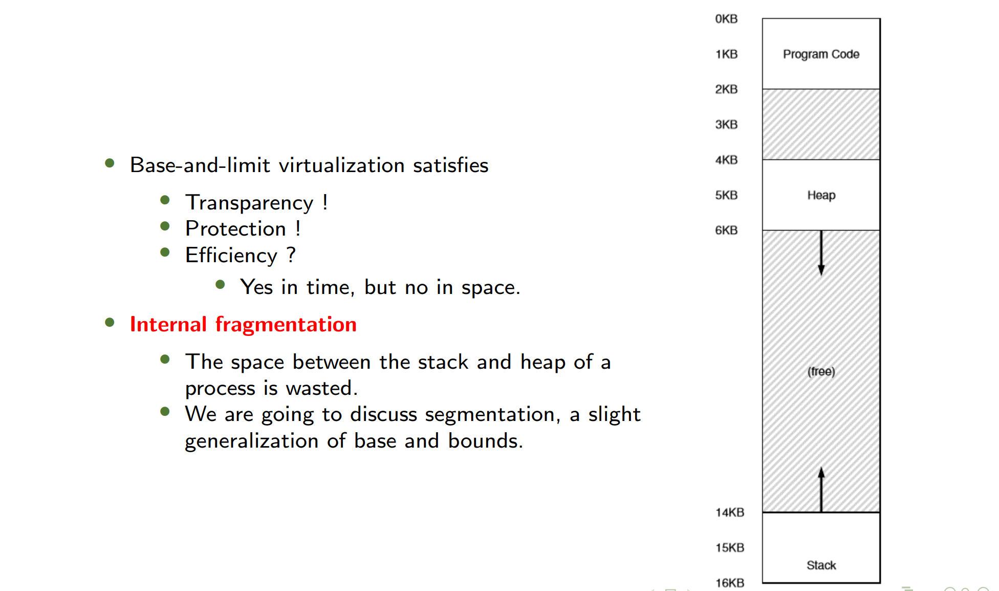
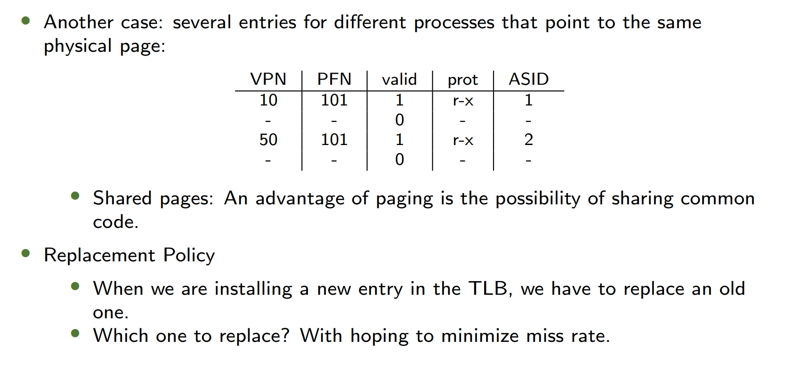
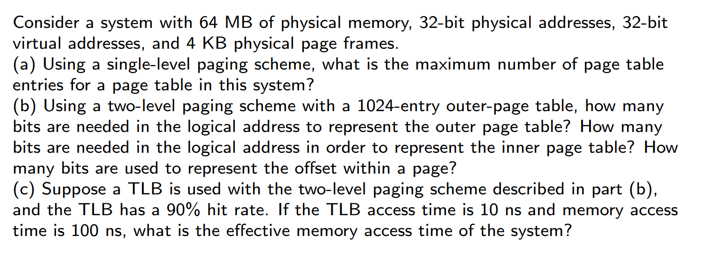
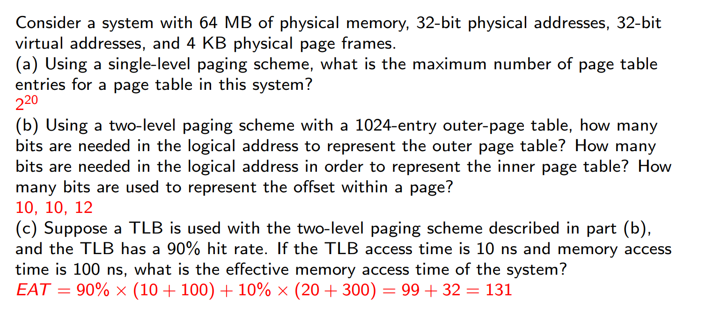

## 目录 / Table of Contents
1. 热身 / Warm-up
2. 背景知识 / Background
3. 地址转换 / Address Translation
4. 分段 / Segmentation
5. 空闲空间管理 / Free Space Management
6. 分页 / Paging
7. 转换后备缓冲器 / Translation Lookaside Buffer
8. 页表结构 / Structure of the Page Table
9. 交换 / Swapping
10. 示例架构 / Example Architectures
---
## 1. 热身 / Warm-up

### 内存API / Memory API
```c
void func() {
    int x;          // 栈内存
    int *x = (int *) malloc(sizeof(int));  // 堆内存
}
```
- **栈内存 (Stack memory)**
  - 分配和释放由编译器隐式管理，因此有时称为自动内存
  - The allocations and deallocations are managed implicitly by the compiler. So it is sometimes called automatic memory.
- **堆内存 (Heap memory)**
  - 所有分配和释放都由程序员显式处理，是许多错误的根源
  - All allocations and deallocations are explicitly handled by the programmer. The cause of many bugs!
### 输出示例 / What is the Output?
```c
#include <unistd.h>
#include <stdio.h>
#include <stdlib.h>
#include "common.h"

int main(int argc, char *argv[]) {
    int *p = malloc(sizeof(int));
    assert(p != NULL);
    printf("(%d) memory address of p: %08x\n", getpid(), (unsigned) p);
    *p = 0;
    while (true) {
        Spin(1);
        *p = *p + 1;
        printf("(%d) p: %d\n", getpid(), *p);
    }
    return 0;
}
```
- 输出显示两个进程可以访问相同的虚拟地址(00200000)，但各自有独立的物理内存
- The output shows two processes can access the same virtual address (00200000) but have independent physical memory
---
## 2. 背景知识 / Background

### 主要概念 / Key Concepts
- 程序必须从磁盘加载到内存才能运行
  - Program must be brought (from disk) into memory and placed within a process to be run
- 只有内存和寄存器能被CPU直接访问
  - Main memory and registers are only storage CPU can access directly
- 存储单元只能看到一连串的地址加读取请求，或者是地址加数据以及写入请求。
  - Memory unit only sees a stream of addresses + read requests, or address + data and write requests
- 在一个 CPU 时钟周期内（或更短时间内）访问寄存器。
  - Register access in one CPU clock (or less)
- 内存访问比寄存器慢很多，导致停顿
  - Main memory can take many cycles, causing a <font color="red">stall</font>
- Cache位于主存储器和中央处理器（CPU）寄存器之间。
  - Cache sits between main memory and CPU register
### 地址绑定 / Address Binding
地址在不同阶段有不同表示形式：
- 源代码地址通常是符号化的(如`int count`)
- 编译代码地址绑定到可重定位地址(如“距模块开头14字节”)
- 链接器或加载器将可重定位地址绑定到绝对地址(如“74014”)
### 绑定时间 / Binding Time
1. **编译时绑定 Compile Time**：If memory location known a priori 先验知道, absolute code can be generated; must recompile code if starting location changes
2. **加载时绑定 Loading Time**：Must generate relocatable code 可重定位代码 if memory location is not known at compile time
3. **执行时绑定 Execution Time**：Binding delayed until run time if the process can be moved during its execution from one memory segment to another 进程可以从一个内存段移动到另一个
	- Need hardware support for address maps (e.g., base and limit registers)
	- Most general-purpose operating systems use this method
### 动态加载与链接 / Dynamic Loading & Linking
- **动态加载 Dynamic loading**：a routine is not loaded until it is called. All routines are kept
on disk in a relocatable load format. (\*.exe, \*.o)
- **静态链接 Static linking**：系统库和程序代码在加载时组合
- **动态链接 Dynamic linking**：延迟到执行时才链接，使用存根(stub)定位库例程
- Small piece of code, **stub 存根**, used to locate the appropriate memory-resident library
	- routine.s
### 地址空间 / Address Space
- **逻辑地址 Logic Address**：CPU生成的地址(虚拟地址)
- **物理地址 Physical Address**：内存单元看到的地址
- Logical and physical addresses are identical in compile-time and load-time address-binding schemes; logical (virtual) and physical addresses differ in execution-time address-binding scheme
  在编译时和加载时地址绑定方案中，逻辑地址和物理地址是相同的；而在运行时地址绑定方案中，逻辑（虚拟）地址和物理地址是不同的。
- Logical address space is the set of all logical addresses generated by a program
- Physical address space is the set of all physical addresses generated by a program
---
## **3. Address Translation / 地址转换**  
### **Base and Limit Registers / 基址和界限寄存器**  
- **Function / 功能**:  
  - A pair of base and limit / bound registers define the logical address space
  - 基址和界限寄存器用于透明地重定位进程并确保内存访问在合法范围内。
- **Formula**:  
 $$
  \text{Physical Address} = \text{Virtual Address} + \text{Base}
$$
### **Memory Management Unit (MMU) / 内存管理单元**  
- The base and limit registers are hardware structures kept on the chip (one pair per CPU).
- The part of the processor that helps with address translation is the memory management unit (MMU)
- MMU是负责地址转换的硬件组件，包含基址和界限寄存器。

### **Hardware & OS Support**

| **硬件需求 Hardware Requirements**                                            | **说明 Notes**                                                                                                |
| ------------------------------------------------------------------------- | ----------------------------------------------------------------------------------------------------------- |
| 特权模式 <br>Privileged mode                                                  | 防止用户模式进程执行特权操作 <br>Needed to prevent user-mode processes from executing privileged operations               |
| 基址/界限寄存器<br>Base/limit registers                                          | 每个CPU需要一对寄存器支持地址转换和边界检查 <br>Need pair of registers per CPU to support address translation and bounds checks |
| 虚拟地址转换和边界检查能力 <br>Ability to translate virtual addresses and check bounds | 执行转换和检查边界的电路，此情况下较为简单 <br>Circuitry to do translations and checks; in this case, quite simple               |
| 更新基址/界限的特权指令<br>Privileged instructions to update base/limit              | 操作系统必须在运行用户程序前能设置这些值<br>OS must be able to set these values before letting user program run                 |
| 注册异常处理程序的特权指令 <br>Privileged instructions to register exception handlers  | 操作系统必须能告诉硬件异常时运行什么代码 <br>OS must be able to tell hardware what code to run on exception                     |
| 异常触发能力 <br>Ability to raise exceptions                                    | 当进程尝试访问特权指令或越界内存时触发 <br>When processes try to access privileged instructions or out-of-bounds memory        |

| **操作系统需求 OS Requirements**       | **说明 Notes**                                                                                                                                                    |
| -------------------------------- | --------------------------------------------------------------------------------------------------------------------------------------------------------------- |
| 内存管理<br>Memory management        | 需要为新进程分配内存；回收终止进程的内存；通常通过空闲列表管理内存 <br>Need to allocate memory for new processes; Reclaim memory from terminated processes; Generally manage memory via freelist |
| 基址/界限管理<br>Base/limit management | 必须在上下文切换时正确设置基址和界限值<br>Must set base / limit properly upon context switch                                                                                       |
| 异常处理 <br>Exception handling      | 异常发生时运行的代码；通常操作是终止违规进程 <br>Code to run when exceptions arise; likely action is to terminate offending process                                                   |

**Summary:**


---
## **4. Segmentation / 分段**  
### **Generalized Base/Limit / 广义基址-界限**  
- **Segmentation Registers / 段寄存器**: 
  - Have a base and bounds pair per logical segment of the address space, instead of having just one base and bounds pair in the MMU.
  - 每个逻辑段（代码、堆、栈）都有自己的基址和界限寄存器。

- Segmentation is a solution to internal fragmentation. 
- One problem with segmentation is external fragmentation. 
- **External Fragmentation**: total memory space exists to satisfy a request, but it is not contiguous
- **Internal Fragmentation**: allocated memory may be slightly larger than requested memory; this size difference is memory internal to a partition, but not being used
	- 内部碎片由MMU分块机制产生
---
## **5. Free Space Management / 空闲空间管理**  
**Mechanisms: Splitting 分裂, coalescing 合并 .**
- Policies: Various strategies.
	- Best-fit (smallest fit)
		- 从所有空闲块中选择**最小的足够大的块**。优点是减少浪费，但可能需要遍历所有空闲块，速度较慢。
	- Worst-fit
		- 选择**最大的空闲块**进行分配，将剩余部分作为新的空闲块。优点是避免产生过多小碎片，但性能较差，实际使用较少。
	- First-fit
		- 从内存的起始位置开始查找，选择**第一个足够大的空闲块**。优点是速度快，但可能导致内存前部分产生较多小碎片。
	- Next-fit
		- 类似首次适应，但从上次分配结束的位置开始查找。优点是分布更均匀，但可能漏掉某些合适的块。
- **Efficiency / 效率**:  
	- Simulations have shown that both first-fit and best-fit are better than worst-fit in terms of decreasing time and storage utilization.
	- First-fit is generally faster than best-fit.
---
## **6. Paging / 分页**  
### 分页与分段比较
- Segmentation
	- to chop up space into different-size chunks.
	-  The space itself can become fragmented, and thus allocation becomes more challenging over time.
- Paging
- to chop up space into fixed-sized pieces, i.e., pages. 分成固定大小的页
- The physical memory can be viewed as an array of fixed-sized slots called page frames; each of these frames can contain a single virtual-memory page.
### **Why Paging? / 为什么使用分页？**  
- **Flexibility / 灵活性**: Supports sparse address spaces efficiently.  
- **Simplicity / 简单性**: Easier free-space management than segmentation.  
- 分页比分段更灵活，支持稀疏地址空间，且空闲空间管理更简单。
### **Paging Overview / 分页概述** 
将物理内存分成固定大小的页框Page Frames。将逻辑内存分成固定大小的页Pages
- **Pages / 页**: Fixed-size chunks of virtual memory (e.g., 4KB).  
- **Page Frames / 页框、帧**: Physical memory slots that hold pages.  
- 虚拟内存被划分为固定大小的页，物理内存划分为页框。  
### **Address Translation / 地址转换**  
- **Page Table / 页表**: Maps **Virtual Page Numbers (VPNs)** to **Physical Frame Numbers (PFNs)** 
- **Virtual Address Structure / 虚拟地址结构**:  
  - `VPN | Offset` (e.g., 20-bit VPN + 12-bit offset for 4KB pages).  
- 页表存储虚拟页号到物理帧号的映射，虚拟地址由VPN和偏移量组成。
	- 虚拟地址=虚页号（VPN）|页内偏移量
	- 物理地址=实页号（PFN）|页内偏移量
#### **Example / 示例**  
- Virtual Address: `21 (0b010101)` → `VPN=01 (1)`, `Offset=0101 (5)`.  
- Page Table Entry: `VP1 → PF7`.  
- Physical Address: `PFN=7 (0b111)`, `Offset=5` → `0b1110101 = 117`. 
### **Page Table Storage / 页表存储**  
- **Not in MMU**: Too large (e.g., 4MB for 32-bit address space with 4KB pages).  
- **In Physical Memory**:
  - **Page-Table Base Register (PTBR)**: Points to the page table.  
  - **Page-Table Length Register (PTLR)**: Indicates its size.  
- 页表存储在**物理内存**中，由PTBR和PTLR寄存器定位。  

### **Page Table Entry (PTE) / 页表项**  
| **Bit**                           | **Purpose**                                        |
| --------------------------------- | -------------------------------------------------- |
| **PFN (20 bits) 实页号**             | Physical Frame Number.                             |
| **Valid Bit 有效位**                 | Whether the translation is valid.                  |
| **Present Bit 存在位 (P)**           | Whether the page is in physical memory.            |
| **Dirty Bit 脏位 (D)**              | Whether the page has been modified.                |
| **Reference Bit 引用位 (A)**         | Whether the page has been accessed.                |
| **User/Supervisor Bit (U/S)**     | User-mode access permissions.                      |
| A few bits (PWT, PCD, PAT, and G) | determine how hardware caching works for the page. |

---
## **7. Translation Lookaside Buffer (TLB) / 转换后援缓冲器**  
### **Why TLB? / 为什么需要TLB？** 
- A translation lookaside buffer, or TLB is
	- part of the chip’s **memory-management unit (MMU)**;**在MMU中！**
	- simply a hardware cache of popular virtual-to-physical address translation;
	- also called an address-translation cache.
		- TLB hit
		- TLB miss
- Without TLB, each memory access requires **two memory lookups**:  
  1. Page table lookup (to get PFN).  
  2. Actual data access.  
- TLB缓存常用地址转换，避免每次内存访问都查询页表。 

### **TLB Basic Algorithm / TLB基本算法**  
1. Extract VPN from virtual address.  
2. Check TLB for VPN → PFN mapping.  
	- **Hit**: Use cached PFN.  
	- **Miss**: Load PTE from memory and update TLB.  
3. Compute physical address: `(PFN << SHIFT) | Offset`.  

```
// 1. 从虚拟地址中提取虚拟页号(VPN)：通过与操作和移位操作获取
VPN = (VirtualAddress & VPN.MASK) >>> SHIFT

// 2. 在TLB(快表)中查找该VPN的转换条目
(Success, TlbEntry) = TLB.Lookup(VPN)

if (Success == True)    // TLB命中
    // 检查访问权限
    if (CanAccess(TlbEntry.ProtectBits) == True)
        // 计算偏移量
        Offset = VirtualAddress & OFFSET.MASK
        // 构造物理地址：将PFN左移后与偏移量组合
        PhysAddr = (TlbEntry.PFN<<SHIFT) | Offset
        // 访问物理内存
        AccessMemory(PhysAddr)
    else
        // 权限检查失败，抛出保护错误异常
        RaiseException(PROTECTION.FAULT)
    // TLB未命中
else
	// or RaiseException(TLB_MISS)
    // 计算页表项(PTE)地址：PTBR是页表基址寄存器
    PTEAddr = PTBR + (VPN * sizeof(PTE))
    // 从内存中获取PTE
    PTE = AccessMemory(PTEAddr)
    if (PTE.Valid == False)
        // 页表项无效，抛出段错误异常（例如缺页）
        RaiseException(SEGMENTATION.FAULT)
    else if (CanAccess(PTE.ProtectBits) == False)
	        // 页表项有效但无访问权限，抛出保护错误异常
        RaiseException(PROTECTION.FAULT)
    else
        // 将转换关系插入TLB
        TLB_Insert(VPN, PTE.PFN, PTE.ProtectBits)
        // 重试当前指令
        RetryInstruction()
```

### Issues
- Return-from-trap
	- Normally the next, but here execute the instruction that caused the trap
- TLB miss-handling 防止无限循环
	- TLB 缺失的无限循环，也就是在处理一个 TLB 缺失的过程中，又不断触发新的 TLB 缺失，进而陷入死循环。这种情况一般在以下情形下会发生：
		- **页表本身不在 TLB 中**：处理 TLB 缺失时，需要从页表中查找物理地址。要是页表项不在 TLB 中，就会引发新的 TLB 缺失。要是每次查找页表项都导致新的 TLB 缺失，就可能形成无限循环。
		- **TLB 缺失处理程序不在物理内存中**：TLB 缺失处理程序是用来处理 TLB 缺失的代码。如果这个程序本身的代码或者数据不在物理内存中，在执行处理程序时就可能再次触发 TLB 缺失。要是每次执行处理程序都触发新的 TLB 缺失，就会出现无限循环。
	- 解决方案
		- **将 TLB 缺失处理程序保留在物理内存中**：把 TLB 缺失处理程序放在物理内存里，能保证在处理 TLB 缺失时，处理程序的代码和数据都能直接访问，不会再因为处理程序本身引发新的 TLB 缺失，从而避免无限循环的出现。
		- **在 TLB 中预留一些条目用于永久性有效的地址转换**：可以在 TLB 里预留一些条目，这些条目存储的映射关系始终有效，例如页表本身的映射关系。这样在处理 TLB 缺失时，就能直接使用这些永久性有效的条目来查找页表项，减少新的 TLB 缺失发生的概率，进而避免无限循环。
- 为什么由操作系统完成？
	- 方便、简单

- What are TLB contents?
		VPN | PFN | other bits
	- A **valid bit**, whether the entry has a valid translation or not.
	- **Protection bits**, how a page can be accessed.
	- A **address-space identifier**,
	- A **dirty bit**, whether or not modified.
	- etc.

### TLB 上下文切换
- TLB存储了虚拟地址到物理地址的转换条目，但这些条目仅对当前运行的进程有效
- 关键问题：如何确保即将运行的进程不会意外使用之前进程留下的TLB转换条目？
- Flush the TLB on context switches, thus emptying it before running the next process. OR
- 上下文切换时清空TLB(Flush TLB)，或者
- Use an address space identifier (ASID).
- 使用**地址空间标识符**(**ASID**)
	- 为每个进程分配唯一的ASID
	- TLB条目同时通过VPN和ASID来标识

### TLB共享内存/替换策略

### **TLB Handling / TLB处理**  
| **Scenario**       | **Solution**                                  |
| ------------------ | --------------------------------------------- |
| **TLB Miss**       | Hardware or OS loads the missing entry.       |
| **Context Switch** | Flush TLB or use **Address Space ID (ASID)**. |
| **Shared Pages**   | Multiple PTEs can map to the same PFN.        |

### **Effective Access Time (EAT) / 有效访问时间**  
从进程发出指定逻辑地址的访问请求到在内存中找到对应的实际物理地址单元并取出数据所需的总时间
1. **TLB查找时间( $\epsilon$ )**：
	- 图片中表示为 $\epsilon$ 时间单位，一般表示相比较于内存访问的时间
    - 典型值：20ns(在示例中)
2. **命中率( $\alpha$ )**：
   - 表示TLB查找成功的概率
   - 示例中给出两个场景：
     - 80%命中率(较保守)
     - 99%命中率(更现实的高性能系统)

## 有效访问时间(EAT)计算
### 基本公式
 $$EAT = ([1] + \epsilon)\alpha + ([2] + 2\epsilon)(1 - \alpha)$$
其中：
 - $\alpha$ 是命中率
- (\[1\] + $\epsilon$) ：TLB命中时的访问时间(1次内存访问 + TLB查找)
	- \[1\]表示1次内存访问需要的时间
	- 比如，内存访问为100ns，TLB搜索 $\epsilon$ 为20ns，则(\[1\]+$\epsilon$)=120ns
- (\[2\] + 2$\epsilon$)：TLB未命中时的访问时间(需要额外的页表访问)
### 计算示例1 ( $\alpha$  = 80%)
参数：
- $\epsilon$ = 20ns (TLB查找时间)
- 内存访问时间 = 100ns (标准化为1时间单位)
计算：$EAT = 0.80 \times 120 + 0.20 \times 240 = 96 + 48 = 144 \ \text{ns}$
### 计算示例2 ( $\alpha$  = 99%)
相同参数下：$EAT = 0.99 \times 120 + 0.01 \times 240 = 118.8 + 2.4 = 121.2 \ \text{ns}$
## 性能分析
1.  **命中率的影响**：
	- 命中率从80%提高到99%，EAT从144ns降至121ns
	- 显示高命中率对系统性能的关键影响
2. **时间组成**：
	- TLB命中时：只需1次内存访问(100ns) + TLB查找(20ns) = 120ns
	- TLB未命中时：需要额外访问页表(再加100ns + 20ns) = 总240n
3. **实际系统考量**：
	- 现代处理器通过大TLB、智能替换策略实现高命中率(>99%)
	- 多级TLB设计(L1 TLB和L2 TLB)进一步优化访问时间

### 页面大小选择考量因素 / Page Size Selection Considerations

#### 1. 内部碎片问题 / Internal Fragmentation
**Small Page**
- **小页面优势 / Small Page Advantage**:  
  减少未使用的页内空间 / Reduces unused space within pages  
- **大页面劣势 / Large Page Disadvantage**:  
  可能造成更多内存浪费 / May lead to more memory waste (e.g. when a process only needs small data but occupies whole large page)
#### 2. 页表大小/缺页中断 / Page Table Size/Page Faults
**Large Page**
- **大页面优势 / Large Page Advantage**:  
  减少页表项数量 / Fewer page table entries (smaller page table memory footprint)  
  减少缺页中断次数 / Fewer page faults (more content loaded per fault)  
- **小页面劣势 / Small Page Disadvantage**:  
  页表更庞大 / Larger page tables  
  缺页中断更频繁 / More frequent page faults
#### 3. IO开销 / IO Overhead
**Large Page**

#### 4. 局部性|粒度控制 / Locality|Granularity Control
**Small Page**
- **小页面优势 / Small Page Advantage**:  
  更好匹配程序工作集 / Better matches program working sets  
  允许更精细的内存管理 / Enables finer-grained memory allocation
#### 5. TLB覆盖范围|TLB大小 / TLB Reach|TLB Size
**Large Page**
- **大页面优势 / Large Page Advantage**:  
  相同TLB条目覆盖更大地址空间 / Same number of TLB entries covers larger address space  
  提高TLB命中率 / Improves TLB hit rate (reduces address translation overhead)

---
## **8. Structure of the Page Table / 页表结构**  
### **Problems with Linear Page Tables / 线性页表的问题**  
- **Sparse Usage**: Most PTEs are invalid (wasteful).  
- **Size**: 4MB for 32-bit address space with 4KB pages.  
  - 线性页表占用过多空间，因为大多数PTE无效。

### Hybrid Approach: Paging and Segments / 混合方法：分页分段
- 将进程的地址空间划分为多个逻辑段（如代码段、数据段、堆、栈等），**每个段拥有独立的页表**，而非整个进程共享一个页表。
	- 先分段，段内分页
- 减少内部碎片（段的大小灵活，无需填充整个页表）
- **地址格式**：  
    虚拟地址被划分为三部分（多了一个SEG）
```
	SEG | VPN | OFFSET
```
- 解释：
	- **SEG**：段号（标识属于哪个逻辑段，如代码段、数据段等）。
	- **VPN**：虚拟页号（在段内进一步分页）。
	- **OFFSET**：页内偏移量。
- **寄存器支持**：  
    每个段对应一对**基址-界限寄存器**：
    - **基址寄存器**：指向该段的页表起始地址。
    - **界限寄存器**：记录页表的大小（防止越界访问）。
- **示例**：  
    假设32位虚拟地址空间，4KB页大小，地址空间分为4个段（如代码、数据、堆、栈），则：
    - 段号（SEG）占2位（4个段），VPN占剩余高位（18位），OFFSET占12位（4KB页）。
### **Multi-Level Paging / 多级页表**  
将页表**按页大小切分**为多个小块（即“页表的页”），并通过**页目录（Page Directory）** 动态管理这些小块。
- **关键优化**：  
    如果某一页的页表项（PTEs）**全部无效**（对应地址未使用），则**不分配该页的页表内存**，仅标记为无效。
**页目录（Page Directory Table）；外页表**
- 作用：作为外层页表，记录页表的分配状态。
- A **page directory** is used to track whether a page of the page table is valid.
- **页目录项（PDE, Page Directory Entry）**：
    - 每个PDE对应**页表划分出的一页**。
#### **Example&Exercise: Two-Level Paging / 示例&练习：二级页表** 
- Imagine a small address space of size 16KB, with 64-byte pages.
- Thus, we have a ?-bit virtual address space, with ? bits for the VPN and ? bits for the offset. (why?)
- A linear page table would have ? entries, even if only a small portion of the address space is in use. (why?)
- Assume each PTE is 4 bytes in size.
- Thus, our page table is ? in size. 
- Given that we have ?-byte pages, the 1KB page table can be divided into ? 64-byte pages; each page can hold ? PTEs. (why?)
- We need ? bits to indicate the page directory index, ? bits to indicate the page table index in each PDE, and ? bits to indicate the offset. (why?)

**Answer**
- Imagine a small address space of size 16KB, with 64-byte pages.
- Thus, we have a 14-bit virtual address space, with 8 bits for the VPN and 6 bits for the offset.
	- 地址空间为16KB，需要 $\log_2{16K}=14$ 位的地址，偏移量： $\log_2{64}=6$ ，虚页号：14-6=8
- A linear page table would have $2^8 = 256$ entries, even if only a small portion of the address space is in use. 
	- 页表项个数=2^8=256
- Assume each PTE is 4 bytes in size.
- Thus, our page table is 1KB (256 × 4 bytes) in size. 
- Given that we have 64-byte pages, the 1KB page table can be divided into 16 64-byte pages; each page can hold 16 PTEs.
	- 1KB/64B = 16
	- 一个页是64B，PTE是4B，页表分出的页共有64B/4B=16个PTE
- We need 4 bits to indicate the page directory index, 4 bits to indicate the page table index in each PDE, and 6 bits to indicate the offset.
	- 页目录的索引：一个页表分成了16个页，页表目录索引位 $\log_2{16}=4$位
	- 在一个PDE对应的部分（即页表划分出的一个页），共分成了16个PTEs，需要 $\log_2{16}=4$位
	- 偏移量与之前一致（6位）

### In Class Exercise

**Answer**


### **Hashed Page Tables / 哈希页表**  
哈希页表是一种用于**大地址空间（>32位）** 的页表设计，通过**哈希表（Hash Table）** 结构优化传统线性/多级页表的内存占用问题。
- **核心思想**：将虚拟页号（VPN）通过哈希函数映射到固定大小的哈希表中，解决稀疏地址空间导致的页表内存浪费。
-  Each element contains (linked hash)
	1. the virtual page number
	2. the value of the mapped page frame
	3. a pointer to the next element

### **Clustered Page Tables / 聚簇页表**
聚簇页表是哈希页表的变种，通过 **一个条目映射多个连续页**（如16页），减少存储开销和哈希冲突。
1. **哈希结构保留**：
    - 仍使用哈希函数将虚拟页号（VPN）映射到哈希表中的桶（Bucket）。
    - 但每个条目（Entry）不再对应单个页，而是 **一组连续页的集群（Cluster）**（例如16页）。
2. **条目内容**：
    - **起始VPN**：记录该集群的第一个虚拟页号。
    - **物理页帧号数组**：存储该集群所有页的PFN（若某页未分配，标记为无效）。
    - **指针**（可选）：指向冲突的下一个集群条目。

### **Inverted Page Tables / 反向页表**  
反向页表颠覆了传统页表的设计逻辑：
- **传统页表**：每个进程维护一个页表，记录 **虚拟页→物理页** 的映射，导致内存开销随进程数量增加而线性增长。
- **反向页表**：系统全局维护 **一个** 页表，记录 **物理页→虚拟页** 的映射，条目数仅与物理内存大小相关，与进程数无关。  
- **条目内容**：  
    每个物理页对应一个条目，包含：
    - **虚拟页号（VPN）**：当前占用该物理页的虚拟页地址。
    - **进程标识符（PID）**：标记拥有该虚拟页的进程（解决多进程共享物理页的问题）。
    - **保护位/状态位**（如读写权限、脏位等）。
#### **3. 地址转换流程**
1. **虚拟地址拆分**：
    \[ VPN | Offset \]
2. **查找物理页**：
    - 遍历反向页表，查找匹配的 `(VPN, PID)` 对。
    - **问题**：线性搜索时间复杂度为 O(n)（n为物理页总数），效率极低。
3. **优化手段**：
    - **哈希表加速**：对 `(VPN, PID)` 哈希，直接定位可能对应的物理页条目（减少搜索范围）。
    - **TLB缓存**：高频访问的映射存于TLB，避免查表。
**优势与劣势**

| **优势**                          | **劣势**                          |
| ------------------------------- | ------------------------------- |
| **内存高效**：仅需与物理页数相同的条目，与进程数无关。   | **查找慢**：需搜索或哈希计算，比多级页表更耗时。      |
| **适合大地址空间**：64位系统中避免多级页表的爆炸式增长。 | **共享内存实现复杂**：需额外机制处理多进程映射同一物理页。 |

---

## **9. Swapping / 交换**  
- **Purpose / 目的**: Move inactive pages to disk to free up physical memory.  
- **Page Tables**: Can be swapped to disk if too large.  
  - *交换将不活跃的页面移至磁盘，页表本身也可被交换。*  

---
## **10. Example Architectures / 示例架构**  
### **Intel IA-32 PAE (Page Address Extensions) / Intel IA-32 PAE（页地址扩展）**  
- **3-Level Paging**: Supports 36-bit physical addresses (64GB RAM).  
- **Page Directory Pointer Table (PDPT)**: Top-level structure.  
  - *IA-32 PAE使用三级页表支持大内存。*  

---
## **Summary / 总结**  
### **Key Concepts / 关键概念**  
| **Concept**                 | **Description**                                     |
| --------------------------- | --------------------------------------------------- |
| **Paging**                  | Fixed-size pages, avoids external fragmentation.    |
| **TLB**                     | Caches translations to speed up address resolution. |
| **Multi-Level Page Tables** | Reduces memory waste for sparse address spaces.     |
| **Swapping**                | Moves inactive pages to disk.                       |
