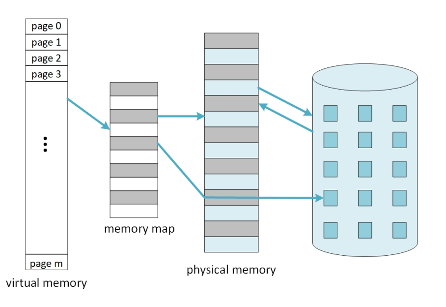
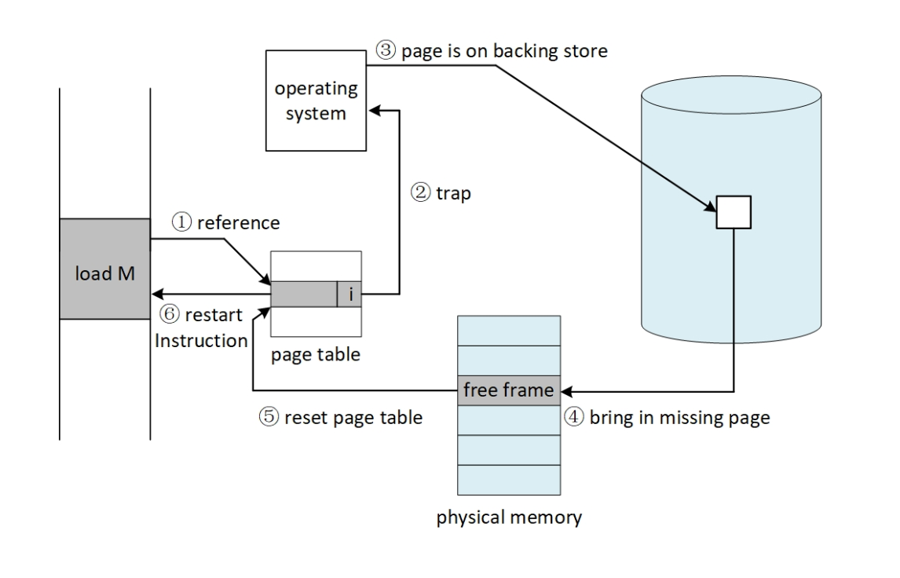
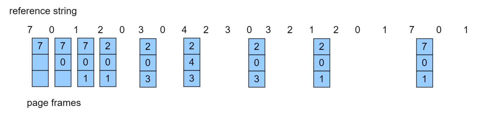
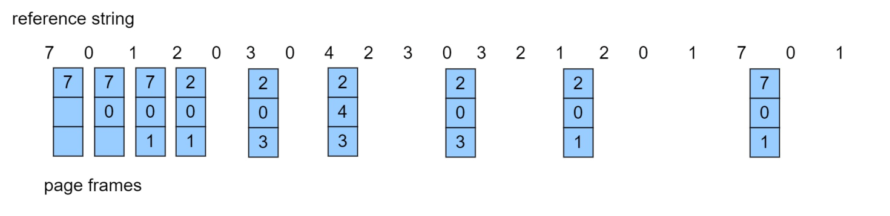
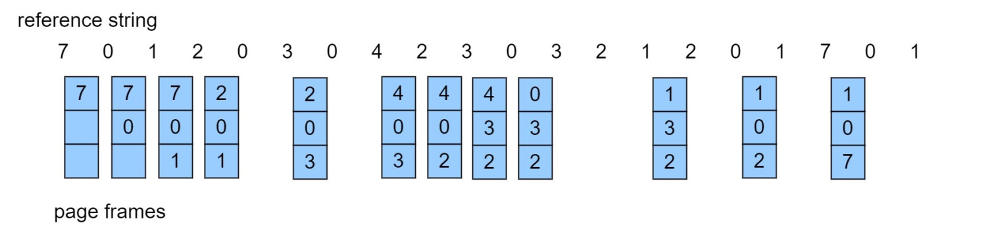
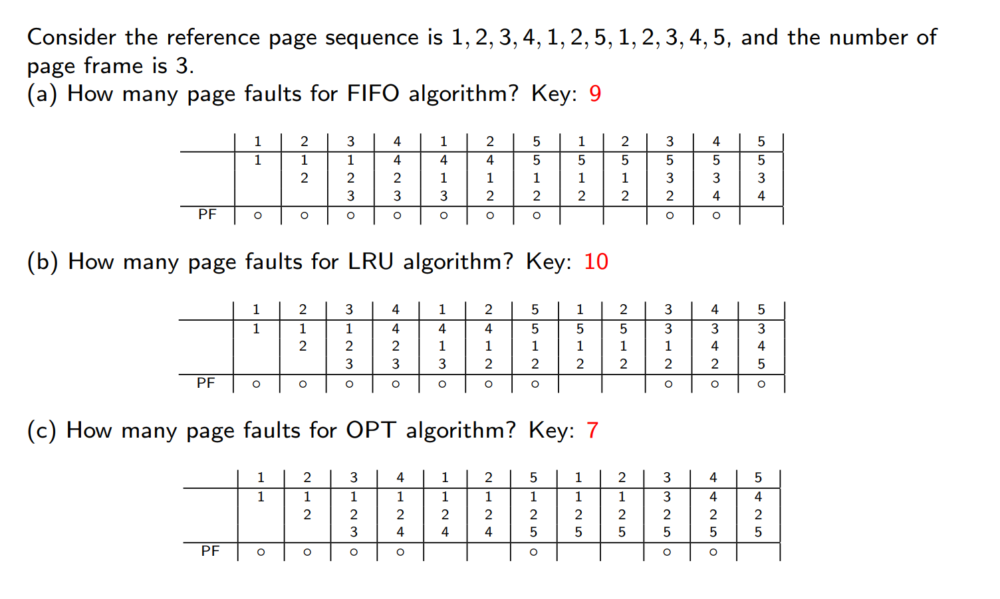

---
#### **1. Warm-up (预热)**  
**What Happens When OS is Booting? (操作系统启动时发生了什么？)**  
- **OS @boot (kernel mode):**  
  - Initialize trap table (初始化陷阱表)  
  - Start interrupt timer (启动中断计时器)  
  - Initialize process table (初始化进程表)  
  - Initialize free list (初始化空闲列表)  
- **Hardware:**  
  - Remember addresses of handlers (记录处理程序的地址):  
    - System call handler (系统调用处理程序)  
    - Timer handler (计时器处理程序)  
    - Illegal memory-access handler (非法内存访问处理程序)  
    - Illegal instruction handler (非法指令处理程序)  
  - Start timer; interrupt after X ms (启动计时器，X毫秒后中断)  
**What Happens When OS is Running? (操作系统运行时发生了什么？)**  
- **OS @run (kernel mode):**  
  - Allocate entry in process table (在进程表中分配条目)  
  - Allocate memory for program (为程序分配内存)  
  - Set base/limit registers (设置基址/界限寄存器)  
  - Return-from-trap (into Process A) (从陷阱返回到进程A)  
- **Hardware:**  
  - Restore registers of A (恢复进程A的寄存器)  
  - Move to user mode (切换到用户模式)  
  - Jump to A’s initial PC (跳转到进程A的程序计数器)  
- **Program (user mode):**  
  - Fetch/execute instructions (取指/执行指令)  
  - Translate virtual addresses (虚拟地址转换)  
**What Happens During an Exception? (异常发生时发生了什么？)**  
- **Timer interrupt → OS handles trap:**  
  - Save/restore process registers (保存/恢复寄存器)  
  - Terminate process if needed (必要时终止进程)  
- **Invalid memory access → Segmentation fault (非法内存访问 → 段错误)**  
- **Page fault → Load missing page (缺页 → 加载缺失页)**  
---
#### **2. Background (背景)** 
- **Virtual memory**: an additional level in the memory hierarchy, separation of user logical memory from physical memory
- Benefits:
	- 程序执行时只需部分驻留在内存中 
	- 因此，逻辑地址空间可以远大于物理地址空间 
	- 允许地址空间被多个进程共享
	- 支持更高效的进程创建
	- 可同时运行更多程序
	- 加载或交换进程所需的I/O操作更少
**Key Concepts (关键概念):**  
- **Backing Store (后备存储):** Reserved disk space for swapping (用于交换的磁盘空间).  
- **Demand Paging (按需分页):** Pages loaded only when accessed (页仅在访问时加载).  

---
#### **3. Swapping Mechanisms (交换机制)**  
**Swap Space (交换空间):**  
- the reserved space on the backing store for moving pages back and forth.
- OS can read from and write to the swap space, in **page-sized units**.
- OS needs to remember the **disk address** of a given page.
**Page Fault Handling (缺页处理):**  
If there is a reference to a page, first reference to that page will trap to operating system.
1. Operating system looks at an internal table to decide:
	- Valid bit = 0 -> abort (**segmentation fault**)
	- Present bit = 0 -> just not in memory (page fault).
2. Handler: 
	- Find free frame (找到空闲帧).  
	- Swap page into frame via scheduled disk operation(调入页).  
	- Reset tables to indicate page now in physical memory (i.e., set Present bit = 1)
	- Restart instruction (重启指令).  

**Hardware Algorithm (硬件算法):**  
```python  
if TLB_hit and access_allowed:  
    Access memory  
else if page_not_present:  
    Raise PAGE_FAULT  
```  

**Software Algorithm (软件算法):**  
```python  
PFN = FindFreePage()  
if no_free_page:  
    EvictPage()  
DiskRead(PTE.DiskAddr, PFN)  
UpdatePageTable()  
RetryInstruction()  
```  

---
#### **4. Swapping Policies: Page Replacement (交换机制：页替换策略)** 
- 通过修改页面错误服务例程以包含页面置换功能，防止内存过度分配
- 使用修改（脏）位来减少页面传输开销：仅将已修改的页面写入磁盘
- 页面置换实现了逻辑内存与物理内存的完全分离：可在较小的物理内存上提供大容量虚拟内存
**Basic Page Replacement**
1. 在磁盘上找到目标页面的位置
2. 查找一个空闲帧： 
	- 若存在空闲帧，使用该帧 
	- 若无空闲帧，使用页面置换算法选择一个被替换帧 
	- 若被替换帧为脏页（已修改），将其写入磁盘 
3. 将目标页面载入（新释放的）空闲帧；更新页表和帧表 
4. 重新启动导致陷阱的指令以继续进程 
- 注意：如果没有空闲帧，此时页面错误可能涉及 2 次页面传输（调出、调入）: 增加有效访问时间（EAT）
**Reference String 引用串**
- 页面编号，不是完整地址
- Repeated access to the same page does not cause a page fault
##### **Algorithms (算法):**  
以Reference String = \[7, 0, 1, 2, 0, 3, 0, 4, 2, 3, 0, 3, 0, 3, 2, 1, 2, 0, 1, 7, 0, 1\] ，内存中 3 frames为例： 
1. **Optimal (OPT):** Replace page unused longest (替换最长时间不会使用的页).  
	- 
	- 9 page faults
	- 无法知道未来，不可实现
2. **FIFO:** Replace oldest page (替换最早进入的页).  
	- 
	- 15 page faults
	- Suffers from **Bélády’s Anomaly**
		- **Adding more frames can cause more page faults**
3. **LRU:** Replace least recently used page (替换最长**时间（不是次数）**没有使用的页).  
	- 
	- 12 page faults
	- 实现：
		- Counter implementation 计数器实现
			- 每个页表项都有一个计数器；每当通过该表项引用页面时，将**时钟值**复制到计数器中
			- 当需要更换页面时，查看计数器以找到最小值
				- 需要遍历页表进行搜索
		- Stack implementation
		- 以双向链表形式维护一个页号栈
		- 当页面被引用时： 
			- 将其移至栈顶
			- 需要修改6个指针（为什么？）： 
			- 假设双向链表中每个节点包含前驱（`prev`）和后继（`next`）指针，移动节点时需操作以下指针： 1. 节点原前驱的`next`指针 2. 节点原后继的`prev`指针 3. 栈顶节点的`prev`指针 4. 节点新前驱（原栈顶）的`next`指针 5. 节点自身的`prev`指针（指向原栈顶） 6. 节点自身的`next`指针（置为`null`，因成为新栈顶）
		- 每次更新代价更高： 
			- 需频繁操作双向指针，时间复杂度为 \(O(1)\)，但常数因子较大。 
		- 无需搜索置换页面（为什么？）： 
			- **LRU页面始终位于链表底部**（尾节点），置换时直接删除尾节点即可，无需遍历链表查找。
	- LRU和OPT算法没有Belady异常
4. **近似LRU算法/LRU Approximation Algorithms**
	1. **Reference bit**
		- With each page associate a bit, initially = 0
		- **When page is referenced, bit set to 1**
		- Replace any with reference bit = 0 (if one exists)
	2. **Additional-Reference-Bits Algorithm 额外引用位算法**
		-  为每个页面保留一个8位字节
		- 定期将各位右移1位，将引用位（Reference Bit）移入最高位，舍弃最低位
			- 此时被引用的高位为1，较大；没被引用的高位为0，较小
		- 将这些8位字节解释为无符号整数，数值最小的页面即为LRU页面
	3. **Second-chance algorithm 第二次机会算法**
		- Generally FIFO, plus hardware-provided reference bit
		-   若要置换的页面满足：
			- **引用位 = 0** → 直接置换该页面 
			- **引用位 = 1** → 
				- 将引用位设置为0，保留页面在内存中 
				-  按相同规则置换下一个页面
	4. **Enhanced Second-Chance Algorithm**
		- Improve algorithm by using reference bit and modify bit (if available) in concert
		- 采用有序对（引用位，修改位）分类页面： 
			1. **(0, 0)**：近期未使用且未修改： **最适合置换的页面** 
			2. **(0, 1)**：近期未使用但已修改： **置换优先级次之，置换前必须先写回磁盘** 
				- **问题：页面如何在未被使用的情况下被修改？** 
				- 解释：可能通过后台进程或DMA（直接内存访问）操作修改（如内存映射I/O），无需CPU访问页面即被修改。 
			3. **(1, 0)**：近期使用过但未修改： **很可能很快会被再次使用** 
			4. **(1, 1)**：近期使用过且已修改： **很可能很快会被再次使用，且置换前需先写回磁盘**
5. 基于计数的页面替换
	-   为每个页面维护一个引用次数计数器  
    - （该方法）并不常见
	- **最不常用算法（Least Frequently Used, LFU）**：置换计数器值最小的页面
	- **最常用算法（Most Frequently Used, MFU）**：基于以下论点 —— 计数器值最小的页面可能刚被调入内存，尚未被使用
6. 页面缓冲算法
	  - 始终维护一个空闲帧池 
		  - 这样在需要时可直接获取空闲帧，而无需在缺页时临时查找 
		  - 将页面读入空闲帧，选择待淘汰的页面并将其加入空闲池 
		  - 在方便时淘汰目标页面 
	  - 可能需要维护一个已修改页面列表 
		  - 当后备存储处于空闲状态时，将这些页面写入并标记为非脏页 
	  - 可能需要保留空闲帧的内容并记录其存储的页面 
		  - 若在重新使用前再次引用该页面，则无需从磁盘重新加载内容 
		  - 总体而言，这有助于减少因错误选择淘汰帧而导致的性能损耗
7. 应用程序与页面置换
	  - 所有这些算法都需要操作系统对未来的页面访问进行猜测 
	  - 某些应用程序（如数据库）对自身的页面访问模式有更清晰的认知 
	  - 内存密集型应用可能导致双重缓冲问题 
		  - 操作系统将页面副本保留在内存中作为I/O缓冲区 
		  - 应用程序为自身工作也会将页面保留在内存中 
	  - 操作系统可以让应用程序直接访问磁盘，避免中间干扰 
		  - 原始磁盘模式 
	  - 绕过缓冲、锁定等操作
**In class Exercise**

**Answer:**


---
#### **5. Allocation of Frames (帧分配)**  
**Fixed Allocation (固定分配):**  
- **Equal Allocation (均等分配):**  
  - Each process gets equal frames (e.g., 100 frames ÷ 5 processes = 20 frames each).  
  - 每个进程获得相同数量的帧（例如：100帧 ÷ 5进程 = 每进程20帧）.  
- **Proportional Allocation (比例分配):**  
  - Allocate based on process size (按进程大小分配).  
  - Formula:  
    $$  
    a_i = \left( \frac{s_i}{\sum s_i} \right) \times m  
    $$  
    - $s_i$: Size of process $P_i$.  
    - $m$: Total frames available.  

**Priority Allocation (优先级分配):**  
- Higher-priority processes get more frames (高优先级进程获得更多帧).  
- Page replacement can steal frames from lower-priority processes (可从低优先级进程抢占帧). 

**Global vs. Local Replacement (全局 vs. 本地替换):**  
- **Global:** Replacement from all frames (higher throughput).  
  - 从所有帧中选择替换（吞吐量更高）.  
- **Local:** Replacement only from process’s own frames (consistent performance).  
  - 仅从进程自身帧中选择替换（性能稳定）.  

**NUMA (Non-Uniform Memory Access):**  
- Memory access speed varies by CPU proximity (内存访问速度因CPU距离而异).  
- OS optimizes by allocating "close" memory (e.g., Solaris uses **lgroups**).  

---
#### **6. Thrashing (抖动)**  
**Definition:**  
- Excessive page faults → Low CPU utilization (频繁缺页 → CPU利用率低).  
- OS responds by adding more processes, worsening thrashing (恶性循环).  

**Locality Model (局部性模型):**  
- Processes alternate between **locality sets** (pages actively used).  
  - 进程在多个**局部性集合**间切换（活跃使用的页）.  
- Thrashing occurs if $\sum \text{locality sizes} > \text{physical memory}$.  

**Working-Set Model (工作集模型):**  
- **Working-Set Window ($\varDelta$):** Tracks pages referenced in last $\varDelta$ accesses.  
  - 工作集窗口：记录最近 $\varDelta$ 次页面引用  
  - 如果一个页面处于活动使用状态，那么它处在工作集中；如果它不再使用，那么他在最后一次引用的 $\varDelta$ 时间单位后，会从工作集中删除
- **Working-Set Size ($WSS_i$):** Pages in current locality (当前局部性的页数).  
- If total demand $D = \sum WSS_i > m$, suspend a processes (若总需求 > 内存，挂起一个进程).  

**Page-Fault Frequency (PFF):**  
- Directly control fault rate by adjusting frames (动态调整帧数以控制缺页率).  
  - Too high → Allocate more frames.  
  - Too low → Reclaim frames.  
---
#### **7. Other Concepts (其他概念)**  
**Copy-on-Write (COW, 写时复制):**  
- **Mechanism:** Share pages until modification triggers copy (共享页直到修改时复制).  
  - Used in `fork()`: Child shares parent’s pages initially.  
  - 用于 `fork()`：子进程初始共享父进程页.  
- `vfork()`: Parent pauses until child calls `exec()` (父进程暂停，直到子进程调用 `exec()`).  

**Memory-Mapped Files (内存映射文件):**  
- Map file to memory region via `mmap()` (通过 `mmap()` 将文件映射到内存).  
- Access file via pointers (e.g., `*p`) instead of `read()`/`write()`.  
  - 通过指针（如 `*p`）访问文件，替代 `read()`/`write()`.  

**Kernel Memory Allocation (内核内存分配):**  
- **Buddy Allocator:** Splits memory into power-of-2 chunks (按2的幂分配).  
  - Example: 256KB → 128KB + 128KB → ... → 32KB for request.  
  - 示例：256KB → 128KB + 128KB → ... → 满足32KB请求.  
- **Slab Allocator:** Pre-allocates objects for kernel structures (e.g., inodes).  
  - 预分配内核对象（如inode），避免碎片.  

---
#### **8. Linux-Specific Optimizations (Linux优化)**  
**Page Cache (页缓存):**  
- Caches file data, metadata, and heap/stack pages (缓存文件数据、元数据、堆栈页).  
- Uses **2Q algorithm** for replacement (近似LRU):  
  - **Inactive List:** First-time accessed pages (首次访问的页).  
  - **Active List:** Promoted on re-access (再次访问时升级).  

**Security (安全机制):**  
- **NX Bit:** Marks stack as non-executable (防止栈溢出攻击).  
- **ASLR:** Randomizes memory layout to thwart ROP attacks (地址空间布局随机化).  
- **KPTI:** Isolates kernel pages to mitigate Meltdown/Spectre (内核页表隔离).  

#### **9. Performance Optimization & Case Studies**  

##### **Demand Paging Optimization (按需分页优化)**  
1. **Swap Space vs. File I/O:**  
   - Swap I/O is faster than file system I/O (even on same device).  
   - 交换空间I/O比文件系统I/O更快（即使在同一设备上）.  
   - Reason: Swap uses larger contiguous blocks (交换空间使用更大的连续块).  

2. **Prepaging (预分页):**  
   - Load predicted pages before they are referenced (提前加载可能需要的页).  
   - Risk: Wasted I/O if predictions are wrong (预测错误会导致浪费).  

3. **Mobile Systems:**  
   - No swap space; reclaim read-only pages directly (无交换空间，直接回收只读页).  

##### **Inverted Page Tables (反向页表)**  
- **Challenge:**  
  - Requires external page tables to locate non-resident pages (需外部页表定位未驻留页).  
  - May trigger additional page faults during lookup (查找时可能引发额外缺页).  

---

#### **10. Program Structure & Performance**  
**(程序结构与性能影响)**  

##### **Example: Row-Major vs. Column-Major Access**  
```c  
int data[128][128];  // Each row stored in one page (每行占一页)  

// Program 1: Column-wise access → 16,384 page faults  
for (int j = 0; j < 128; j++)  
    for (int i = 0; i < 128; i++)  
        data[i][j] = 0;  

// Program 2: Row-wise access → 128 page faults  
for (int i = 0; i < 128; i++)  
    for (int j = 0; j < 128; j++)  
        data[i][j] = 0;  
```  
- **Key Insight:** Access patterns affect page fault rates (访问模式影响缺页率).  

##### **I/O Interlock (I/O 锁)**  
- Pages involved in I/O must be locked in memory (禁止被替换).  
- Prevents corruption during device transfers (防止数据传输期间的错误).  

---

#### **11. After-Class Exercises (课后练习)**  


---

#### **12. Summary (总结)**  
| **Concept**          | **Key Point**                                  |  
|-----------------------|-----------------------------------------------|  
| Virtual Memory        | Decouples logical vs. physical memory (逻辑内存 ≠ 物理内存) |  
| Page Replacement      | LRU ≈ Optimal but hard to implement (LRU接近OPT但难实现) |  
| Thrashing Prevention  | Working-Set Model or PFF (工作集模型或缺页频率控制)       |  
| Linux Implementations | 2Q algorithm + KPTI (2Q算法 + 内核页表隔离)             |  
  