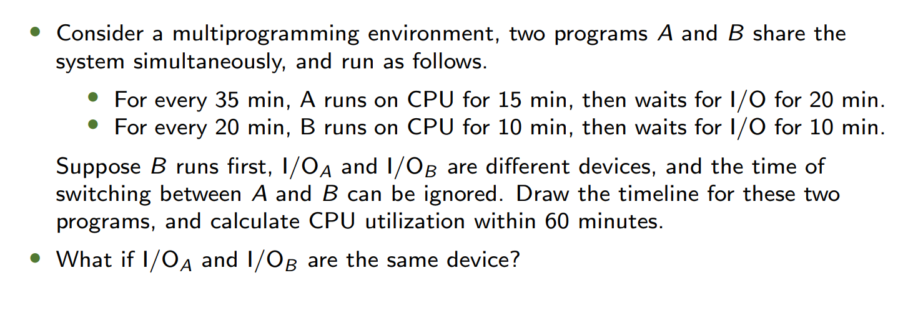
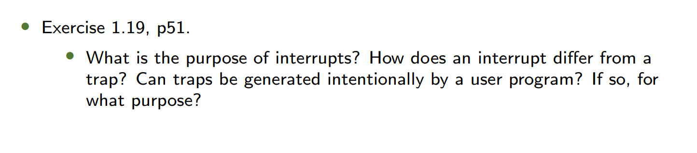
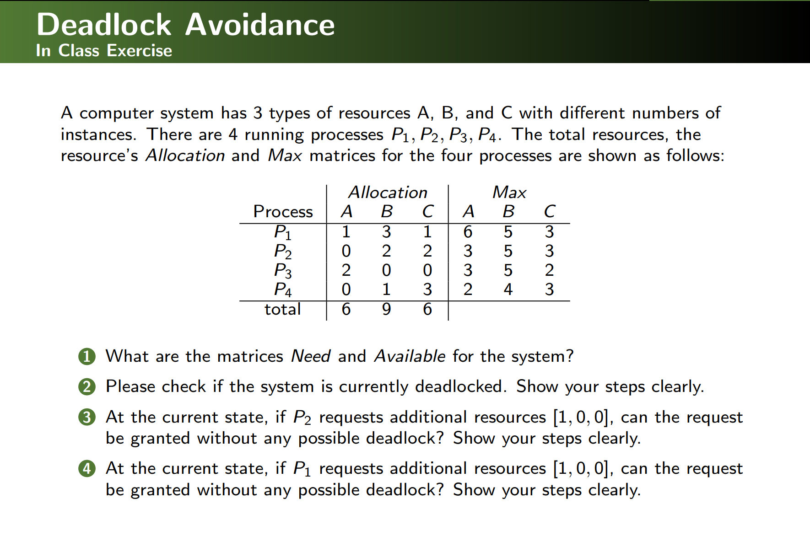
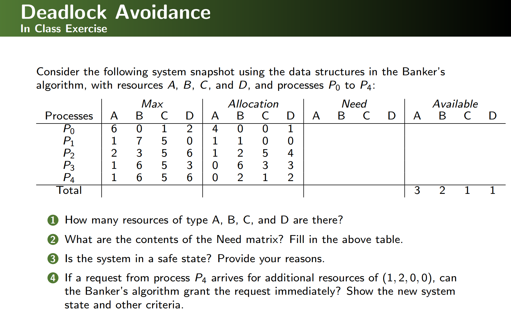
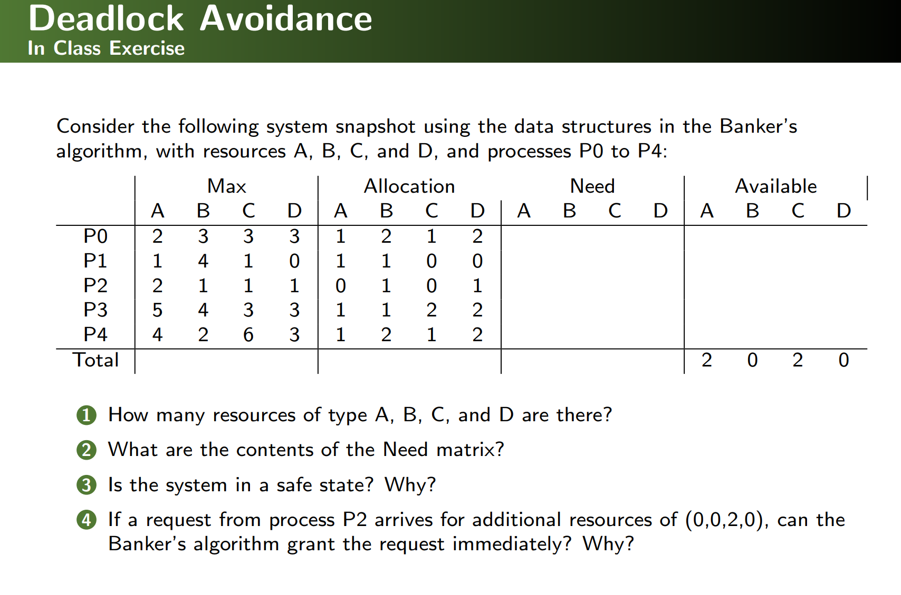
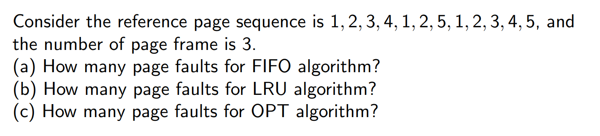
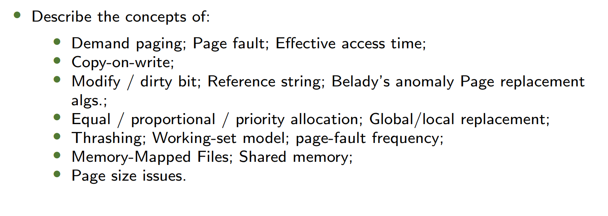
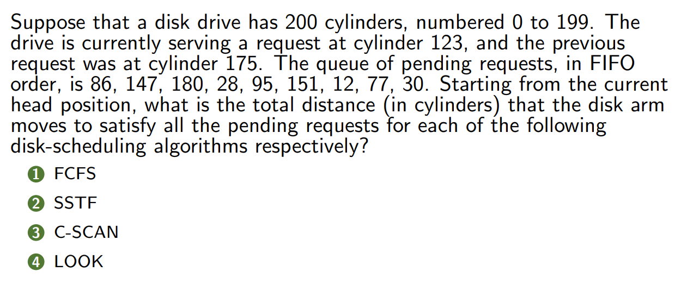

## *Notice: These exercises do not include answers. Refer to the Notes of each chapter for solutions*

---
## CH01
### 1

### 2


---
## CH02
### 1


---
## CH03
### 1

### 2
```c
for (i = 0; i < 4; i++) fork();  // How many processes?
```
### 3
**Draw process state diagram**

---
## CH04
### 1
What are the outputs?
```c
/* kai.c */
#include <stdio.h>
#include <pthread.h>

void *helloFunc(void *ptr) {
    int *data;
    data = (int *)ptr;
    printf("I'm Thread %d\n", *data);
    return (void *)data;
}

int main(int argc, char *argv[]) {
    pthread_t hThread[4];
    int *rvals[4];
    
    for (int i = 0; i < 4; i++) {
        pthread_create(&hThread[i], NULL, helloFunc, (void *)&i);
    }
    
    for (int i = 0; i < 4; i++) {
        pthread_join(hThread[i], (void **)&rvals[i]);
        // printf("Thread %d returns %d\n", i, *rvals[i]);
    }
    
    return 0;
}
```

```sh
gcc -o kai kai.c -pthread -Wall
./kai
```
### 2
- What are two differences between user-level threads and kernel-level threads? Under what circumstances is one type better than the other?
---
## CH05
### 1

### 2


---
## CH06
**WARNING: THIS CHAPTER IS SO DIFFICULT THAT YOU NEED TO FIND MORE EXERCISES BEYOND CLASS!**


---
## CH07
### 1

### 2

### 3


---
## CH08
### 1
- Imagine a small address space of size 16KB, with 64-byte pages.
- Thus, we have a ?-bit virtual address space, with ? bits for the VPN and ? bits for the offset. (why?)
- A linear page table would have ? entries, even if only a small portion of the address space is in use. (why?)
- Assume each PTE is 4 bytes in size.
- Thus, our page table is ? in size. 
- Given that we have ?-byte pages, the 1KB page table can be divided into ? 64-byte pages; each page can hold ? PTEs. (why?)
- We need ? bits to indicate the page directory index, ? bits to indicate the page table index in each PDE, and ? bits to indicate the offset. (why?)
### 2


---
## CH09
### 1

### 2


---
## CH10
### 1


---
## CH12
### 1
